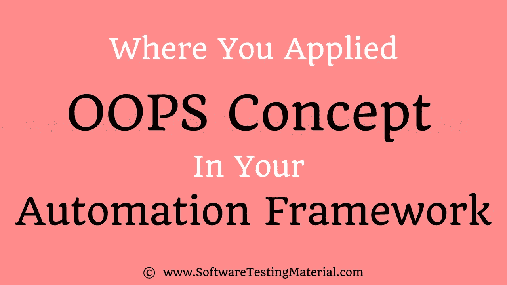

# 您在自动化框架中应用 OOPS 的地方

> 原文:[https://www.softwaretestingmaterial.com/oops-concept/](https://www.softwaretestingmaterial.com/oops-concept/)

你可能会在几乎所有的 [Selenium 访谈](https://www.softwaretestingmaterial.com/selenium-interview-questions/)中面临这个问题(你在自动化框架中应用了 OOPS 概念的地方)。在进一步学习之前，先学习 Java 中的 OOPS 概念。早先我们已经用 Java 发布了 [OOPS 概念，并附有一些易于理解的例子。](https://www.softwaretestingmaterial.com/oops-concept-in-java/)

也可以查看这个关于 Selenium 自动化框架的[解释的帖子。我使用这篇文章的组成部分来解释当前的文章(即 OOPS 概念在自动化框架中的应用)。](https://www.softwaretestingmaterial.com/explain-test-automation-framework/)

## **Selenium 自动化框架中 OOPS 的概念**

在这篇文章中，我们将讨论在自动化框架中如何以及在哪里应用 OOPs 概念。

Table of Contents <button class="kb-table-of-contents-icon-trigger kb-table-of-contents-toggle" aria-expanded="true" aria-label="Collapse Table of Contents">*   [Selenium 自动化框架中 OOPS 的概念](#concepts-of-oops-in-selenium-automation-framework)
    *   [#1。抽象](#ABSTRACTION)
    *   [#2。接口](#INTERFACE)
    *   [#3。继承](#INHERITANCE)
    *   [#4。多态性](#POLYMORPHISM)
        *   [#1。方法重载](#METHOD-OVERLOADING)
        *   [#2。方法覆盖](#METHOD-OVERRIDING)
    *   [#5。封装](#ENCAPSULATION)
*   [其他 Selenium 自动化框架概念](#other-selenium-automation-framework-concepts)
    *   [#1。WEB 元素](#1-web-element)
    *   [二号。web 驱动程序](#2-webdriver)
    *   [#3。按](#3-find-by)查找
    *   [#4。查找元素](#4-find-element)</button> 

### **#1。抽象**

抽象是隐藏内部细节的实现并向用户显示功能的方法。

在 Java 中，抽象是通过接口和抽象类来实现的。使用接口，我们可以实现 100%的抽象。

让我们看看下面的接口概念。

### **#2。接口**

Selenium 中我们都知道的基本语句是**web driver driver = new Firefox driver()；**

> 详细解释为什么我们要写[web driver driver = new Firefox driver()；](https://www.softwaretestingmaterial.com/webdriver-driver-new-firefoxdriver/)硒。

WebDriver 本身就是一个接口。所以基于上面的语句**web driver driver = new Firefox driver()；**我们正在使用 Selenium WebDriver 初始化 Firefox 浏览器。这意味着我们正在创建一个*接口(WebDriver)* 的*引用变量(driver)* 并创建一个*对象*。这里的 *WebDriver* 是前面提到的*接口*而 *FirefoxDriver* 是*类*。

Java 中的接口看起来类似于类，但是接口和类是两个不同的概念。一个接口可以有方法和变量，就像类一样，但是在接口中声明的方法在默认情况下是抽象的。我们可以用接口在 Java 中实现 100%的抽象和多重继承。

点击了解更多关于[界面的信息。](https://www.softwaretestingmaterial.com/interface-in-java/)

### **#3。继承**

Java 中一个类获取另一个类的属性(实例变量)和功能的机制被称为继承。

我们在自动化框架中创建一个基类来初始化 WebDriver 接口、WebDriver 等待、属性文件、电子表格等。，在基类中。

我们在其他类中扩展了基类，如测试和实用程序类。

在这里，我们将一个类(基类，如 WebDriver 接口)扩展到另一个类(如 Tests，Utility 类)称为继承。

点击了解更多关于[继承的信息。](https://www.softwaretestingmaterial.com/inheritance-in-java/)

### **#4。多态性**

多态性允许我们以多种方式执行一项任务。

重载和重写的结合称为多态。我们将在下面看到重载和重写。

点击了解更多关于[多态性的信息。](https://www.softwaretestingmaterial.com/polymorphism-in-java/)

#### **#1。方法重载**

我们在 Selenium 中使用**隐式等待**。隐式等待是重载的一个例子。在隐式等待中，我们使用不同的时间戳，如秒、分、小时等。,

TestNG 中的 **Action 类**也是重载的一个例子。

TestNG 中的 Assert 类也是重载的一个例子。

一个类包含多个同名但参数不同的方法，称为方法重载

点击了解更多关于[超载的信息。](https://www.softwaretestingmaterial.com/method-overloading-in-java/)

#### **#2。方法覆盖**

我们使用一个已经在另一个类中通过改变参数实现的方法。要理解这一点，你需要理解 Java 中的覆盖。

在子类中声明一个已经存在于父类中的方法称为方法重写。例子有 **get** 和**navigate**Selenium 中不同驱动程序的方法。

在此通过示例了解更多关于[覆盖的信息](https://www.softwaretestingmaterial.com/method-overriding-in-java/)

### **#5。封装**

框架中的所有类都是封装的例子。在 POM 类中，我们使用 **@FindBy** 声明数据成员，数据成员的初始化将使用[构造函数](https://www.softwaretestingmaterial.com/java-tutorial/#constructor)来利用方法中的那些。

封装是一种将代码和数据(变量)绑定在一个单元中的机制。

点击了解更多关于[封装的信息](https://www.softwaretestingmaterial.com/encapsulation-in-java/)

## **其他 Selenium 自动化框架概念**

我想讨论一些我们在自动化框架中使用的其他主题。

### **#1。WEB 元素**

Web 元素是一个界面，用于识别网页中的元素。

### **二号。web 驱动程序**

WebDriver 是一个界面，用于启动不同的浏览器，如 Firefox、Chrome、Internet Explorer、Safari 等。,

### **#3。按**查找

FindBy 是页面对象模型设计模式中用来标识元素的注释。

### **#4。查找元素**

Find Element 是 POM 中的一种方法，用于识别网页中的元素。

[学习 Java](https://www.softwaretestingmaterial.com/java-tutorial/)——Selenium 自动化测试人员定制的帖子

您可能还喜欢:

*   [硒面试问题](https://www.softwaretestingmaterial.com/selenium-interview-questions/)
*   [硒教程](https://www.softwaretestingmaterial.com/selenium-tutorial/)
*   [Java 面试问题](https://www.softwaretestingmaterial.com/java-interview-questions/)
*   [Java 教程](https://www.softwaretestingmaterial.com/java-tutorial/)
*   [TestNG 面试问题](https://www.softwaretestingmaterial.com/testng-interview-questions/)
*   [TestNG 教程](https://www.softwaretestingmaterial.com/testng-tutorial/)
*   [人工测试面试问题](https://www.softwaretestingmaterial.com/100-software-testing-interview-questions/)
*   [手动测试教程](https://www.softwaretestingmaterial.com/manual-testing-tutorial/)