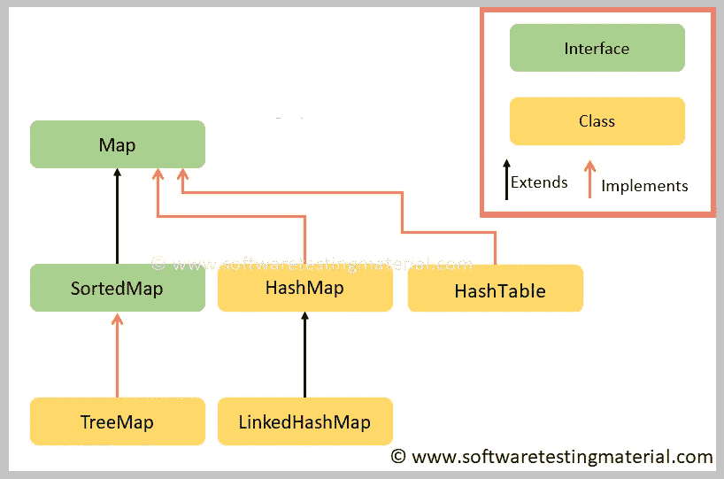

# Java 中的地图| Java 教程

> 原文:[https://www.softwaretestingmaterial.com/map-in-java/](https://www.softwaretestingmaterial.com/map-in-java/)

Java Map 是集合框架的一部分。映射接口基于键值对。它将唯一的键映射到值。映射接口不是集合接口的子类型。Map 接口的行为类似于集合，但与其他集合类型略有不同。它不能包含重复的键，但是允许重复的值。



在 Java 中实现 Map 有两个接口。
1。地图
2。有序映射

Java 中有三类 Map 是
1。HashMap
2。散列表
3。树形图
4。ConcurrentHashMap
5。LinkedHashMap。

查看 HashMap 上的详细帖子

**linked HashMap:**linked HashMap 是 Map 的实现，它继承了 HashMap 类。它允许空值和空键。它保持插入顺序。因此，当您希望映射的键值对按照插入顺序排序时，可以考虑使用 LinkedHashMap。

查看 LinkedHashMap 上的详细帖子

**TreeMap:** TreeMap 是 Map 和 SortedMap 的实现。它保持升序。它不允许空值。因此，当您希望映射按照键的自然顺序对其键-值对进行排序时，可以考虑使用树映射。

查看树状图上的详细帖子

**要点记住:**

*   Map 不允许重复的键，但允许重复的值。
*   HashMap 和 LinkedHashMap 允许空键和空值，但 TreeMap 不允许任何空键或空值。
*   无法遍历地图，因此您需要使用 keySet()或 entrySet()方法将其转换为 Set。

Map 接口包括基本操作(如 *put、get、remove、containsKey、containsValue、size、*和 *empty* )、批量操作(如 *putAll* 和 *clear* )和集合视图(如 *keySet、entrySet、*和 *values* )的方法。

**地图界面中的方法:**

*   public Object put(Object key，Object value):这个方法用于在 map 中插入一个条目。
*   public void putAll(Map m):该方法用于在该地图中插入指定的地图。
*   public Object remove(Object k):这个方法用于删除一个键等于 k 的条目。
*   public Object get(Object k):这个方法用于返回与键 k 相关联的值。
*   public boolean contains key(Object k):如果调用的映射包含 k 作为键，该方法返回 true。否则返回 false。
*   public Set keySet():该方法用于返回包含调用映射中的键的集合。这种方法
*   提供调用映射中键的集合视图。
*   public Set entrySet():这个方法用于返回一个包含 map 中条目的集合。该集合包含 Map.Entry 类型的对象。该方法提供调用映射的集合视图。

**收藏浏览量**

集合视图方法允许通过以下方式将地图作为集合进行查看。

1.  密钥集–映射中包含的密钥集
2.  值–地图中包含的值的集合。这个集合不是一个集合，因为多个键可以映射到同一个值
3.  entry Set–映射中包含的键值对的集合。Map 接口提供了一个名为 *Map 的小型嵌套接口。条目，*该集合中元素的类型。

> 学习 Java 中的[集合](https://www.softwaretestingmaterial.com/collections-framework-in-java/)

**地图。录入界面:**

入口是地图的子界面。我们可以通过 Map.Entry 来访问它，它提供了获取键和值的方法。

**绘制地图的方法。录入界面:**

*   object getKey()–用于获取密钥。
*   object getValue()–它用于获取值。

**示例程序使用** ***图。条目:***

```
package myPackage;

import java.util.HashMap;
import java.util.Hashtable;
import java.util.Iterator;
import java.util.Map;
import java.util.Map.Entry;
import java.util.Set;

public class MapsClassA {

	public static void main(String [] args) {

		Map<String,String> value = new HashMap<>();
		value.put("Name", "Raj");
		value.put("Country", "India");
		value.put(null, null);
		value.put("Null Value", null);

		for(Map.Entry<String, String> en : value.entrySet()) {
			System.out.println(en.getKey()+" = "+en.getValue());
		}

	}	
}
```

**样本程序:**

```
package myPackage;

import java.util.HashMap;
import java.util.Hashtable;
import java.util.Iterator;
import java.util.Map;
import java.util.Map.Entry;
import java.util.Set;

public class MapsClassA {

	public static void main(String [] args) {

		Map<String,String> value = new HashMap<>();
		value.put("Name", "Raj");
		value.put("Country", "India");
		value.put(null, null);
		value.put("Null Value", null);
        System.out.println(value);
        // To fetch a value, we use get method and pass the key as parameter
		System.out.println("Value of Name is : "+value.get("Name"));
		// If we pass a key which is not available - You wont face any exception, output will be null
		System.out.println("Value of Name1 is : "+value.get("Name1"));
		// To get the size of the Map
		System.out.println("Size is : "+value.size());

		/*As a Map is not a true collection, there is no direct method for iterating over a map. 
		Instead, we can iterate over a map using its collection views. 
		Any Map’s implementation has to provide three Collection view methods ie., keySet(), values(), and entrySet()*/

		//Converting to Set so that we can transverse
		Set<String> keys = value.keySet();

		for(String key:keys) {
			System.out.println(key + " = " + value.get(key));
		}
		// To get the value
		System.out.println("Value of Country is : "+value.get("Country"));
		// To remove the value
		value.remove("Country");
		// Lets see how the value will be after we applied remove in the above statement
		System.out.println("Value of Country after removed it is : "+value.get("Country"));

	}	
}
```

> [Java 教程](https://www.softwaretestingmaterial.com/java-tutorial/)