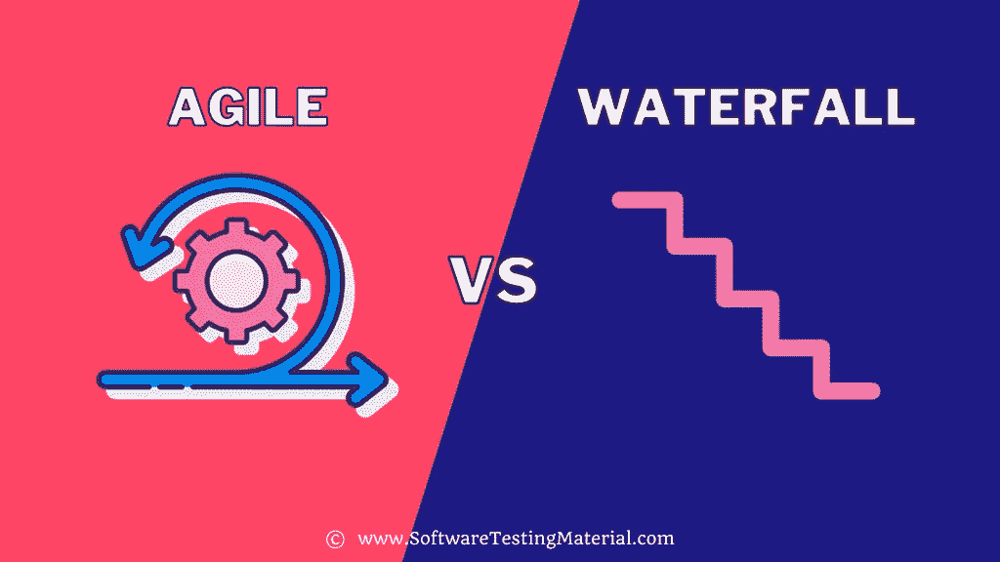

# 敏捷 vs 瀑布:你需要知道的一切

> 原文:[https://www.softwaretestingmaterial.com/agile-vs-waterfall/](https://www.softwaretestingmaterial.com/agile-vs-waterfall/)

在上一篇文章中，我们学习了敏捷和 Scrum 的区别，在这篇文章中，我们将学习敏捷和瀑布的区别，以及下面的内容

*   [什么是敏捷？](#h-what-is-agile)
*   [什么是瀑布法？](#h-what-is-waterfall-method)
*   [敏捷&瀑布有什么区别？](#h-what-is-the-difference-between-agile-waterfall)

## **什么是敏捷？**

敏捷是项目管理和软件开发的增量迭代方法，旨在尽可能快速高效地交付软件产品，减少麻烦。

> **必读:** [敏捷原则](https://www.softwaretestingmaterial.com/principles-agile-software-development/)

## **什么是瀑布法？**

瀑布方法是一种传统的系统开发生命周期(SDLC)模型。它遵循用于软件设计和 It 项目的顺序的、线性的设计过程。它经历了不同的阶段，如需求收集、可行性研究/分析、设计、编码、测试、安装和维护。只有在前一阶段完成后，下一阶段才会开始。在质量比进度或成本更重要的项目中，这种方法是首选。

## **敏捷&瀑布有什么区别？**

| 敏捷 | 瀑布 |
| --- | --- |
| 测试与开发活动并行进行，这意味着随着开发的进展，测试也在进行 | 测试通常在开发结束时进行 |
| 敏捷是一种迭代和增量的方法 | 这是一个连续的设计过程，其中设计、开发、测试和其他阶段以连续的方式一个接一个地发生 |
| 测试与软件开发同时进行 | “测试”阶段在“构建”阶段之后 |
| 甚至在开发的后期才收集需求。 | 在瀑布模型中开始开发之前收集需求。 |
| 敏捷团队参与变更需求。 | 瀑布团队不参与需求变更。 |
| 敏捷方法以其灵活性而闻名 | 瀑布是一种结构化的软件开发方法，并且经常非常严格 |
| 它相信不断的反馈，并接受需求的变化 | 客户反馈通常直到项目的最后才被收集，并且改变是不被鼓励的 |
| 敏捷关注协作、小规模发布和客户反馈 | 团队协作非常有限 |
| 敏捷将项目分成冲刺阶段。 | 瀑布将项目分成几个阶段。 |
| 自我激励和自我组织的团队推动项目 | 项目经理作为中央控制机构推动项目 |
| 它允许我们完成多个小的活动项目。 | 它允许我们完成单个项目。 |
| 测试阶段与敏捷开发同时开始。 | 测试阶段仅在瀑布模型开发之后开始。 |

**相关帖子:**