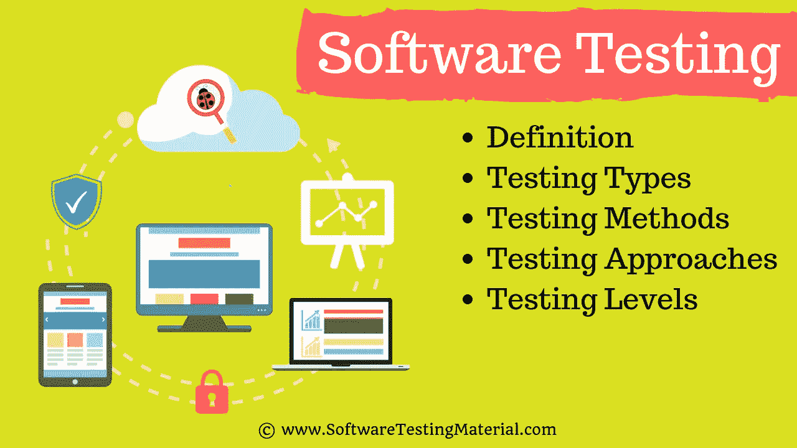

# 什么是软件测试|你应该知道的一切

> 原文:[https://www.softwaretestingmaterial.com/software-testing/](https://www.softwaretestingmaterial.com/software-testing/)

想了解关于什么是软件测试的所有知识吗？你来对地方了。现在让我们继续前进，了解更多关于测试的重要性。

软件测试已经不是十年前的样子了。在过去的几年里，它发生了很大的变化。

在本文中，您将了解到:

<button class="kb-table-of-contents-title-btn kb-table-of-contents-toggle" aria-expanded="false" aria-label="Expand Table of Contents">Table of Contents</button>

*   [什么是软件](#what-is-software)
*   [什么是测试](#h-what-is-testing)
*   [什么是软件测试](#h-what-is-software-testing)
*   [软件工程中软件测试的定义](#h-definition-of-software-testing-in-software-engineering)
*   为什么我们需要软件测试？
*   [如果软件开发过程中没有软件测试怎么办](#h-what-if-there-is-no-software-testing-in-the-software-development-process)
    *   [1。成本效益](#h-1-cost-effectiveness)
    *   [2。客户满意度](#h-2-customer-satisfaction)
    *   [3。安全性](#h-3-security)
    *   [4。产品质量](#h-4-product-quality)
*   软件测试有哪些不同的类型？
    *   [#1。手动测试](#h-1-manual-testing)
    *   [#2。自动化测试](#h-2-automation-testing)
*   [测试方法](#h-testing-methods)
    *   [#1。静态测试](#h-1-static-testing)
    *   [#2。动态测试](#h-2-dynamic-testing)
*   [测试方法](#h-testing-approaches)
    *   [#1。白盒测试](#h-1-white-box-testing)
    *   [#2。黑盒测试](#h-2-black-box-testing)
    *   [#3。灰盒测试](#h-3-grey-box-testing)
*   [测试等级](#h-testing-levels)
    *   [#1。单元测试](#h-1-unit-testing)
    *   [#2。集成测试](#h-2-integration-testing)
    *   [#3。系统测试(端到端测试)](#h-3-system-testing-end-to-end-testing)
    *   [#4。验收测试](#h-4-acceptance-testing)
*   [黑盒测试的类型](#h-types-of-black-box-testing)
    *   [#1。功能测试](#h-1-functional-testing)
    *   [#2。非功能性测试](#h-2-non-functional-testing)
*   [测试工件](#h-testing-artifacts)
*   [软件测试的原则](#h-principles-of-software-testing)
*   [最佳软件测试公司](#h-best-software-testing-companies)
*   [总之](#h-in-conclusion)
*   [软件测试常见问题解答](#h-faq-s-on-software-testing)
    *   [如何成为一名软件测试人员？](#how-to-become-a-software-tester)
    *   软件测试是个好职业吗？
    *   [如何开始学习软件测试](#how-to-start-learning-software-testing)
    *   [如何从手工测试转向自动化测试？](#how-to-shift-from-manual-testing-to-automation-testing)
    *   自动化测试是否让手工测试变得过时了？
    *   [一个软件测试工程师挣多少钱？](#how-much-does-a-software-test-engineer-make)
    *   [自动化测试工程师工资多少？](#how-much-does-an-automation-test-engineer-make)
    *   [为什么对测试自动化的需求如此巨大？](#why-is-there-such-a-huge-demand-for-test-automation)
    *   有哪些关于软件测试的好书？
    *   [什么是软件测试中的程序测试？](#what-is-program-testing-in-software-testing)
    *   软件测试的最新趋势是什么？
    *   [移动测试的最新趋势是什么？](#what-are-the-latest-trends-in-mobile-testing)

## **什么是软件**

软件是告诉计算机做什么的一组指令或程序。它可以分为两大类。、系统软件和应用软件。

## **什么是软件测试**

**软件测试**是一个过程，旨在评估软件应用的功能，以发现开发的软件是否满足规定的要求，并识别缺陷，以确保产品无缺陷，从而生产出高质量的产品。

让我们看看标准定义，测试类型如[手工测试](https://www.softwaretestingmaterial.com/manual-testing-tutorial/)和[自动化测试](https://www.softwaretestingmaterial.com/automation-testing-tutorial/)，测试方法，测试途径，以及黑盒测试的类型。

## **软件工程中软件测试的定义**

根据 **ANSI/IEEE 1059** 标准，软件工程中的**测试**是对软件产品或系统进行分析，以检查软件产品或系统是否满足既定条件(即缺陷)的过程。测试过程评估软件产品的需求特征，如缺失的需求、缺陷或错误，以评估其可靠性、安全性和性能。

Software Testing Market TrendsAccording to Global Market Insights, the global software testing market is forecast to grow from USD 40 billion in 2020 to $60 billion by 2027, at a CAGR of 7%. The IT sector is growing with technological advancements in artificial intelligence, machine learning, and CI/CD, which is likely to result in a significant growth in the market.

<figcaption>**Source:** [Global Market insights](https://www.gminsights.com/industry-analysis/software-testing-market)</figcaption>

此外，请查看下面的测试视频教程。

[https://www.youtube.com/embed/jjvBKn76nJU](https://www.youtube.com/embed/jjvBKn76nJU)

如果你喜欢这个视频，那么请订阅我们的 [YouTube 频道](https://www.youtube.com/channel/UCIJGI_3XgnfUaSNQD8D2IMQ)以获得更多视频教程。

## 为什么我们需要软件测试？

面试官可能会问你“**为什么需要测试**”或者“**为什么要进行软件测试**”。

当我开始职业生涯时，我不知道什么是软件测试，也不知道为什么需要软件测试。

我也不知道从哪里开始。也许你和我很久以前的情况一样。

不要错过我们关于如何成为一名软件测试员的指南以及[如何将你的职业从手工转向自动化测试](https://www.softwaretestingmaterial.com/career-shift-from-manual-to-automation-testing/)

现在我说，评估软件应用程序的功能是一门艺术，目的是发现开发的软件是否满足指定的需求，并识别缺陷以确保产品没有缺陷，从而生产出高质量的产品。

## **如果软件开发过程中没有软件测试怎么办**

按照目前的趋势，由于数字化的不断变化和发展，我们的生活在各个领域都得到了改善。我们的工作方式也改变了。

例如，我们在网上访问我们的银行，我们在网上购物，我们在网上订餐，等等。我们依赖软件和系统。

如果这些系统被证明是有缺陷的。我们都知道，一个小小的错误会对业务造成巨大的财务损失和商誉影响。

为了交付高质量的产品，我们需要在[软件开发过程](https://www.softwaretestingmaterial.com/sdlc-software-development-life-cycle/)中进行测试。

测试成为信息技术领域中非常重要和不可分割的一部分的一些原因如下。这些就是软件测试的好处。

1.  成本效益
2.  客户满意度
3.  安全性
4.  产品质量

### **1。成本效益**

事实上，任何复杂系统都不可能完全排除设计缺陷。

这不是因为开发人员粗心大意，而是因为系统的复杂性难以处理。

如果设计问题没有被发现，那么追溯缺陷并纠正它将变得更加困难。修理它将变得更加昂贵。

有时候，在修复一个 bug 的时候，我们可能会不知不觉地在其他模块中引入另一个 bug。如果可以在开发的早期阶段识别出这些缺陷，那么修复它们的成本就会低得多。

这就是为什么在软件开发生命周期的早期阶段发现缺陷是重要的。

测试的好处之一是成本效益。

最好尽早开始测试，并在软件开发生命周期的每个阶段引入测试，并且需要定期测试以确保应用程序是按照需求开发的。

### **2。客户满意度**

在任何业务中，最终目标都是让客户满意。是的，顾客满意非常重要。

软件测试改善了应用程序的用户体验，让客户感到满意。满意的顾客意味着企业更多的收入。

### **3。安全性**

这可能是测试中最敏感和最脆弱的部分。测试([渗透测试](https://www.softwaretestingmaterial.com/penetration-testing-tutorial/) & [安全测试](https://www.softwaretestingmaterial.com/security-testing-tutorial/))有助于产品安全。

黑客获得了对数据的未授权访问。这些黑客窃取用户信息，并利用这些信息为自己谋利。如果你的产品不安全，用户不会喜欢你的产品。用户总是寻找值得信赖的产品。测试有助于消除产品中的漏洞。

### **4。产品质量**

软件测试是一门艺术，它通过向客户交付高质量的产品来帮助增强公司的市场声誉，正如需求规格文档中所提到的。

由于这些原因，软件测试成为软件开发过程中非常重要和不可或缺的一部分。

## 软件测试有哪些不同的类型？

> 不要错过:[手工测试 vs 自动化测试](https://www.softwaretestingmaterial.com/manual-testing-vs-automation-testing/)

### **#1。手动测试**

手动测试是用手测试软件的过程，以了解更多关于它的信息，发现什么是可行的，什么是不可行的。

这通常包括验证需求文档中指定的所有特性，但通常也包括测试人员从最终用户的角度来测试软件。

手动测试计划各不相同，从完全脚本化的测试用例，给测试人员详细的步骤和预期的结果，到指导探索性测试会话的高级指南。

市场上有很多复杂的工具来帮助手动测试，但是如果你想要一个简单灵活的起点，看看 [Testpad](https://www.softwaretestingmaterial.com/go/testpad-stpost/) 。

### **#2。自动化测试**

自动化测试是使用自动化工具测试软件以发现缺陷的过程。

在这个过程中，测试人员通过使用自动化工具自动执行测试脚本并生成测试结果。

一些著名的用于功能测试的自动化测试工具包括 Selenium、testRigor 和 Katalon Studio。

对于 web 应用程序测试人员来说，Selenium 不再是一个陌生的名字。它提供了强大的功能，如跨浏览器测试，但对于自动化新手或编程经验有限的人来说很难学习。

这就是为什么大多数 QAs 新鲜人和手动测试者开始使用[Selenium替代品](https://www.softwaretestingmaterial.com/best-selenium-alternatives/)。

**[test right](https://www.softwaretestingmaterial.com/go/testrigor-software-testing/)**是Selenium的最佳替代品之一。

*   它允许你用简单的英语创建稳定的测试。
*   它允许你构建可以在所有桌面和移动浏览器以及本地移动应用中运行的测试。

> 查看我们的详细步骤[Selenium教程](https://www.softwaretestingmaterial.com/selenium-tutorial/)

## **测试方法**

1.  静态测试
2.  动态试验

### **#1。静态测试**

它在软件测试中也被称为验证。

验证是检查文档和文件的静态方法。

验证是一个过程，以确保我们是否正在构建正确的产品，即验证我们拥有的需求，并验证我们是否正在相应地开发产品。

这里涉及的活动有检查、评审和走查

### **#2。动态测试**

它也被称为软件测试中的验证。

验证是测试真实产品的动态过程。

验证是一个过程，无论我们是否在制造正确的产品，即验证我们开发的产品是否正确。

这涉及的活动是测试软件应用程序(桌面应用程序、网络应用程序、移动应用程序)

> 阅读更多关于[静态和动态测试](https://www.softwaretestingmaterial.com/verification-and-validation/)的信息。

## **测试方法**

有三种类型的软件测试方法。

1.  白盒测试
2.  黑箱测试
3.  灰箱测试

### **#1。白盒测试**

它也被称为玻璃盒，透明盒，结构测试。

白盒测试基于应用程序的内部代码结构。在白盒测试中，系统的内部视角以及编程技巧被用来设计测试用例。这种测试通常在单元级完成。

### **#2。黑盒测试**

它也被称为行为/基于规格/输入输出测试。

黑盒测试是一种软件测试方法，测试人员在不查看内部代码结构的情况下评估被测软件的功能。

### **#3。灰盒测试**

灰盒是白盒测试和黑盒测试的结合。

从事这类测试的测试人员需要访问设计文档。这有助于在这个过程中创建更好的测试用例。

> 阅读更多关于[白盒和黑盒测试的信息](https://www.softwaretestingmaterial.com/black-box-and-white-box-testing/)

不管你是黑盒，白盒，还是灰盒测试者。由于软件测试在软件工程中对一个项目的成功有着巨大的作用。

## **测试等级**

1.  单元测试
2.  集成测试
3.  系统试验
4.  验收测试

### **#1。单元测试**

进行单元测试是为了检查源代码的各个模块是否工作正常。即由开发者在开发者环境中单独测试应用程序的每个单元。这就是所谓的模块测试或组件测试。要了解单元测试，请查看我们详细的[单元测试指南](https://www.softwaretestingmaterial.com/unit-testing/)

### **#2。集成测试**

集成测试是测试几个单元测试模块之间的连通性或数据传输的过程。这就是所谓的 I&T 测试或字符串测试。它被细分为自顶向下方法、自底向上方法和夹层方法(自顶向下和自底向上的结合)。要了解集成测试，请查看我们详细的[集成测试指南](https://www.softwaretestingmaterial.com/integration-testing/)

### **#3。系统测试(端到端测试)**

这是一个黑盒测试。测试完全集成的应用程序也称为端到端场景测试。确保软件在所有预期的目标系统中都能工作。验证对应用程序中每个输入的彻底测试，以检查期望的输出。测试用户对应用程序的体验。要了解系统测试，请查看我们详细的[系统测试指南](https://www.softwaretestingmaterial.com/system-testing/)

### **#4。验收测试**

获得客户签准，以便交付软件并收到付款。验收测试的类型有α、β和γ测试。要了解验收测试，请查看我们详细的[验收测试指南](https://www.softwaretestingmaterial.com/acceptance-testing/)

> 阅读更多关于测试级别的信息。

## **黑盒测试的类型**

1.  功能测试
2.  非功能性测试

### **#1。功能测试**

简单来说，系统实际做的是功能测试。验证软件应用程序的每个功能都符合需求文档中的规定。通过提供适当的输入来测试所有功能，以验证实际输出是否与预期输出相匹配。它属于黑盒测试的范围，测试人员不需要关心应用程序的源代码。

> **不要错过:** [功能测试 vs 非功能测试](https://www.softwaretestingmaterial.com/functional-testing-vs-non-functional-testing/)

### **#2。非功能性测试**

简单来说，系统性能的好坏是非功能性测试。非功能性测试是指软件的各个方面，如[性能](https://www.softwaretestingmaterial.com/performance-testing-tutorial/)、[负载](https://www.softwaretestingmaterial.com/load-testing-tutorial/)、压力、可伸缩性、安全性、兼容性等。的主要目的是改善用户体验，提高系统响应请求的速度。

测试类型有 100 多种。你可以看看这个帖子，我们提到过 [100 多种软件测试类型](https://www.softwaretestingmaterial.com/types-of-software-testing/)。

## **测试工件**

测试工件是交付给软件项目涉众的可交付物。遵循 SDLC 的软件项目在交付给客户之前会经历不同的阶段。在这个过程中，每个阶段都会有一些可交付成果。一些可交付成果在测试阶段开始前提供，一些在测试阶段提供，其余的在测试阶段完成后提供。

一些测试成果如下:([免费下载测试资源](https://www.softwaretestingmaterial.com/resources/))

1.  测试计划
2.  判例案件
3.  追溯矩阵
4.  测试脚本
5.  测试套
6.  版本注释
7.  测试数据或测试夹具
8.  试验用接线

> **阅读更多:** [详解——考试神器](https://www.softwaretestingmaterial.com/test-deliverables/)

## **软件测试的原则**

软件测试包含一些在测试项目时起着重要作用的原则。

测试原理如下:

1.  测试表明存在缺陷
2.  彻底的测试是不可能的
3.  早期测试
4.  缺陷聚类
5.  农药悖论
6.  测试是上下文相关的
7.  没有错误——一种谬误

> **阅读更多:** [详解——软件测试原理](https://www.softwaretestingmaterial.com/principles-of-software-testing-2/)

## **最佳软件测试公司**

以下是最佳[QA/测试服务提供商公司](https://www.softwaretestingmaterial.com/software-testing-companies/)的综合列表。在该列表中，您可以找到来自印度和世界各地的软件质量保证服务提供商公司，它们提供创新且经济高效的质量保证和软件测试解决方案。

最重要的是，现在自动化测试在市场上有巨大的需求。

例如，如果你是一个有经验的手工测试者，你可以尝试自动化领域。您想成为一名自动化测试人员，然后通过这篇详细的指南来了解如何将您的职业从手工测试转向自动化测试吗？

还有，知道软件测试员& SDET(测试中的软件开发工程师)的[区别](https://www.softwaretestingmaterial.com/sdet-software-development-engineer-in-test/)

## **总之**

我希望你在软件测试的世界中学到了一些重要的东西。请随意查看我们广泛的[软件测试资源](https://www.softwaretestingmaterial.com/category/tutorial/)列表，它们将帮助您发展您的软件测试事业。

**您可能还喜欢:**

*   [软件测试教程](https://www.softwaretestingmaterial.com/manual-testing-tutorial/)(免费软件测试课程)
*   [人工测试面试问题](https://www.softwaretestingmaterial.com/100-software-testing-interview-questions/)
*   [100 多种软件测试](https://www.softwaretestingmaterial.com/types-of-software-testing/)
*   [软件开发生命周期(SDLC)–完整指南](https://www.softwaretestingmaterial.com/sdlc-software-development-life-cycle/)
*   [软件测试生命周期(STLC)–完整指南](https://www.softwaretestingmaterial.com/stlc-software-testing-life-cycle/)
*   [Bug 生命周期(缺陷生命周期)–完整指南](https://www.softwaretestingmaterial.com/bug-life-cycle/)
*   [我们何时以及如何在软件开发中进行回归测试](https://www.softwaretestingmaterial.com/regression-testing/)
*   [当我们在软件开发中做再测试的时候](https://www.softwaretestingmaterial.com/retesting/)
*   [软件测试工具](https://www.softwaretestingmaterial.com/category/testing-tools/)

最后，点击这里查看我们的自由软件测试工作

## **软件测试常见问题解答**

### **如何成为一名软件测试人员？**

要成为一名软件测试人员，你需要有良好的逻辑思维、分析技能、热情、教育资格、沟通技巧。查看此贴关于[如何成为一名软件测试人员](https://www.softwaretestingmaterial.com/how-to-become-a-software-tester/)和[高效软件测试人员的 20 项技能](https://www.softwaretestingmaterial.com/skills-highly-effective-software-tester/)。

### 软件测试是个好职业吗？

选择软件测试作为职业是一个不错的选择。现在公司更关心他们产品的质量。没有人会在没有质量检查的情况下发布产品。你可以从学习手工测试概念开始你的软件测试生涯，然后转向自动化测试。

### **如何开始学习软件测试**

互联网上有很多好的博客可以学习软件测试的理论和实践。好消息是你可以通过这个免费的 [**软件测试课程**](https://www.softwaretestingmaterial.com/manual-testing-tutorial/) 轻松学习软件测试。

### **如何从手工测试转向自动化测试？**

如果你在软件测试领域有很好的手工测试经验，那么你可以通过学习任何流行的自动化测试工具，比如 [Selenium](https://www.softwaretestingmaterial.com/selenium-tutorial/) ，很容易地转向自动化测试。这里有一个关于[如何从手工测试转移到自动化测试的指南](https://www.softwaretestingmaterial.com/career-shift-from-manual-to-automation-testing/)。

### 自动化测试是否让手工测试变得过时了？

简短的回答是:不，手工测试不会过时。

这有几个原因。首先，在某些情况下，手动测试可能比自动化更有效。例如，手动测试通常更善于发现与软件应用程序的用户界面或 UX 相关的错误。自动化有时会遇到这类错误。

第二，手工测试往往是自动化测试的必要补充。自动化可以覆盖很多领域，但不能面面俱到。手动测试可以帮助填补空白，并确保软件应用程序的所有方面都得到测试。

最后，手工测试比自动化更灵活。自动化要求提前编写测试，并遵循一定的结构。另一方面，手动测试可以在运行中完成，不需要任何预先计划。这使得手动测试非常适合定期对软件应用程序进行更改的情况。当手动和自动测试相结合时，可以获得最好的结果。总之，手工测试并没有过时。它仍然是软件测试过程的一个重要部分，并且在可预见的将来还会继续。

### **一个软件测试工程师挣多少钱？**

软件开发工程师 Test (SDET)的平均工资是 71508 美元。

印度软件测试员的平均工资(SDET)是₹820,490.

### **自动化测试工程师工资多少？**

高级质量保证(QA) /测试自动化工程师的平均工资为 71508 美元。

印度高级质量保证(QA) /测试自动化工程师的平均工资是₹867,192.

### **为什么对测试自动化的需求如此巨大？**

出于多种原因，对测试自动化的需求很高。首先，它可以为组织节省大量时间和金钱。测试自动化还可以通过在开发过程的早期捕捉缺陷来提高软件产品的质量。此外，自动化测试可以帮助您加快软件发布周期，使您的产品在市场上更具竞争力。自动化测试有许多不同的方法，比如使用开源工具、商业工具，甚至是定制工具。无论您采用什么方法，自动化测试都会对软件开发项目的成功产生很大的影响。

### 有哪些关于软件测试的好书？

查看我们精选的 [15 本最佳软件测试书籍](https://www.softwaretestingmaterial.com/software-testing-books/)清单，每个软件 QA 都应该阅读。

### **什么是软件测试中的程序测试？**

程序测试是一种执行程序的方法，目的是测试程序的行为和发现程序缺陷。它仅在存在错误时显示，而不能显示不存在错误。一个好的程序测试是一个很有可能发现错误的测试。

### 软件测试的最新趋势是什么？

顶级软件测试趋势如下
#1。敏捷和 DevOps
#2。QAOps
#3。无脚本测试自动化
#4。大数据测试
#5。物联网(IoT)测试自动化
#6。人工智能&机器学习
#7。机器人过程自动化(RPA)
#8。左移测试
#9。区块链测试
#10。测试自动化
#11。Selenium 4
在这里查看我们关于最新[软件测试趋势](https://www.softwaretestingmaterial.com/software-testing-trends/)的详细文章。

### **移动测试的最新趋势是什么？**

十大移动测试趋势如下
#1。人工智能
#2。质量保证自动化
#3。安全测试将变得越来越重要
#4。无脚本测试自动化
#5。API 和服务测试
#6。外包给可用性和质量测试中心
#7。持续集成和持续交付将继续增长
#8。开发运维与敏捷测试
#9。真实设备云测试
#10。物联网测试焦点
点击此处查看我们关于最新[移动测试趋势](https://www.softwaretestingmaterial.com/mobile-testing-trends/)的详细文章。