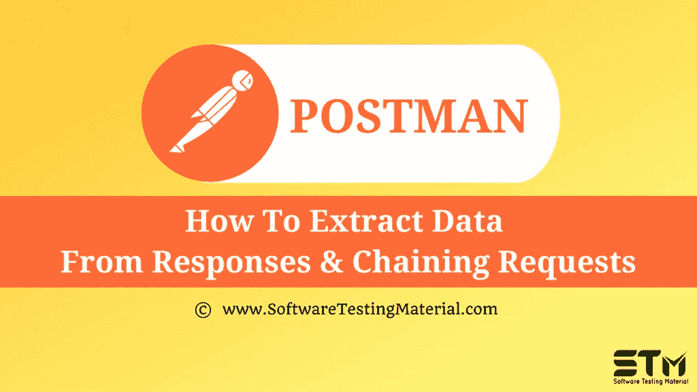

# 从响应中提取数据并链接请求

> 原文:[https://www . software testing material . com/extracting-data-from-responses-chaining-requests/](https://www.softwaretestingmaterial.com/extracting-data-from-responses-chaining-requests/)



在之前关于[邮差教程](https://www.softwaretestingmaterial.com/postman-tutorial/)的文章中，我们已经介绍了“[在请求中生成随机/动态数据](https://www.softwaretestingmaterial.com/generate-random-dynamic-data-in-postman-requests/)

在这篇“从响应和链接请求中提取数据”的文章中，我将演示如何在 postman 中从响应和链接请求中提取数据。这篇文章可以帮助你实现这个概念，并更好地理解它。

我们可以通过使用变量将信息从一个请求传递到另一个请求，这样，我们可以使我们的请求更加动态。

我们在 Tests 选项卡中保存一个变量。Tests 选项卡中的所有内容都将在请求完成后执行，因此我们可以访问响应体。我们用一个例子来理解这个。

*   API 请求 1 为**“http bin . org/uuid”**
*   生成的响应是**" uuid ":EFD SG-75 gsn-4 dfe-54 fgvdfg "**
*   我们需要从响应中获取 uuid 值，并在请求 2 中发送


*   在 API 请求 1 的“测试”标签下，

//访问响应正文

*T1】const response = pm . response . JSON()；T3】*

//保存为全局变量。其他请求也可以访问这些信息。

***pm.globals.set("orderId "，response . uuid)；*T3】**


*   API 请求 2 为**“http bin . org/post”**
*   参数化请求 2 的 JSON 主体中的 orderId 值。

```
{
"orderId": "{{orderId}}",
"products": [
                {
                        "quantity": 20,
			"productId": 3000
		},
		{
			"quantity": 10,
			"productId": 2000
		}
		]
}
```


**下一步:**

在下一个教程中学习“ [**在邮递员**](https://www.softwaretestingmaterial.com/testing-oauth2-authorization-in-postman/) 中测试 OAuth2 授权”。

**相关帖子:**

*   [邮递员教程](https://www.softwaretestingmaterial.com/postman-tutorial/)
*   [API 测试教程](https://www.softwaretestingmaterial.com/api-testing/)
*   [API 测试面试问题](https://www.softwaretestingmaterial.com/api-testing-interview-questions/)