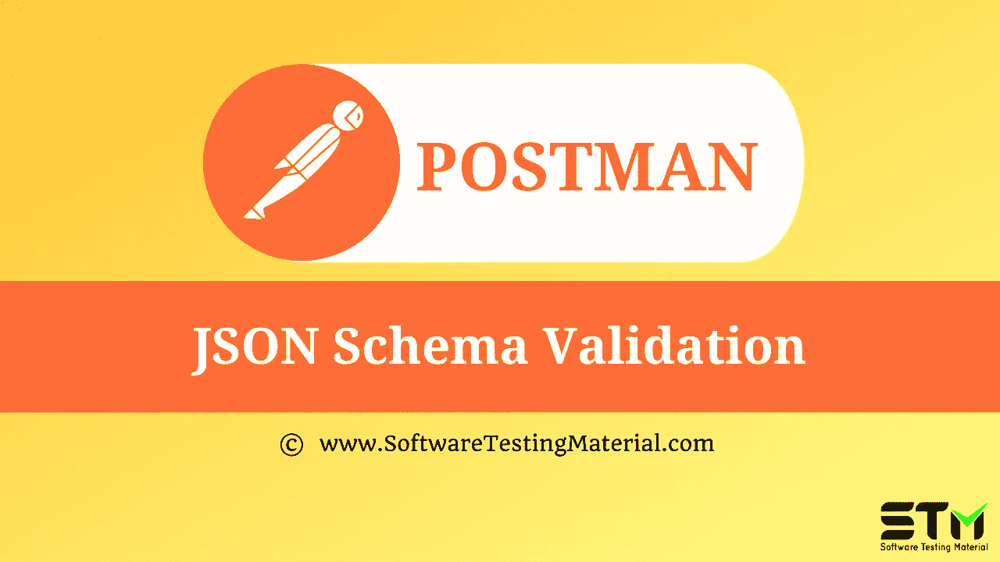

# Postman 中的 JSON 模式验证

> 原文:[https://www . software testing material . com/JSON-schema-validation-in-postman/](https://www.softwaretestingmaterial.com/json-schema-validation-in-postman/)



在之前关于[邮差教程](https://www.softwaretestingmaterial.com/postman-tutorial/)的文章中，我们已经涵盖了“[如何发送 JWT 令牌作为报头](https://www.softwaretestingmaterial.com/how-to-send-jwt-token-as-header/)

在这篇“Postman 中的 JSON 模式验证”文章中，我将演示如何实现这个概念并牢牢把握住它。

### **JSON 是什么？**

JSON 代表 JavaScript 对象符号。JSON 是一种存储和传输数据的轻量级格式。当数据从服务器发送到网页时，经常使用 JSON。JSON 不是一种编程语言。它是一种用于存储和交换数据的通用开放标准格式。JSON 是独立于语言的。

```java
"name": "John"
```

2.数据由逗号分隔:在 JSON 中，数据由逗号分隔

**举例:**

```java
});
"name": "John",<br />"age": 10,<br />"country": "USA"
```

3.对象以花括号{}开始和结束:JSON 对象被花括号{}包围

**举例:**

```java
{
"name": "John",
"age": 10,
"country": "USA"
}
```

4.数组以方括号[]开始和结束:方括号表示数组。

**举例:**

```java
{
"Students": [
{
"name": "John",
"age": 10,
"country": "USA"
},
{
"name": "Mark",
"age": 12,
"country": "USA"
}
]
}
```

### **什么是 JSON 路径？**

它是 JSON 中的特定值或数据。我们可以手动创建一个 JSON 路径，或者使用像 JSON Path finder-http://jsonpathfinder.com/这样的工具

我们只需要复制 JSON 并粘贴到工具中。

**举例:**

```java
{
"Students": [
{
"name": "John",
"age": 10,
"country": "USA"
},
{
"name": "Mark",
"age": 12,
"country": "USA"
}
]
}
```

让完整的学生数组存储在一个变量中，比如 x。

*   约翰时代的 JSON 路径是:x .学生[0]。年龄
*   JSON 路径的名字标记为:x.Students[1]。名字

**什么是 JSON 模式？**

JSON Schema 是 JSON 文档的契约，它定义了响应中每个字段的预期数据类型和格式。

它用清晰的、人和机器可读的文档描述了现有的数据格式，用于完整的结构验证，对于自动化测试和验证客户提交的数据非常有用。


**为什么需要 JSON 模式验证？**

需要 JSON 模式验证，因为:

1.  我们监控 API 响应，并确保我们得到的格式与预期的格式相同。
2.  每当 JSON 响应中出现任何重大变化时，我们都会保持警惕。
3.  我们使用 JSON 模式来构建 API 响应的模型，这使得验证 API 是否返回有效数据变得更加容易。

**JSON 对象:**

```java
[
{
"name": "John",
"age": 10
}
]
```

**JSON 模式示例:**

```java
{
"type": "array",
"items":
{
"type": "object",
"Properties":
{
"name": {"type": "string"},
"age": {"type": "integer"}
}
}
}
```

**JSON 模式验证**

模式本身是一个具有不同属性的对象。这些属性之一是**类型**。如果我们将**类型**声明为一个对象，这意味着如果我们发送一个不是对象的东西，它将无法工作。我们将使用另一个 JSON 模式验证器(Ajv)。这是最近内置在邮差。

*   去 https://jsonschema.net/home
*   在左侧添加 JSON 正文
*   单击提交
*   它将在右侧创建一个模式
*   复制模式并添加到 Postman 中的测试选项卡中，以执行模式验证
*   添加以下代码进行模式验证:

```java
pm.test("Validate schema", () => {
            pm.response.to.have.jsonSchema(schema);
});
```

*   我们已经用我们的响应创建了一个 JSON 模式，现在我们用我们的 JSON 模式验证 JSON 响应，如果任何与这个模式和 JSON 响应的属性相关的内容不匹配，测试将失败。


我们可以根据需要从右上角的齿轮图标编辑设置。我们可以改变某些事情。例如，在 Object 中，我希望有额外的属性，但不希望每个属性都是必需的。我甚至可以从关键字可见性选项中选择 JSON 模式中应该包含哪个关键字。


让我们来看看 JSON 模式验证的更多细节:

1.作为响应，对于空对象{}，验证模式测试通过。

**在测试选项卡下，**

```java
const schema = {
"type": "object"
};

pm.test("Validate schema", () => {
pm.response.to.have.jsonSchema(schema);
});
```

2.为了验证模式实际上是否有效，让我们用 Foo 代替 body。我们将得到一个 JSON 错误。所以如果主体不是 JSON，模式将失败。

3.假设我们有一个属性，在响应体中有一个字符串，而不是空体:

```java
{
 	"code": "FX002"
}
```

该架构将是有效的，因为它是一个对象。

如果我们必须测试这个属性，我们将需要向模式中添加另一个属性，这个属性称为 properties，在 properties 对象中，我们可以定义多个属性。

```java
const schema = {
"type": "object",
 "properties": {
        "code": { "type" : "string" }
    }
};

pm.test("Validate schema", () => {
pm.response.to.have.jsonSchema(schema);
});
```

当我们发送这个时，模式将是有效的。

4.如果我们有一个整数值，

```java
{
 	"code": 2
}
```

架构验证将失败。该错误会指出代码应该是一个字符串。

5.让我们看看如果将它重命名为 statusCode 会发生什么。

```java
    {
 	"statusCode": 2
    }
```

当我们运行它时，模式仍然有效，即使我们已经指定了一个名为 code 的属性，它应该是一个字符串。这就是原因，我们需要详细测试我们的模式，以确保一切正常。

在这种情况下，我们可以指定这个属性实际上是必需的。

```java
const schema = {
"type": "object",
"properties": {
        "code": { "type" : "string" }
    },
"required": ["code"]
};

pm.test("Validate schema", () => {
pm.response.to.have.jsonSchema(schema);
});
```

当我们再次发送请求时，我们会看到验证现在是正确的。它检查属性代码，在响应中，没有属性代码。因此，验证模式测试失败。错误提示“数据应该具有必需的属性‘代码’”。

6.为了限制从响应中获得的属性数量，我们在模式中指定了 **additionalProperties** 。

**举例:**

```java
{
	"code": "FX002",
	 "error": {}
}
```

如果我们希望避免使用我们不知道的属性，并且希望在响应中确实发生变化时得到通知，那么我们可以向模式添加一个额外的配置。这被称为**附加属性**。如果我们将它指定为 false，那么它将不允许附加属性。

```java
const schema = {
"type": "object",
"properties": {
        "code": { "type" : "string" }
    },
"required": ["code"],
	 "additionalProperties": false
};

pm.test("Validate schema", () => {
pm.response.to.have.jsonSchema(schema);
});
```

验证模式将失败。它说数据不应该有额外的属性。但是响应具有作为附加属性的错误。

7.假设我们在响应中有一个名为 error 的嵌套对象，而 error 本身有一个名为 message 的属性。

**举例:**

```java
{
	"code": "FX002",
	 "error": {
		"message": "Something went wrong"
}
}
```

**模式将为:**

```java
const schema = {
"type": "object",
"properties": {
        "code": { "type" : "string" },
	         "error": {
  "type": "object",
"properties": {
    "message": { "type": "string"}
},
"required": ["message"]
}
    },
"required": ["code", "error"],
	 "additionalProperties": false
};

pm.test("Validate schema", () => {
pm.response.to.have.jsonSchema(schema);
});
```

验证模式测试将通过。

8.如果我们的响应中有数组，

**举例:**

```java
{
	"code": "FX002",
	 "error": {
		"message": "Something went wrong"
},
 		"tags": ["fatal, "error"]
}
```

**模式将为:**

```java
const schema = {
"type": "object",
"properties": {
        "code": { "type" : "string" },
	         "error": {
  "type": "object",
"properties": {
    "message": { "type": "string"}
},
"required": ["message"]
},
"tags" : {
    "type": "array",
    "minItems": 1,
    "maxItems": 3,
		    "items": {
"type": "string"
}
}
    },
"required": ["code", "error"],
	 "additionalProperties": false
};

pm.test("Validate schema", () => {
pm.response.to.have.jsonSchema(schema);
});
```

验证模式测试将通过。如果我们希望至少有 1 个项目，我们将指定为**最小项目**属性，同样，我们可以指定**最大项目**。为了定义数组中项的类型，我们使用 items 属性。

**下一步:**

在下一个教程中学习邮差 中的 [**数据驱动测试。**](https://www.softwaretestingmaterial.com/data-driven-testing-in-postman/)

**相关帖子:**

*   [邮递员教程](https://www.softwaretestingmaterial.com/postman-tutorial/)
*   [API 测试教程](https://www.softwaretestingmaterial.com/api-testing/)
*   [API 测试面试问题](https://www.softwaretestingmaterial.com/api-testing-interview-questions/)