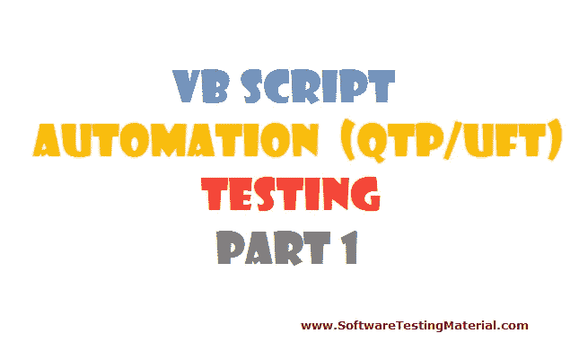

# VBScript 自动化(QTP/UFT)测试–第 1 部分

> 原文:[https://www . software testing material . com/VBScript-for-automation-qtpuft-testing-part-1](https://www.softwaretestingmaterial.com/vbscript-for-automation-qtpuft-testing-part-1)

在 VBScript–第 1 部分中，我们来看看以下主题:

[简介](#Introduction)
[先决条件](#Prerequisites)
[一般信息](#GeneralInformation)
[数据类型](#DataTypes)
[变量](#Variables)
[运算符——算术、关系、逻辑&特殊](#Operators)
[转换函数](#Conversionfunctions)
[验证函数](#Validationfunctions)



#### 简介:

VBScript(Microsoft Visual Basic Script)是微软开发的一种脚本语言。VBScript 是 QTP(快速测试专家)的脚本语言。

#### 先决条件:

计算机编程的基础知识

#### 工具:

记事本或记事本++或 EditPlus。VBScript 在线工具很多。谷歌一下，用你方便的那个。

#### 一般信息:

VBScript 是不区分大小写的语言(不区分大小写)

VBScript 是一个解释器(逐行执行)。它不是编译器(像 C++，。net、java)

在这里可以看到解释器和编译器的区别。

VBScript 也称为逐行编译器

在 windows 中，2 Injens 支持 VB 脚本文件:

**wscript.exe**(windows 脚本)——默认

**cscript.exe**(命令脚本)——如果文件丢失/损坏，使用这个。(cscript“文件名”)

有很多编辑器可以用来编写脚本。建议记事本++吧

#### 数据类型:

VBScript 只支持一种叫做 **Variant** 的数据类型。变量数据类型是一种特殊的数据类型，可以包含不同种类的信息。它在字符串上下文中用作字符串，在数值上下文中用作数值。

#### 变量:

VBScript 变量用于保存值或表达式

#### 变量名规则:

必须以字母表开头

不能包含句点(。)

不能超过 255 个字符

不得使用预定义类型(如 rem，')

不得使用特殊字符

不得包含空格

#### 变量声明:

VBScript 中的变量可以通过三种方式声明:

1.  模糊语句
2.  公开声明
3.  私人声明

**单变量:**我们如下所示声明单变量

```
Dim SoftwareTestingMaterial
```

**多个变量:**我们可以通过用逗号分隔变量来声明多个变量

```
Dim SoftwareTestingMaterial, SoftwareTestingMaterial1, SoftwareTestingMaterial2
```

最佳做法是使用 Option Explicit 语句来声明变量。有时我们可能会拼错脚本中的变量名。导致剧本失败。Option explicit 允许我们避免这个问题。

```
Option Explicit
Dim SoftwareTestingMaterial
```

**给变量赋值:**

```
Option Explicit
Dim SoftwareTestingMaterial
SoftwareTestingMaterial  = 123
```

在上面的表达式中，**软件测试材料**是一个变量， **123** 是一个值

**将字符串值赋给变量:**

```
Option Explicit
Dim SoftwareTestingMaterial
SoftwareTestingMaterial  = "stm"
```

在上面的表达式中， **SoftwareTestingMaterial** 是一个变量，**“STM”**是一个字符串值

**将数字作为字符串赋给变量:**

```
Option Explicit
Dim SoftwareTestingMaterial
SoftwareTestingMaterial  = "123"
```

**给一个变量分配多个值:**

```
Option Explicit
'Dim arrayvalue(size)
Dim SoftwareTestingMaterial(2)
```

**注:**引用数组。

#### 子数据类型:

TypeName()

它给出了变量的子数据类型

##### <u>举例:</u>

```
var="Software Testing Material"
msgbox typename(var)
```

**Different Sub Data Types available in VBScript:**

整数、字符串、双精度、日期、货币、布尔值、空、Null、错误、无

#### 操作员:

**VBScript 支持的不同运算符:**

1.  **算术运算符**
2.  **关系运算符**
3.  **逻辑运算符**
4.  **特殊操作员**

#### 算术运算符:

```
+, -, *, /, \
```

##### <u>举例:</u>

```
Dim a,b
a=20: b=10
msgbox a+b
msgbox a-b
msgbox a*b
msgbox a/b
msgbox a\b
```

#### 关系运算符:

总是返回布尔值

```
=, >, <, >=, <=, <>
```

##### <u>举例:</u>

```
Option explicit
Dim a,b
a=5: b=4
msgbox a=b
msgbox a<b
msgbox a>b
msgbox a>=b
msgbox a<=b
msgbox a<>b
```

#### 逻辑运算符:

接受作为布尔值的输入

和，或者，不是

| **答** | **B** | **系列** | **平行** | **反转** |
| **A 和 B** | **A 或 B** | **不是一个** |
| T | T | T | T | F |
| T | F | F | T | F |
| F | T | F | T | T |
| F | F | F | F | T |

#### 特殊操作员:

```
Single Quote (') - To comment
```

##### <u>举例:</u>

```
Str="Software Testing Material"
'msgbox str
```

```
Rem - To comment
```

##### <u>举例:</u>

```
str="Software Testing Material"
rem msgbox str 

& -  concatenation
```

##### <u>举例:</u>

```
str="Software Testing Material"
str1="website: "
msgbox str1 & str
```

**= – Assignment**

##### <u>举例:</u>

```
option explicit
Dim a,b,c
a=5: b=4: c=3
a=b=c
msgbox a
```

##### <u><u>例如:</u></u>

```
Option explicit
Dim a,b,c,d
a=5: b=4: c=3: d=false
a=b=c=d
msgbox a
```

<u>**Note:** The first left most “=” operator is an assignment operator and remaining all are relationship operators.

#### inputbox 函数:

```
str = Inputbox("Enter the value")
msgbox str
msgbox typename(str)
```

#### 转换功能:

它从一种有效的子数据类型转换为另一种有效的子数据类型。

**cint()**–从字符串(应该始终是数字字符串)转换为整数子类型的变量。

**cdbl()**–从字符串转换为双精度值子类型的变量

**cdate()**–将有效的日期和时间表达式转换为日期子类型的变量

**cbool()**–从字符串转换为布尔值字符串的子类型变量，可为真/假

**CSTR()**–从子类型字符串的整数转换为变量

**ccur()**–将表达式转换为货币子类型的变量

**cbyte()**–将表达式转换为子类型 byte 的变量

##### <u>举例:</u>

```
str = "123"
msgbox cint(str)
msgbox typename(str)
msgbox typename(cint(str))
```

#### 验证功能:

验证数据的类型

所有的验证函数都返回布尔值

一些重要的验证功能有

**Isnumeric()** , **Isempty()** , **Isarray()** , **Isobject()**

##### <u>举例:</u>

```
option explicit
dim a, b, res
a = inputbox("Enter the value")
b = inputbox ("Enter the value")
res=a+b
msgbox res
```

**Input:** 4 and 5

**输出:** 45

```
If isnumeric(a) and isnumeric(b) then
res = cint(a) + cint(b)
msgbox res
else
msgbox "Enter integer value"
End if 
```

我想在这里结束 VBScript-Part 1，并在下一篇文章中开始 VBScript-Part 2。

**[VBScript 系列:](https://www.softwaretestingmaterial.com/vbscript-for-automation-qtp-uft-testing/)T3】**

[用于自动化(QTP/UFT)测试的 VBScript–第 1 部分](https://www.softwaretestingmaterial.com/vbscript-for-automation-qtpuft-testing-part-1)

[用于自动化(QTP/UFT)测试的 VBScript–第二部分](https://www.softwaretestingmaterial.com/vbscript-automation-qtpuft-testing-part-2/)

[用于自动化(QTP/UFT)测试的 VBScript–第三部分](https://www.softwaretestingmaterial.com/vbscript-automation-qtpuft-testing-part-3/)

[用于自动化(QTP/UFT)测试的 VBScript–第四部分](https://www.softwaretestingmaterial.com/vbscript-for-automation-qtp-uft-testing-part4/)

[用于自动化(QTP/UFT)测试的 VBScript–第 5 部分](https://www.softwaretestingmaterial.com/vbscript-for-automation-qtp-uft-testing-part5/)</u>