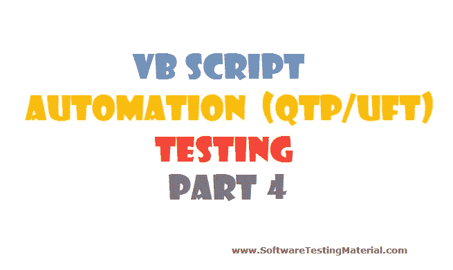

# 用于自动化(QTP/UFT)测试的 VBScript–第 4 部分

> 原文:[https://www . software testing material . com/VBScript-for-automation-qtp-uft-testing-part 4/](https://www.softwaretestingmaterial.com/vbscript-for-automation-qtp-uft-testing-part4/)

在 VBScript–第 4 部分中，我们来看看以下主题:

[字符串函数](#STRINGFUNCTIONS)
[日期&时间](#DATETIMEFUNCTIONS)

## 

让我们看看一些重要字符串函数的语法和示例:

#### UCase:

将指定的字符串转换为大写

##### 语法:

```java
Len(string | varname)
```

##### 示例:

```java
dim str
str = " Software Testing Material "
msgbox str
msgbox len(str)
```

#### 替换:

将一个字符串的指定部分替换为另一个字符串指定的次数

##### 语法:

```java
Replace(expression, find, replacewith[, start[, count[, compare]]])
```

##### 示例:

```java
dim str
str = " Software Testing Material "
msgbox str
msgbox replace(str, "A", "A", 1, 2,1)
```

#### 空间:

返回由指定数量的空格组成的字符串

##### 语法:

```java
Space(number)
```

##### 示例:

```java
dim str
str = " Software Testing Material "
msgbox str
msgbox str &amp; space(10) &amp; str
```

#### 左侧:

从字符串的左侧返回指定数量的字符

##### 语法:

```java
Left(string, length)
```

##### 示例:

```java
dim str
str = " Software Testing Material "
msgbox str
msgbox left(str, 5)
```

#### 右:

从字符串的右侧返回指定数量的字符

##### 语法:

```java
Right(string, length)
```

##### 示例:

```java
dim str
str = " Software Testing Material "
msgbox str
msgbox right(str, 5)
```

#### Mid:

从字符串中返回指定数量的字符

##### 语法:

```java
Mid(string, start[, length])
```

##### 示例:

```java
dim str
str = " Software Testing Material "
msgbox str
msgbox mid(str, 5, 9)
```

#### 修剪:

移除字符串左侧和右侧的空格

##### 语法:

```java
Trim(string)
```

##### 示例:

```java
dim str
str = " Software Testing Material "
msgbox str
msgbox len(trim(str))
```

#### LTrim:

移除字符串左侧的空格

##### 语法:

```java
LTrim(string)
```

##### 示例:

```java
dim str
str = " Software Testing Material "
msgbox str
msgbox len(ltrim(str))
```

#### RTrim:

移除字符串右侧的空格

##### 语法:

```java
RTrim(string)
```

##### 示例:

```java
dim str
str = " Software Testing Material "
msgbox str
msgbox len(rtrim(str))
```

#### StrReverse:

它反转一个字符串

##### 语法:

```java
StrReverse(string)
```

##### 示例:

```java
dim str
str = " Software Testing Material "
msgbox str
msgbox strreverse(str)
```

#### 仪器:

返回一个字符串在另一个字符串中第一次出现的位置

##### 语法:

```java
InStr([start, ]string1, string2[, compare])
```

##### 示例:

```java
dim str
str = " Software Testing Material "
msgbox str
msgbox instr(1,str, "Testing",1)
```

#### InStrRev:

返回一个字符串在另一个字符串中第一次出现的位置。搜索从字符串的最后一个字符开始

##### 语法:

```java
InStrRev(string1, string2[, start[, compare]])
```

##### 示例:

```java
dim str
str = " Software Testing Material "
msgbox str
msgbox instrrev(str, "Testing", len(str),1)
```

#### StrComp:

比较两个字符串并返回一个表示比较结果的值

##### 语法:

```java
StrComp(string1, string2[, compare])
```

##### 示例:

```java
dim str
str = " Software Testing Material "
msgbox str
msgbox strcomp(str, "Testing",1)
```

#### 分割:

它返回一个数组，该数组包含根据分隔符拆分的特定数量的值

##### 语法:

```java
Split(expression[, delimiter[, count[, compare]]])
```

##### 示例:

```java
dim str
str = " Software Testing Material "
msgbox str
A=split(str)
for i =0 to ubound(A)
msgbox A(i)
next
```

## [日期&时间函数:](#DATETIMEFUNCTIONS)

让我们看看一些重要的日期和时间函数的语法和示例:

#### 现在:

返回当前系统日期和时间

##### 语法:

```java
Now
```

##### 示例:

```java
msgbox now
```

#### 日期:

返回当前系统日期

##### 语法:

```java
Date
```

##### 示例:

```java
msgbox date
```

#### 时间:

返回当前系统时间

##### 语法:

```java
Time
```

##### 示例:

```java
msgbox time
```

#### DateAdd:

返回添加了指定时间间隔的日期

##### 语法:

```java
DateAdd(interval, number, date)
```

##### 示例:

```java
msgbox DateAdd("YYYY", 1, now)
```

#### DateDiff:

返回两个指定日期之间的间隔数

##### 语法:

```java
DateDiff(interval, date1, date2 [,firstdayofweek[,firstweekofyear]])
```

##### 示例:

```java
msgbox DateDiff("YYYY", now, dateadd("YYYY", 1, now))
```

#### 开始日期:

返回给定日期的指定部分

##### 语法:

```java
DatePart(interval, date[, firstdayofweek[, firstweekofyear]])
```

##### 示例:

```java
msgbox DatePart("YYYY",now)
```

#### 日期:

返回表示一个月中某一天的数字

##### 语法:

```java
Day(date)
```

##### 示例:

```java
msgbox day(now)
```

#### 月份:

返回一个代表一年中的月份的数字

##### 语法:

```java
Month(date)
```

##### 示例:

```java
msgbox month(now)
```

#### MonthName:

返回指定月份的名称

##### 语法:

```java
MonthName(month[, abbreviate])
```

##### 示例:

```java
msgbox monthname(month(now))
```

#### 工作日:

返回一个表示一周中某一天的数字

##### 语法:

```java
Weekday(date, [firstdayofweek])
```

##### 示例:

```java
msgbox weekday(now)
```

#### 星期名称:

返回一周中指定日期的星期名称

##### 语法:

```java
WeekdayName(weekday, abbreviate, firstdayofweek)
```

##### 示例:

```java
msgbox weekdayname(weekday(now))
```

#### 年份:

返回一个表示年份的数字

##### 语法:

```java
Year(date)
```

##### 示例:

```java
msgbox year(now)
```

#### 小时:

返回一个表示一天中某小时的数字

##### 语法:

```java
Hour(time)
```

##### 示例:

```java
msgbox hour(time)
```

#### 分钟:

返回一个表示一小时中某一分钟的数字

##### 语法:

```java
minute(time)
```

##### 示例:

```java
msgbox<span style="line-height: 1.5;"> minute(time)</span>
```

#### 第二:

返回一个表示分钟的秒的数字

##### 语法:

```java
Second(time)
```

##### 示例:

```java
msgbox second(time)
```

#### TimeSerial:

返回特定小时、分钟和秒的时间

##### 语法:

```java
TimeSerial(hour, minute, second)
```

##### 示例:

```java
msgbox timeserial(2,00,1)
```

#### TimeValue:

返回时间

##### 语法:

```java
TimeValue(time)
```

##### 示例:

```java
msgbox timevalue(time) 
```

I would like to conclude VBScript – Part 4 here and will start [VBScript – Part 5](https://www.softwaretestingmaterial.com/vbscript-for-automation-qtp-uft-testing-part5/) in the next post.

**VBScript 系列:**

[用于自动化(QTP/UFT)测试的 VBScript–第 1 部分](https://www.softwaretestingmaterial.com/vbscript-for-automation-qtpuft-testing-part-1)

[用于自动化(QTP/UFT)测试的 VBScript–第二部分](https://www.softwaretestingmaterial.com/vbscript-automation-qtpuft-testing-part-2/)

[用于自动化(QTP/UFT)测试的 VBScript–第三部分](https://www.softwaretestingmaterial.com/vbscript-automation-qtpuft-testing-part-3/)

[用于自动化(QTP/UFT)测试的 VBScript–第四部分](https://www.softwaretestingmaterial.com/vbscript-for-automation-qtp-uft-testing-part4/)

[用于自动化(QTP/UFT)测试的 VBScript–第 5 部分](https://www.softwaretestingmaterial.com/vbscript-for-automation-qtp-uft-testing-part5/)