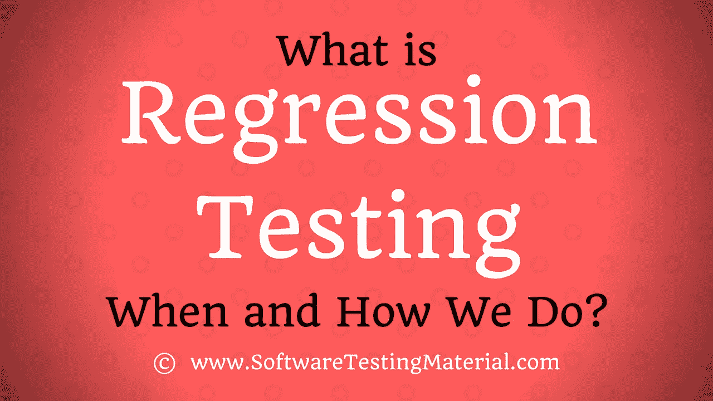

# 什么是回归测试|定义、工具、如何执行

> 原文:[https://www.softwaretestingmaterial.com/regression-testing/](https://www.softwaretestingmaterial.com/regression-testing/)

在本**回归测试**指南中，我们将了解什么是回归测试以及以下内容。

<button class="kb-table-of-contents-title-btn kb-table-of-contents-toggle" aria-expanded="false" aria-label="Expand Table of Contents">Table of Contents</button>

*   [什么是带实例的回归测试？](#What-is-Regression-Testing)
    *   [回归测试示例](#regression-testing-example)
*   回归测试有哪些类型？
    *   [#1。单位回归](#1-unit-regression)
    *   [#2。部分回归](#2-partial-regression)
    *   [#3。完全回归](#3-complete-regression)
*   [回归测试技术](#regression-testing-techniques)
    *   [#1。全部重新测试](#1-retest-all)
    *   [#2。回归测试选择](#2-regression-test-selection)
    *   [#3。测试用例优先级](#3-test-case-prioritization)
*   [重测和回归测试的区别](#difference-between-retesting-and-regression-testing)
*   我们什么时候做回归检查？
    *   [#1。当新功能被添加到应用程序中时](#1-when-new-functionalities-are-added-to-the-application)
    *   [#2。当有变更需求时(CR)](#2-when-there-is-a-change-requirement-cr)
    *   [#3。当有缺陷修复时](#3-when-there-is-a-defect-fix)
    *   [#4。当有性能问题修复时](#4-when-there-is-a-performance-issue-fix)
    *   [#5。当环境发生变化时](#5-when-there-is-an-environment-change)
*   我们如何执行回归测试？
*   [自动化回归测试](#automated-regression-testing)
*   [回归测试的挑战是什么](#what-are-the-challenges-of-regression-testing)
    *   [#1。右工具](#1-right-tool)
    *   [#2。资源](#2-resources)
    *   [#3。耗时](#3-time-consuming)
    *   [#4。测试覆盖范围](#4-test-coverage)
*   [什么是再生测试期间的配置管理](#what-is-configuration-management-during-regreesion-testing)
*   [敏捷中的回归测试](#regression-testing-in-agile)
*   [回归测试的最佳实践](#best-practices-of-regression-testing)
*   [自动化回归测试工具](#Regression-Testing-Tools)
    *   [#1。Selenium](#1-selenium)
    *   [二号。加泰隆尼亚人](#2-katalon)
    *   [#3\. Ranorex](#3-ranorex)
*   [优缺点](#h-advantages-and-disadvantages)
    *   [回归测试的优势](#h-advantages-of-regression-testing)
    *   [回归测试的缺点](#h-disadvantages-of-regression-testing)
*   [结论](#conclusion)

## **什么是带实例的回归测试？**

回归测试是[软件测试](https://www.softwaretestingmaterial.com/software-testing/)的一种，旨在识别之前工作正常的软件代码中的错误。

该测试通常在添加或修改新代码后执行，以确保新代码不会破坏现有功能。

回归测试可以手动或自动运行，有各种工具可以帮助这两种方法。

> **亦读:** [什么是复试？我们什么时候重新测试？](https://www.softwaretestingmaterial.com/retesting/)

回归测试让开发人员相信在修改产品代码后不会破坏功能。

它确保没有意外的副作用。希望你已经理解了什么是回归测试。现在让我们看看什么时候进行这种[类型的测试](https://www.softwaretestingmaterial.com/types-of-testing/)。

### **回归测试示例**

假设有一个应用程序具有“添加”、“保存”和“删除”的功能。这些功能允许用户添加数据、保存数据和删除数据。现在，开发人员正在开发一个新功能，即“更新”。该功能允许用户编辑和更新数据。作为测试人员，你必须验证一个新特性的引入(即更新)是否影响现有特征(例如“添加”、“保存”和“删除”功能)。

查看下面的视频，看看“**这是什么&我们什么时候开始**

[https://www.youtube.com/embed/4MtsWBxCPHw?rel=0](https://www.youtube.com/embed/4MtsWBxCPHw?rel=0)

请耐心等待。视频将在一段时间后加载。

如果你喜欢这个视频，那么请[订阅我们的 YouTube 频道](https://www.youtube.com/channel/UCIJGI_3XgnfUaSNQD8D2IMQ?sub_confirmation=1)获取更多视频教程。

## 回归测试有哪些类型？

回归测试有三种类型。

1.  单位回归
2.  偏回归
3.  完全回归

### **#1。单位回归**

**单元回归测试**在单元测试阶段完成，代码作为一个独立的单元进行测试。如果有的话，依赖关系会被暂时阻塞，以便独立地测试单元。

在这里，我们将只测试被改变的单元，而不是影响区域，因为它可能会影响同一个模块的组件。

假设有一个表单接受用户的详细信息，如名字(只接受最多 10 个字符的字母)、姓氏(只接受最多 10 个字符的字母)、Emai Id(接受最多 30 个字符的字母、数字和特殊字符)。

基于测试用例设计技术，一旦构建发布，测试人员就测试上面的表单。

一旦开发团队发布了构建版本( **B0001** )，测试人员就开始测试这个构建版本，以验证表单是否按预期工作。

如果客户要求对表格进行一些修改，比如名字和姓氏字段应该接受最多 15 个字符，而不是之前给定的 10 个字符。

开发人员将修改功能并发布另一个版本( **B0002** )，测试人员在这里只测试名字和姓氏是否接受最多 15 个字符，而不会检查第一个版本的任何其他特性( **B0001** )。

这里，测试人员确信名字和姓氏字段中字符数的增加不会影响表单的功能，所以他们只测试字符数。

仅测试修改的特征被称为**单元再润滑测试**。

### **#2。部分回归**

**部分回归测试**是指在一个模块上进行回归测试，其中代码的变化与该特定模块相关，并且不会对其他模块产生任何影响。

也称为**区域回归测试**。

假设我们有登录页面以及用户详细信息表单。如果测试人员在表单功能中发现缺陷( **D0001** )并报告。

开发人员修复它并发布另一个包含 bug 修复的版本(比如说 **B0003** )。

在测试版本( **B0003** )时，测试人员发现用户详细信息表单中的错误修复会影响登录页面。

因此测试人员首先测试 bug 修复，然后测试登录页面功能。

> **Pro Tip:** 无论何时发布一个构建，作为测试人员，你都需要遵循这个顺序——执行冒烟测试，测试新发布的特性，测试修改的特性，重新测试 bug，通过执行**区域回归测试**来测试影响区域。

### **#3。完全回归**

**完全回归测试**是指当对许多模块进行回归测试时，其中代码的变化与其他模块相关是不确定的。

它也被称为**完全回归测试**。

如果在构建中有新的特性和一些错误修复。测试团队将进行影响分析。如果他们确定新的构建将导致测试整个应用程序，那么他们将测试新的特性以及所有现有的特性。

## **回归测试技术**

软件维护是修改软件应用程序的过程，包括改进、修复错误、删除现有功能和优化。当我们进行这些修改时，系统可能无法正常工作。为了避免修改代码时出现问题，我们遵循回归测试技术。这些技术帮助我们消除与修改代码相关的风险。

以下是各种技术。

1.  全部重新测试
2.  回归测试选择
3.  测试用例优先级

### **#1。全部重新测试**

重新执行现有测试桶或测试套件中的所有测试用例，以验证没有由于修改代码而发生的错误。

这是一种非常昂贵的方法，因为与其他技术相比，它需要大量的时间和资源。

### **#2。回归测试选择**

通过使用回归测试选择技术，我们从测试套件中选择一部分测试用例来运行，以验证修改后的代码是否影响应用程序，而不是重新执行整个测试套件。从测试套件中选择测试用例是基于修改后的代码完成的。选择的测试用例分为两部分，如可重用测试用例和过时测试用例。

**可重用测试用例—**可以在后续回归周期中使用的测试用例。

**过时的测试用例—**不能在后续回归周期中使用的测试用例。

### **#3。测试用例优先级**

通过使用这种技术，我们首先选择高优先级的测试用例来运行，而不是中低优先级的测试用例。测试用例的优先级取决于其业务影响、频率和关键程度。

## **重测和回归测试的区别**

**再测试**是一种再次测试功能或 bug 的测试类型，以确保在早期版本中发现并发布的缺陷在最新版本中得到修复。

**回归测试**是一种测试类型，在修改后对已经测试过的程序进行重复测试，以发现由于被测软件或另一个相关或不相关软件组件的变化而引入或暴露的任何缺陷。

大多数时候，测试人员会对回归和重测感到困惑。作为测试人员，你必须记住这些回归测试和重测是不同的。你可以在这里详细阅读[回归测试与再测试](https://www.softwaretestingmaterial.com/difference-between-regression-and-retesting/)之间的差异的完整列表。

## 我们什么时候做回归检查？

面试官可能会问你为什么要做回归测试。每当产品代码被修改时，我们就进行软件回归测试。通常，我们会在以下情况下执行回归测试:

这里是一些回归测试的例子。

### **#1。当新功能被添加到应用程序中时**

**举例:**一个网站有登录功能，允许用户只用电子邮件登录。现在，新功能看起来就像“提供一个使用脸书登录的新功能”。

### **#2。当有变更需求时(CR)**

**示例:**记住密码应该从之前可用的登录页面中删除。

### **#3。当有缺陷修复时**

**示例:**假设登录页面上的登录按钮不起作用，测试人员报告了一个错误，指出登录按钮坏了。一旦开发人员修复了 bug，测试人员就会对其进行测试，以确保登录按钮是否按照预期的结果工作。同时，测试人员测试与登录按钮相关的其他功能。

### **#4。当有性能问题修复时**

**举例:**加载首页需要 5 秒钟。将加载时间减少到 2 秒。

### **#5。当环境发生变化时**

**示例:**将数据库从 MySQL 更新到 Oracle。

到目前为止，我们已经了解了什么是回归，以及何时回归。现在让我们看看我们是怎么做的。

## 我们如何执行回归测试？

执行回归测试的步骤是

*   **步骤#1:** 清楚了解软件有哪些变化
*   **步骤#2:** 分析修改后的代码可能会影响软件的哪个部分
*   第三步:确定你是否必须遵循哪种类型的回归，如单位回归、部分回归或完全回归。
*   **步骤#4:** 执行选中的测试用例。

## **自动化回归测试**

回归测试通常是极其乏味和耗时的。

我们在每次部署后都进行回归，因此自动化测试用例会比每次都手动运行更容易。

如果我们有数以千计的测试用例，最好为我们在每次构建时做的测试用例创建自动化测试脚本(即回归测试)

自动化回归测试是最佳实践，是组织节省大量时间和运行每夜构建的选择。

当使用自动化进行回归测试时，考虑测试运行的频率是很重要的。

例如，如果代码库不断变化，那么可能有必要每晚运行一次测试。或者，如果代码只是偶尔更改，也可以不那么频繁地运行测试。

当自动化被用于回归测试时，考虑假阳性的影响也很重要。

假阳性是指测试错误地报告了一个 bug 或错误。

这可能由于各种原因而发生，例如环境的变化、不再使用的代码或者不正确的测试用例。

如果误报处理不当，会导致重大问题，例如浪费时间和资源去调查实际上并不存在的 bug。

## **回归测试的挑战是什么**

尽管回归测试在 QA 过程中起着至关重要的作用，但是在执行回归测试时还是有一些挑战。

### **#1。右工具**

选择合适的工具在回归测试自动化的成功中起着关键的作用。如果我们选择了一个不合适的工具，那么回归测试自动化将会变得耗时，并且不会产生好的 ROI。

### **#2。资源**

为了以适当的方式利用所选择的工具来产生良好的 ROI，我们需要拥有能够有效使用该工具的熟练资源。

### **#3。耗时**

回归测试包括一次又一次地运行相同的测试用例。它导致大型测试套件，并消耗更多的时间来完成测试执行。有时由于时间限制，我们可能不会运行整个回归测试套件。

### **#4。测试覆盖范围**

为了克服时间消耗，我们必须最小化测试套件。当最小化测试套件时，我们可能无法实现最大的测试覆盖率。

## **什么是再生测试期间的配置管理**

在敏捷环境中，当代码频繁变更时，回归测试中的配置管理变得至关重要。

为了创建一个有效的回归测试，我们必须遵循这些步骤:

*   在回归测试阶段，不允许对代码进行任何修改。开发人员的变更必须远离回归测试代码。
*   回归测试数据必须保持隔离。不允许对数据库进行任何修改。
*   被测试的代码应该在配置管理工具下。

> **必读:** [配置测试教程](https://www.softwaretestingmaterial.com/configuration-testing/)

## **敏捷中的回归测试**

如今，大多数组织都在遵循敏捷实践。敏捷以迭代和增量的方式工作。开发人员开发新的功能，并在每 2-4 周发布一次。在敏捷中，每 2-4 周肯定会有一次代码变更。在这种情况下，回归测试有助于在每次迭代中测试新的代码变化，以确保被测试的应用程序在每次迭代后继续正确执行。

## **回归测试的最佳实践**

下面是进行测试时要遵循的一些最佳实践。

*   选择导致常见缺陷的测试用例。
*   选择对用户更具可见性的工作流。
*   在冒烟和健全性测试之后进行回归测试。
*   在功能测试结束时进行回归测试。
*   手边有一个回归测试计划。
*   定期运行回归测试用例，以避免下一次构建中的发布风险。
*   使用合适的工具加速测试过程。
*   选择所有集成测试用例、复杂测试用例、边界值测试用例。

> **必读:** [要自动化的测试用例类型](https://www.softwaretestingmaterial.com/test-cases-to-be-automated/)和[不要自动化的测试用例类型](https://www.softwaretestingmaterial.com/test-cases-not-to-be-automated/)

## **自动化回归测试工具**

在大多数情况下，软件经历频繁的变化，我们花费了大量的时间来执行这些回归测试用例，这导致了高成本和耗时。

为了避免这些问题，我们可以选择自动化回归测试。

自动化测试是一种高效且经济地运行回归测试的好方法。这也有助于测试人员不去测试那些重复和枯燥的测试。

一般来说，回归测试套件必须经常更新。因此，在根据您的需求选择工具时，请确保该工具能够更新测试套件。

这里有一些回归测试的工具，可以帮助你高效快速地自动化你的回归测试用例。

### **#1。Selenium**

Selenium 是一个免费的开源测试自动化工具，用于自动化 web 应用程序。它可以用于在所有主流浏览器上测试基于网络的应用程序，包括 Firefox、Chrome、Internet Explorer、Safari 和 Opera。Selenium 还可以用来[测试 Android 和 iOS 平台上的移动应用](https://www.softwaretestingmaterial.com/mobile-app-testing-guide/)。

[Learn Selenium](https://www.softwaretestingmaterial.com/selenium-tutorial/)

### **二号。加泰隆尼亚人**

Katalon Studio 是一个强大的自动化测试工具，可以用于 web 测试和移动测试。它支持许多流行的编程语言，如 Java、Python、Ruby、Groovy 和 C#。它通过自动化 web、API 和移动测试来帮助测试人员节省时间和金钱。

它配备了卡塔龙录音机，作为一个记录和回放工具。

Katalon Studio IDE 支持用 Java 和 groovy 创建测试用例。

[Learn Katalon](https://www.softwaretestingmaterial.com/katalon-studio-tutorial/)

### **#3\. Ranorex**

Ranorex Studio 是一个无代码的测试自动化工具，它使测试人员能够为桌面、web 和移动应用程序创建、维护和执行自动化测试。Ranorex 提供了端到端测试自动化的一体化解决方案，包括对 Ranorex Studio 的支持——一种用于创建和维护 Ranorex 测试用例的集成开发环境(IDE)。

Ranorex 还集成了流行的持续集成(CI)系统，如 Jenkins 和 TeamCity，从而可以轻松设置自动化测试工作流。Ranorex 支持在多种平台上进行测试，包括 Windows、macOS 和 Linux。Ranorex 测试可以在物理设备或仿真器/模拟器上执行。

[Learn Ranorex](https://www.softwaretestingmaterial.com/selenium-tutorial/)

> **必读:** [最佳回归测试工具](https://www.softwaretestingmaterial.com/regression-testing-tools/)

## **优缺点**

### **回归测试的优势**

*   它可以自动化。
*   检查代码更改，以确保它们不会对其他功能产生负面影响。
*   它提高了应用程序的质量。
*   确保已经修复的问题和错误不会重复出现。
*   在测试过程中，它作为一种降低风险的方法。

### **回归测试的缺点**

*   如果没有自动化，回归测试可能是一项耗时的任务。
*   软件代码中的每一个小变化都必须这样做。
*   我们需要设计复杂的测试用例来执行回归测试。
*   在敏捷冲刺的每一次，回归测试都应该重复。

## **结论**

回归测试节省了时间和金钱。它通过确保代码变更不会影响现有的功能来帮助组织交付高质量的产品。

如果你有任何关于回归测试的问题，请在下面评论。

**相关帖子:**

*   [手动测试教程](https://www.softwaretestingmaterial.com/manual-testing-tutorial/)
*   [单元测试教程](https://www.softwaretestingmaterial.com/unit-testing/)
*   [集成测试教程](https://www.softwaretestingmaterial.com/integration-testing/)
*   [功能测试教程](https://www.softwaretestingmaterial.com/functional-testing/)
*   [系统测试教程](https://www.softwaretestingmaterial.com/system-testing/)