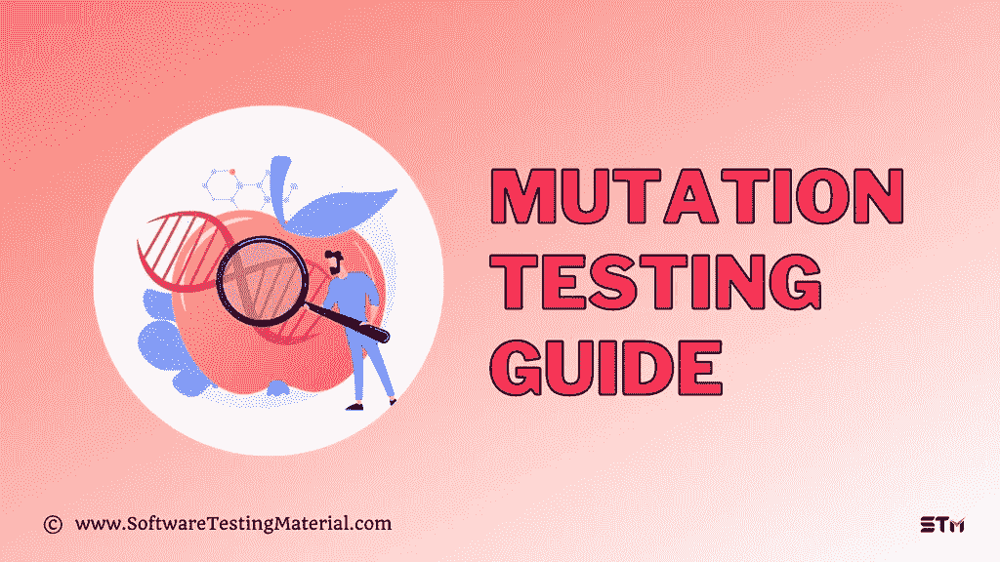

# 突变测试指南:你应该知道什么

> 原文:[https://www.softwaretestingmaterial.com/mutation-testing/](https://www.softwaretestingmaterial.com/mutation-testing/)

如果你刚刚开始学习突变测试的概念，这里是了解什么是突变，什么是突变测试，以及以下内容的地方。

<button class="kb-table-of-contents-title-btn kb-table-of-contents-toggle" aria-expanded="false" aria-label="Expand Table of Contents">Table of Contents</button>

*   [什么是突变](#h-what-is-mutation)
*   [变种人状态](#h-mutants-state)
*   [什么是突变测试](#h-what-is-mutation-testing)
*   [突变检测类型](#h-mutation-testing-types)
    *   [值突变](#h-value-mutation)
    *   [语句突变](#h-statement-mutation)
    *   [决定突变](#h-decision-mutation)
    *   [突变分数:](#h-mutation-score)
    *   [其他突变指标](#h-other-mutation-metrics)
*   [突变检测的好处](#h-mutation-testing-benefits)
*   [如何进行突变测试](#h-how-to-perform-mutation-testing)
*   [变异测试工具](#h-mutation-testing-tools)
*   [突变测试的优势](#h-advantages-of-mutation-testing)
*   [突变测试的缺点](#h-disadvantages-of-mutation-testing)
*   [结论](#h-conclusion)

## **什么是突变**

突变(故障)可以定义为源代码中微小但故意的修改；这些小的修改是针对编码过程中出现的典型低级错误而设计的。

源代码发生了变异，即程序中的微小变化。我们将看到一个不同之处，[测试数据](https://www.softwaretestingmaterial.com/big-data-testing/)是通过突变体运行的。变种人也被称为**变异程序**。

变异程序可以简单地定义为源代码的变异版本。换句话说，它通过重写源代码将故障注入程序。很少有错误被植入到源代码中，以发现代码中的歧义。当测试数据通过突变程序运行时，我们应该会得到与源代码不同的结果。

这是一个[单元测试](https://www.softwaretestingmaterial.com/unit-testing/)方法。它使用故障注入方法将突变体插入到程序中。

简单地说，相互测试测试了测试用例的效率。

突变测试可以用四个简单的步骤来完成，它们如下

1.  用变种人修改源代码。
2.  为那些特定的领域开发测试用例。
3.  运行原始程序和变异程序的测试用例。
4.  比较结果

突变测试的目标是:

*   找到一组不合适的代码。
*   识别隐藏的缺陷，这些缺陷不能用其他测试方法检测出来。
*   识别新种类的[错误或 bug](https://www.softwaretestingmaterial.com/difference-between-defect-bug-error-and-failure/)。
*   来计算变异分数。
*   检查测试用例的覆盖率和有效性。

## **突变检测类型**

突变测试有几种类型，每一种都有自己的目标和用途。

1.  值突变包括用大值替换小值，即修改不同的值
2.  语句变异是通过改变源代码中的语句来实现的。
3.  决策变异通过改变待识别缺陷的逻辑、算术和关系操作符来识别缺陷。

### **值突变**

在这种类型的变异中，主要参数的值被改变以检查程序的输出。

**原始代码:**

*int num = 101；*
*int x = 98765432；*
*int y = 12345 678；*
*int z =(x+y)% num；*

**突变代码:**

*int num = 1000000；*
*int x = 98765432；*
*int y = 12345 678；*
*int z =(x+y)% num；*

### **语句突变**

在这种类型的变异中，一个语句可以被编辑、删除或重新排列。代码中的这一修改对输出有一定的影响。

**原始代码:**

*if(x<y)*
T3】z = 20；
*else*
*z = 30；*

**突变代码:**

*if(x<y)*
T3】w = 20；
*else*
*w = 30；*

### **决定突变**

在这种类型的变异中，改变逻辑或算术运算符来检测程序中的错误。

**原始代码:**

*if(x>y)*
T3】z = 20；
*else*
*z = 30；*

**变异代码:**

*if(x<y)*
T3】z = 20；
*else*
*z = 30；*

### **突变分数:**

如果我们杀死了程序中的所有变种人，我们可以说我们已经为程序提供了完整的覆盖范围。

*   变异分数可以定义为覆盖量。
*   在这里，我们将突变体视为测试要求。
*   我们使用随机抽样来分配程序中突变体的数量，因此是随机抽样

突变分数可以定义为杀死的突变体占突变体总数的百分比。

*突变得分=(杀死的突变体/突变体总数)* 100*

如果突变分数是 100%,那么测试用例就足够了。这是度量测试用例充分性的有效方法。但是产生突变体和为每个突变体程序执行测试用例可能是密集的，并且需要巨大的成本。

### **其他突变指标**

#### **检测到**

这是我们的试验检测到的突变体的数量，即被杀死的突变体。

*杀死变种人+超时*

#### **未被发现**

它是我们的试验没有检测到的突变体的数量，即存活的突变体。

*幸存突变体+无覆盖*

#### **已覆盖**

这是我们的测试产生代码覆盖率的突变体的数量。

*检测到的突变体+存活的突变体*

#### **有效**

它是有效变种人的数量，它们没有出现编译错误或运行时错误

*检测到的突变体+未检测到的突变体*

#### **无效**

它是所有无效变种人的数量。它们无法被测试，因为它们会产生编译错误或运行时错误。

*运行时错误+编译错误*

#### **全部变种人**

它包含了所有的变种人，它专注于一切。

*有效+无效+忽略*

#### **突变分数**

它会计算出被杀死的变异体总数的百分比。

*检测到/有效* 100*

#### **基于覆盖代码的变异分数**

它根据代码覆盖率评估被杀死的突变体的总百分比

*检测/覆盖* 100*

#### **不正确的语法**

他们被称为死产突变体，这是一个语法错误。通常，编译器会检测到这些错误。

让我们看一个代码的例子，其中我们在原始代码中引入了一个语法错误。如果我们得到一个编译器错误，那么突变体被检测到。

**原始代码:**

*读取数字*
*如果数字< 100*
*Type =两位数()*
*结束如果*

**突变程序:**

*读取数字*
*如果数字%% 100*
*Type =两位数()*
*结束如果*

#### **等效变种人**

当一个突变体具有与原始代码相同的语义时，它就是一个等价的突变体。

**原始代码:**

*int I = 0；*
*而(……)*
*{*
*……。；*
*i++；*
*if(I = = 10)*
*break；*
*}*

**突变代码:**

*int I = 0；*
*而(……)*
*{*
*……。；*
*i++；*
*if(I>= 10)*
*break；*
*}*

#### **微不足道的变种人**

顾名思义，普通的变种人不会对程序做任何事情。任何测试案例都可以杀死这些变种人。如果在测试结束时仍然有测试用例，那么它就是一个无效的突变体。

**举例:**

*读取数字*
*如果数字= 10*
*删除赋值语句*
*结束如果*

## **突变检测的好处**

*   突变测试通过关注新类型的错误来帮助团队。
*   突变测试可能非常强大，因为它有助于识别隐藏的缺陷，而这些缺陷使用传统的测试技术是不可能识别的。
*   突变测试使得产品的维护和调试更加容易。
*   突变测试是验证任何产品的最全面的技术。
*   变异测试可以检测出源代码中的所有漏洞
*   突变测试对于评估测试策略的有效性非常有用

## **如何进行突变测试**

第一步:团队会引入一些变种人。源代码的错误。程序中的单个错误有助于我们理解程序中的薄弱环节和测试用例的有效性。

**第二步:**通常自动化脚本是通过程序运行的。用于测试原始程序的脚本在原始程序和变异程序中运行。当两个测试并行运行时，测试用例/测试脚本应该足够有效地识别程序中的缺陷，这有助于我们找到代码薄弱的确切位置。

第三步:然后团队比较原始程序和变异程序的结果。

**步骤 4:** 如果测试结果不同，即缺陷被识别，那么测试用例/测试脚本将杀死该突变体。测试用例/测试脚本足以有效地检测原始程序和变异程序之间的差别。

**第五步:**如果输出没有差异，说明突变体还活着。团队试图识别测试用例/测试脚本中的薄弱区域，以便在下一次杀死突变体。

## **变异测试工具**

人工执行突变测试非常耗时且复杂。明智的做法是使用自动化工具来加速这个过程。

他们还有助于减少团队的成本和时间。这些工具将帮助我们处理突变体的产生。下面列出了几种突变体测试工具:

*   Stryker Mutator
*   混乱
*   凹陷
*   投保++吧。
*   纠缠
*   MuClipse

## **突变测试的优势**

*   它增加了代码的可信度，因为它转化为稳定可靠的系统
*   因为突变测试，客户得到最稳定可靠的系统。
*   变异测试帮助团队检测源代码中的所有错误
*   突变测试揭示了初级阶段源代码中的歧义。
*   变异测试提供了源程序的高覆盖率。
*   软件产品的整体质量得到了提高。
*   代码和测试数据中的漏洞可以通过突变测试来识别。
*   客户获得安全可靠的产品

## **突变测试的缺点**

*   突变测试需要大量的时间和资源，这增加了过程的成本。
*   突变测试执行起来可能有点复杂，所以应该自动化。
*   由于更改是在代码级别完成的，因此变异测试不能手动完成，黑盒测试不能用于此测试。
*   当引入一个变种时，程序必须从头到尾进行测试，以查看其副作用，自动化套件应该具有良好的覆盖率。
*   许多变种程序会要求对照原始测试套件进行测试。
*   由于使用随机采样和选择性突变产生了大量的突变体，因此这将是计算密集型的。

## **结论**

如果您的产品需要详尽的测试，并且您的自动化套件是高效的，您可以随时进行突变测试。因为它是测试任何程序的最全面的技术，因为它在代码级别测试产品。它用于验证测试用例的效率。但这可能是一项耗费时间和资源的活动。只有当您拥有合适的自动化工具和需求来完成最大的代码覆盖率时，您才能去做

**相关帖子:**

*   [Salesforce 测试指南](https://www.softwaretestingmaterial.com/salesforce-testing/)
*   [SOA 测试指南](https://www.softwaretestingmaterial.com/soa-testing/)
*   [SaaS 测试指南](https://www.softwaretestingmaterial.com/saas-testing/)
*   [100 多种软件测试——终极清单](https://www.softwaretestingmaterial.com/types-of-software-testing/)
*   [Java 教程——初学者指南](https://www.softwaretestingmaterial.com/java-tutorial/)
*   [众包和外包——最佳 QA 实践](https://www.softwaretestingmaterial.com/crowdsourcing-and-outsourcing-qa-practices/)
*   [什么是白盒测试及其类型并举例说明？](https://www.softwaretestingmaterial.com/white-box-testing/)