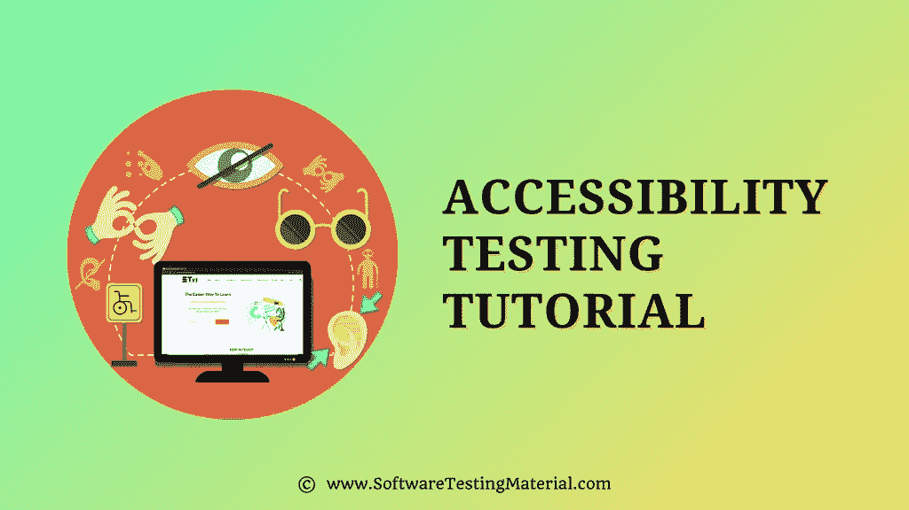

# 易访问性测试教程|完整的分步指南

> 原文:[https://www . software testing material . com/accessibility-testing/](https://www.softwaretestingmaterial.com/accessibility-testing/)

在这篇文章中，我们将学习什么是**可访问性测试**以及下面的可访问性测试完整指南。

*   什么是网页可访问性？
*   什么是可访问性测试？
*   [为什么要进行可访问性测试？](#h-why-accessibility-testing)
*   [可访问性测试示例](#h-example-of-accessibility-testing)
*   [需要支持的残疾类型](#h-types-of-disabilities-to-support)
*   [关于测试网页可访问性的一些误区](#h-some-myths-about-testing-web-accessibility)
*   如何执行可访问性测试？
    *   [无障碍测试的手动方法](#h-manual-method-for-accessibility-testing)
*   用于网页可访问性测试的工具有哪些？
*   [可访问性测试清单/可访问性测试案例](#h-accessibility-test-checklist-accessibility-test-cases)
*   [关于可访问性测试的常见问题解答](#h-faq-s-on-accessibility-testing)
    *   易访问性测试属于功能性测试还是非功能性测试？
    *   可访问性测试解决了哪些挑战？
    *   可访问性测试可以自动化吗？
    *   用于执行网页可访问性测试的工具有哪些？
*   [结论:](#conclusion)

软件应用程序的设计应该让每个能力不同的客户都可以访问，了解他们的需求和行为，以便他们可以轻松地使用该产品。遗憾的是，市场上的大多数应用程序并非如此，它们的设计方式使得残疾用户很难甚至有时无法使用它们。

具有视觉、听觉、运动和认知能力的用户应该能够访问网站和应用程序。

## 什么是网页可访问性？

网页可访问性帮助具有不同能力的用户轻松地感知、理解、浏览网站并与之交互。它的重点是打破障碍，使残疾用户难以使用网络应用程序。

这是一种从最终用户的角度验证应用程序的测试，包括有听力、年龄相关问题、身体、视觉和学习障碍等的客户。

它通常被称为 **508 符合性测试**。

简而言之，它可以说是为满足所有用户需求而设计的测试类型，例如:

*   视力低下、失明和色盲等视觉障碍的用户。
*   有听觉障碍的用户喜欢耳聋或重听。
*   患有认知和神经障碍(如学习障碍、记忆障碍、多发性硬化症、多动症、癫痫症)的用户。
*   可能患有身体和运动障碍(如关节炎、截肢、灵活性降低、肌肉萎缩等)的用户。
*   还能提升屏幕小、网速慢、暂时残疾、老年用户等客户的体验。

它被称为[可用性测试](https://www.softwaretestingmaterial.com/usability-testing/)的子集。可访问性测试的一些特征是:

*   **特殊键盘**，帮助有运动控制问题的人打字。
*   **屏幕阅读器**读出屏幕上可见内容的应用程序。
*   **屏幕放大**为视力有问题的人放大监视器显示的应用程序。
*   **语音识别**应用程序，将测试中所说的话翻译成计算机的输入。

## **为什么要进行可访问性测试？**

进行无障碍测试是为了确保网站的质量标准符合政府和其他网站协会制定的无障碍指南。

通过让更多的用户能够更容易地访问网络，企业可以让更多的用户能够访问他们的产品和服务。

当谈到可访问性时，我们有规则和指导方针要遵守，我们必须遵循既定的指导方针来防止对我们的软件产品的诉讼。

在可访问性方面有一些政府法令、标准和最佳实践:

*   美国残疾人法案
*   澳大利亚 1992 年的残疾歧视法。
*   2005 年爱尔兰残疾法。
*   第 508 条
*   辅助技术法案
*   WCAG 2.1
*   可访问性和可用性最佳实践
*   BBC 手机无障碍指南

## **可访问性测试示例**

可访问性测试是根据 W3C 提出的指南进行的，也称为**网页内容可访问性指南(WCAG)** 。

可访问性测试的一些参数包括检查以下内容:

*   密码
*   尺寸
*   环境
*   文本
*   标记语言
*   开发工具
*   网页标题
*   图像 alt 属性
*   颜色
*   对比
*   标题
*   段落

总是建议从项目一开始就实现可访问性参数，以减少在项目后期修复可访问性问题的成本。

## **需要支持的残疾类型**

| 残疾类型 | 残疾描述 |
| --- | --- |
| 视力残疾 | 完全失明或色盲或视力不佳 |
| 身体残疾 | 难以使用键盘和鼠标 |
| 认知障碍 | 记忆力差或学习困难 |
| 识字障碍 | 找词和阅读困难 |
| 听力残疾 | 像耳聋和听力损伤这样的听觉问题。难以听到或听不清楚
 |

## **关于** **测试网** **可达性**的一些神话

关于易访问性测试有许多神话。让我们来讨论一下:

神话 1:构建一个易访问的产品是一件昂贵的事情。

**事实**:如果我们从项目设计和规划阶段就开始关注可访问性参数，成本一点也不低。

神话 2:把一个不可访问的网站变成一个可访问的网站需要很多时间。

**事实**:没有必要一次实现所有可访问的参数。可以优先排序，一个一个添加。

误区三:简单而单调。

**事实:**很少看到网站只包含文字。图像可以纳入，使其引人注目。不建议根据 W3C web 内容可访问性指南创建纯文本页面。

误解 4:它只适用于盲人和残障人士。

**事实:**应该牢记要满足广泛用户的需求，让它对所有用户都更有用。

## 如何执行可访问性测试？

我们既可以手动也可以自动执行可访问性测试。

### **无障碍测试的手动方法**

我们可以使用操作系统和设备中可用的设置手动执行可访问性测试。以下是您的设备中可能提供的一些选项，可使设备更易于访问，使用这些功能您可以验证网页和应用程序。

您可以用来执行可访问性测试的一些可访问性功能:

**视力残疾相关特征:**

1.  **放大镜:**它可以放大屏幕的一部分，甚至整个屏幕以获得更好的可视性，它还具有跟随鼠标指针/手指在屏幕上移动的镜头的功能。
2.  **文字大小:**可以扩大文字的大小，以获得更好的可视性。
3.  **光标/指针:**它通过不同的颜色、更大的尺寸使触摸反馈更加明显，甚至使光标在打字时更容易看到。
4.  **色彩校正:**它帮助患有色盲的用户，使屏幕上的某些颜色更加清晰，并避免某些颜色的组合。
5.  **高对比度:**使网站的文字和背景采用两种对比色，以获得更好的可视性。
6.  **talk back/旁白:**它是一个屏幕阅读器，在浏览屏幕时描述屏幕中的内容。

**听力残疾相关特征:**

1.  **声音放大器:**增强声音，同时降低背景噪音。
2.  **单声道音频:**将左右声道合并为一个声道。
3.  **字幕:**以文本形式显示音频。

**易访问性测试的手动测试场景:**

*   验证内容在高对比度模式下是否可见。
*   通过禁用图像文件来验证文本是否与内容对齐。大多数情况下，加载图像需要花费大量时间，而且一些用户可能无法访问图像。
*   验证说明、标签和标题是否可用，并且是描述性的。
*   验证是否有替代键盘选项可用于鼠标操作。
*   核实是否提供了用户手册，并以简单的文字进行了描述。
*   验证选项卡是否按顺序导航。
*   验证菜单项是否有快捷方式。
*   验证用户是否知道大概的页面加载时间。
*   验证产品的颜色和对比度是否能舒缓眼睛。
*   验证图像和图形用户界面是否设计合理，以便每个人都能理解。
*   验证是否有正确的产品警报。
*   验证字体大小是否可以放大。
*   验证图像中的文本是否可以通过放大来阅读。
*   验证元素的颜色不是提供信息的唯一方式。
*   验证用户是否可以控制调整屏幕上的移动显示。
*   验证用户是否可以访问视频和音频控件。

验证页面的完整内容是否简单、切中要点、易于理解。

## 用于网页可访问性测试的工具有哪些？

网络无障碍倡议提出了对网站进行初步和一致性审查的想法。它提供了一组软件工具来执行可访问性测试，如:

1.  [WAVE 网页无障碍评估工具](https://wave.webaim.org/)
2.  [自动化可访问性测试工具(AATT)](https://github.com/paypal/AATT)
3.  棋子
4.  约会网站
5.  [CK source 的可访问性检查器](https://cksource.com/accessibility-checker/demo.html)
6.  [谷歌安卓(GATF)无障碍测试框架](https://github.com/google/Accessibility-Test-Framework-for-Android)

这些工具主要检查以下参数:

*   检查网站的代码语法。
*   查找有问题元素的网页。
*   查找可能有问题元素的网页。

## **可访问性测试清单/可访问性测试案例**

*   验证页面标题是否有效描述了页面内容。
*   验证标题是否与网站上的其他页面不同，有效区分页面与其他网页。
*   验证图像是否具有带适当替代文本的 alt。
*   验证页面是否有标题。
*   验证标题是否被标记为标题
*   验证颜色对比度是否保持不变。注意:对于正常大小的文本，网页的最低对比度至少应为 4.5:1。
*   验证您是否可以使用选项卡导航到所有元素，如链接、按钮、表单域和媒体播放器控件。
*   验证您是否可以从可以定位的标签元素中定位出来
*   验证 tab 键顺序是否遵循逻辑阅读顺序。
*   验证当您在元素间切换时焦点是否清晰。
*   验证您是否可以在不使用鼠标的情况下使用键盘完成所有操作。
*   验证您是否可以使用箭头键浏览下拉列表中的所有选项。
*   验证标签是否位于文本框和下拉列表的左侧，单选按钮和复选框的右侧。

下面给出了在执行可访问性测试时需要检查的几个要点。

*   它应该能够满足有视觉、身体、认知和听觉障碍的用户的需求。
*   链接文本应该具有表现力，并且可以通过 tab 键到达。
*   图片、图标或任何视觉指示器应该尽可能地可用，因为它们可以为有读写问题的用户描述内容。
*   内容的设计应该让有学习障碍的用户也能理解。
*   避免弹出窗口，因为它会给从屏幕阅读器获取帮助的用户带来问题。
*   将大句子拆分成小句子，以便视力有障碍的用户可以轻松记住。

## **关于可访问性测试的常见问题解答**

### 易访问性测试属于功能性测试还是非功能性测试？

可访问性测试是一种软件测试，属于功能测试，确保普通用户和残障用户都可以访问应用程序。

### 可访问性测试解决了哪些挑战？

它打破了视力残疾、听力残疾、识字残疾、身体残疾、认知残疾的界限。

### 可访问性测试可以自动化吗？

我们可以使用类似于 [WAVE Web 可访问性评估工具](https://wave.webaim.org/)、[自动化可访问性测试工具(AATT)](https://github.com/paypal/AATT) 、 [SortSite](https://www.powermapper.com/products/sortsite/) 、[CKSource 的 Accessibility Checker](https://cksource.com/accessibility-checker/demo.html)、 [Google 的 Android 可访问性测试框架(GATF)](https://github.com/google/Accessibility-Test-Framework-for-Android) 等工具进行自动化可访问性测试

### 用于执行网页可访问性测试的工具有哪些？

WAVE Web Accessibility Evaluation Tool，自动化可访问性测试工具(AATT)，AChecker，SortSite，CKSource 的 Accessibility Checker，Google 的 Android 可访问性测试框架(GATF)

## **结论:**

网络为公众提供了获取信息和资源的非凡途径，并帮助用户与其他具有相同兴趣的用户进行互动。因此，非常重要的是，每个人都可以访问网络，为具有不同能力的用户提供平等的访问和平等的机会。

除此之外，它还为发展中国家的用户、老年用户和生活在农村地区的用户提供了社交可访问性。从而为这些用户提供一个包容的环境。

因此，对于一个网站来说，对不同的人群来说是可访问的是至关重要的，作为测试人员，我们必须通过执行可访问性测试来确保质量标准。

**相关帖子:**

*   [Web 应用测试指南](https://www.softwaretestingmaterial.com/web-application-testing-tutorial/)
*   [可用性测试指南](https://www.softwaretestingmaterial.com/usability-testing/)
*   [用户验收测试指南](https://www.softwaretestingmaterial.com/user-acceptance-testing-uat/)
*   [手机应用测试指南](https://www.softwaretestingmaterial.com/mobile-app-testing-guide/)
*   [电子商务测试指南](https://www.softwaretestingmaterial.com/ecommerce-testing/)
*   [产品测试指南](https://www.softwaretestingmaterial.com/product-testing/)