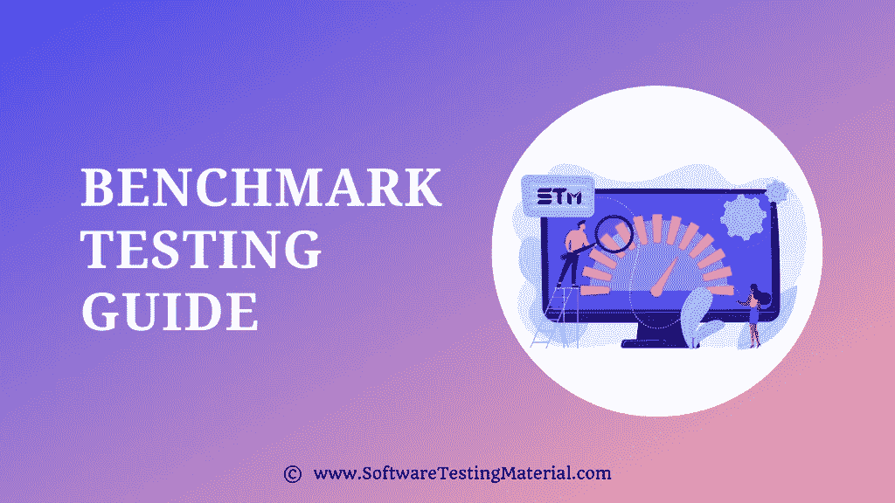

# 基准测试|如何执行，技术，阶段，工具

> 原文:[https://www.softwaretestingmaterial.com/benchmark-testing/](https://www.softwaretestingmaterial.com/benchmark-testing/)

在本基准测试指南中，我们将了解什么是基准测试以及以下内容。

<button class="kb-table-of-contents-title-btn kb-table-of-contents-toggle" aria-expanded="false" aria-label="Expand Table of Contents">Table of Contents</button>

*   [什么是基准测试？](#h-what-is-benchmark-testing)
*   [性能测试中的基准测试](#h-benchmark-testing-in-performance-testing)
*   [为什么基准测试很重要？](#h-why-benchmark-testing-is-important)
*   [基准测试先决条件](#h-benchmark-testing-prerequisites)
*   基准测试是如何进行的？
*   我们如何创建一个基准测试计划？
*   基准测试阶段有哪些？
    *   [#1。规划阶段](#h-1-planning-phase)
    *   [#2。分析阶段](#h-2-analysis-phase)
    *   [#3。整合阶段](#h-3-integration-phase)
    *   [#4。行动阶段](#h-4-action-phase)
*   [有哪些基准测试技术？](#h-what-are-the-benchmark-testing-techniques)
*   [基准测试的优缺点是什么？](#h-what-are-the-advantages-and-disadvantages-of-benchmark-testing)
    *   [优点:](#h-advantages)
    *   [缺点:](#h-disadvantages)
*   [基准测试工具](#h-benchmark-testing-tools)
*   [结论](#h-conclusion)

让我们开始吧。

## **什么是基准测试？**

用外行人的话来说，基准只是一个参考点，它是通过测量一组可重复的可量化的结果来决定的。该参考点被认为是用作进一步分析的标准指针的点。

基准测试和[性能测试](https://www.softwaretestingmaterial.com/performance-testing-tutorial/)只有很小的差别。根据绩效指标得出的结果在任何业务中都是一致的，并且基于各种行业标准。

由于基准测试测量一组可重复的可量化结果，作为比较产品/服务的参考点，其目的是将当前和未来的软件版本与其各自的基准进行比较。

## **性能测试中的基准测试**

正如前面所讨论的，性能测试中的基准被认为是一种度量，软件产品或服务可以与它进行比较以评估质量度量。

例如，对于一个 web 应用程序开发团队来说，初级开发人员有资格成为助理级别的开发人员。基准测试的技能可以是这个人为了在几周内创建一个小型应用程序而编写的代码行。

## **为什么基准测试很重要？**

基准测试在许多方面都是必不可少的。其中几个可以理解如下:

*   用于实施质量标准以及服务水平协议(SLA)
*   为软件应用程序实际建立用户体验和其他业务标准。
*   检查软件应用程序的性能分析，并与竞争对手进行比较。
*   帮助分析用户体验和可用性。
*   确保遵守法规遵从性、行业最佳实践、SLA，并满足这些要求。
*   评估第三方供应商的评估，并帮助找出要避免的错误。

## **基准测试先决条件**

就像我们需要在开始任何类型的测试之前考虑一些先决条件一样，基准测试也是如此。

预先确定一个有相关经验的合适的软件测试工程师。

*   如果没有固定下来，那么至少要试着弄清楚首选的性能目标。
*   创建有意义的测试用例。
*   决定和使用合适的测试工具。
*   如果可能，尝试模拟生产场景。
*   最后但同样重要的是，起草一份可靠的[测试计划](https://www.softwaretestingmaterial.com/test-plan-template/)。

## 基准测试是如何进行的？

正如我们在上面的章节中读到的，当谈到基准测试时，测试计划的创建是最重要的先决条件之一。

我们如何创建它，将在下一节中介绍，但是在开始之前，让我们了解一下基准测试实际上是如何执行的。

基准测试是通过使用生产中使用或将要使用的相同组件重复测试套件来执行的。

*   通过重复[测试测试用例](https://www.softwaretestingmaterial.com/test-case-template-with-explanation/)，我们想要检查测试运行中结果的一对一匹配。
*   为了获得优化的结果，在执行测试时，除了基准测试套件之外，不应该有其他应用程序在运行。
*   一旦我们遇到错误或其他问题，应该很好地记录故障症状的所有细节和每一个相关信息。这是至关重要的，尤其是当您希望开发团队能够复制场景的时候。

## 我们如何创建一个基准测试计划？

现在来看基准测试的测试计划的创建，有几个简单的步骤，如下所示，

*   决定工作量。来缩放和调用它。
*   作为基准测试的一部分，收集和记录度量是必要的
*   记录可配置的数据，例如所需的时间跨度和测试过程的终点
*   明智的做法是准备一个备份计划，以防任何测试用例失败
*   正如在传统的测试计划创建中，我们决定所涉及的人力资源，在这里，我们也需要指定负责人或产品所有者，他们被授权指导团队何时调用结束过程的终止。

## 基准测试阶段有哪些？

大致来说，基准测试有四个阶段。它们如下。

1.  规划阶段
2.  分析阶段
3.  整合阶段
4.  行动阶段

### **#1。规划阶段**

在这个阶段，我们确定并优先考虑已决定的标准和需求，决定基准标准，并定义基准测试过程。

### **#2。分析阶段**

在分析阶段，我们的座右铭是识别错误的根本原因，以提高质量并为测试过程设定目标。

### **#3。整合阶段**

在集成阶段，成果与团队或领导共享，并通过建立功能目标获得批准。

### **#4。行动阶段**

最后，在行动阶段，我们需要在开发了测试计划、文档并实施了前面阶段中指定的行动之后，持续地运行流程。这一阶段也需要监测。

## **有哪些基准测试技术？**

我们有几个测试组件，通常使用基准测试进行检查，如 SQL 查询、SQL 索引、SQL 过程、SQL 触发器、表空间配置、硬件配置、应用程序代码、网络和防火墙等。

因此，很自然地，测试所有这些类型的环境并进一步设置相同的基准将排除一种通用的测试技术。

然而，最常用的基准测试技术是，

*   对测试结果的一致性和控制进行检查。这是在基准测试时要执行的一个重要措施
*   彻底理解系统架构，这样设计测试标准和测试数据就容易了。这是必须的，因为每个系统都有不同的架构和设计，在执行基准测试时需要考虑不同的方法
*   记录和分析初始静态数据。贴这个，按用户数更新。
*   把所有东西都放在一个篮子里可能会导致你错过重要的参数，因此强烈建议根据功能性来分割系统元素。

## **基准测试的优缺点是什么？**

### **优点:**

*   基准测试为开发人员和测试人员提供了许多好处。
*   它可以一次性检查最终产品的质量、效率和性能。
*   它还帮助团队分析系统如何响应应用程序中的变化。
*   验证软件组件是否处于工作状态。
*   它还可以用来测试移动设备以及数据库等等。
*   工作负载规范、度量规范和测量也作为其主要组成部分包含在基准测试中。
*   通过测试基准负载条件，它有助于确定系统行为，即使是针对 DDoS 攻击。

### **缺点:**

*   基准测试有这么多额外的优点，但我们能想到的缺点却非常有限。
*   需要特殊的资源分配，测试工程师应该对被测系统的内外都有很好的了解。
*   许多可重复的测试步骤和案例执行可能会导致更多的时间消耗，然而，有效地选择测试工具，设计测试计划可能是解决这个问题的一个方法。

## **基准测试工具**

测试 Windows PCs 的一些基准测试工具有 [Prime95](http://www.mersenne.org/download/) 、 [Novabench](https://novabench.com/) 、 [3DMark](https://www.3dmark.com/)

测试 CPU 性能的一些基准测试工具有 Geekbench、Cinebench

测试系统速度和移动设备电池的一些工具有 Phoronix、CPU-M、Vellamo。

## **结论**

简而言之，让我们修改几个要点。

*   在软件工程中，基准测试帮助我们获得一组可重复的可量化的结果，并通过检查系统的性能来增加测试的价值。
*   基准测试可以用于软件和移动应用程序。
*   当要检测负载情况和 DDoS 攻击时，这非常有用。
*   一些最常见的基准测试组件是工作负载规范、度量规范和测量规范。
*   在当前市场中，我们确实有一些可用的工具和框架，如果用于执行基准测试，它有助于快速有效地交付测试结果。

**相关文章:**

*   [什么是软件开发生命周期(SDLC)、阶段、SDLC 与 STLC](https://www.softwaretestingmaterial.com/sdlc-software-development-life-cycle/)
*   [SDLC vs STLC:有什么区别](https://www.softwaretestingmaterial.com/sdlc-vs-stlc/)
*   [什么是软件测试生命周期(STLC) & STLC 阶段](https://www.softwaretestingmaterial.com/stlc-software-testing-life-cycle/)
*   [Selenium 4.0–简介、新功能、安装、弃用内容](https://www.softwaretestingmaterial.com/selenium-4/)
*   [软件开发生命周期的瀑布模型](https://www.softwaretestingmaterial.com/waterfall-model-in-sdlc/)