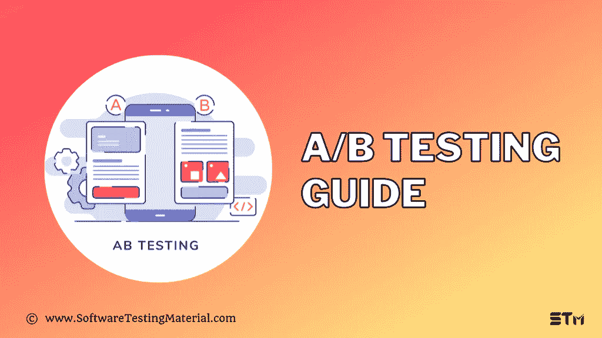

# A/B 测试指南:如何执行 AB 测试

> 原文:[https://www.softwaretestingmaterial.com/ab-testing/](https://www.softwaretestingmaterial.com/ab-testing/)

在这个 A/B 测试(也称为分割测试或桶测试)指南中，我们将讨论你需要知道的关于 AB 测试的一切。

<button class="kb-table-of-contents-title-btn kb-table-of-contents-toggle" aria-expanded="false" aria-label="Expand Table of Contents">Table of Contents</button>

*   [什么是 A/B 测试](#h-what-is-a-b-testing)
*   [A/B 测试术语](#h-a-b-testing-terminology)
    *   [#1。变体](#h-1-variant)
    *   [#2。冠军](#h-2-champion)
    *   [#3。挑战者](#h-3-challenger)
    *   [#4。交通](#h-4-traffic)
    *   [#5。转换率](#h-5-conversion-rate)
    *   [#6。转化率优化](#h-6-conversion-rate-optimization)
    *   [#7。假设](#h-7-hypothesis)
    *   [#8。洞察力](#h-8-insights)
    *   [#9。复制](#h-9-copy)
*   [A/B 测试如何工作](#h-how-a-b-testing-works)
*   [为什么你应该进行 A/B 测试](#h-why-you-should-a-b-test)
*   如何进行 A/B 测试？
    *   [#1。分析你的见解](#h-1-analyze-your-insights)
    *   [#2。确定最终目标](#h-2-identify-the-end-goal)
    *   [#3。创建一个变体](#h-3-create-a-variant)
    *   [#4。运行测试](#h-4-run-the-test)
    *   [#5。解读结果](#h-5-interpret-the-results)
*   [什么是多元测试](#h-what-is-multivariate-testing)
*   [什么是拆分 URL 测试](#h-what-is-split-url-testing)
*   [什么是多页测试](#h-what-is-multi-page-testing)
*   [A/B 测试对比多元测试](#h-a-b-testing-vs-multivariate-testing)
*   [A/B 测试与分割 URL 测试](#h-a-b-testing-vs-split-url-testing)
*   [你能考什么 A/B](#h-what-can-you-a-b-test)
    *   [#1。登陆页面](#h-1-landing-pages)
    *   [#2。头条新闻](#h-2-headlines)
    *   [#3。页面布局](#h-3-page-layout)
    *   [#4。导航](#h-4-navigation)
    *   [#5。表格](#h-5-forms)
    *   [#6。页面长度(内容深度)](#h-6-page-length-content-depth)
    *   [#7。CTA(行动号召)](#h-7-cta-call-to-action)
    *   [#8。媒体](#h-8-media)
*   [在 A/B 测试中要避免哪些错误](#h-what-are-the-mistakes-to-avoid-while-a-b-testing)
    *   [#1。期待小变化带来大胜利](#h-1-expecting-big-wins-from-small-changes)
    *   [#2。一次测试太多项目](#h-2-testing-too-many-items-at-once)
    *   [#3。不理解统计意义](#h-3-not-understanding-statistical-significance)
    *   [#4。运行测试的持续时间不正确](#h-4-running-your-test-for-an-incorrect-duration)
    *   [#5。不遵循迭代过程:](#h-5-not-following-an-iterative-process)
    *   [#6。在测试过程中改变参数](#h-6-changing-parameters-in-the-middle-of-testing)
*   [A/B 测试的挑战是什么](#h-what-are-the-challenges-of-a-b-testing)
*   [A/B 测试流程](#h-a-b-testing-process)
*   [A/B 测试最佳实践](#h-a-b-testing-best-practices)
    *   [#1。专注于优化人们最常访问的页面](#h-1-focus-on-optimizing-the-pages-people-visit-most)
    *   [#2。样本大小是测试中的主要因素](#h-2-the-sample-size-is-a-prime-factor-in-your-testing)
    *   [#3。有一个适当的预先计划的时间表](#h-3-have-a-proper-pre-planned-schedule)
    *   [#4。切勿在中期测试期间进行更改](#h-4-never-make-changes-during-mid-testing)
    *   [#5。测试一个元素的经验法则](#h-5-have-a-thumb-rule-of-testing-one-element)
*   [A/B 测试示例](#h-a-b-testing-examples)
    *   [例 1:电子商务网站——壁猴](#h-example-1-ecommerce-website-wall-monkey)
    *   [示例 2: SaaS 网站-工作区](#h-example-2-saas-website-workzone)
    *   [例 3:媒体公司-电子艺界-模拟城市](#h-example-3-media-company-electronic-arts-simcity)
*   [最佳 A/B 测试工具](#h-best-a-b-testing-tools)
    *   [#1。谷歌优化](#h-1-google-optimize)
    *   [#2。优化地](#h-2-optimizely)

*   [结论](#h-conclusion)

## **什么是 A/B 测试**

A/B 测试可以定义为用两组不同的访问者比较同一网页的两种变化，以查看哪一个表现良好。这种比较不仅限于网页，它可以是应用程序界面、登录页面、电子邮件营销或任何其他营销资产。

将原始设计(A)与备选设计(B)进行比较，看哪种设计转换得好。最初的设计称为“控制”，替代版本称为“变化”。

## **A/B 测试术语**

在进行 A/B 测试时，我们从冠军、挑战者和变体中获得数据/静态数据。这些版本提供了你的访问者转化率的洞察力。

### **#3。挑战者**

挑战者是你的网页的一个新变种，与你现有的冠军相比。

### **#4。交通**

它指的是用户访问你的网站，它是由用户在你的网站上花费时间的数量来衡量的。

### **#5。转换率**

转换率是用户采取网站中预期的行动的百分比，如注册电子邮件列表以支付产品的费用，除以访问者的数量。

### **#6。转化率优化**

转化率优化(CRO)是根据网站访问者的行为来优化网站或登录页面体验的实践。它有助于网站所有者了解网站访问者如何采取所需的行动(转化)，如点击“添加到购物车”、购买产品、注册服务、填写表格或点击链接、成为相应页面上的客户，以及是什么阻止他们完成目标。

### **#7。假设**

一个结构良好的假设会让你洞察到它是成功的、失败的还是结果不确定的。如果按钮是蓝色的，会有更多人点击，因为它与页面上的其他颜色形成对比。

### **#8。洞察力**

它是在系统收集和分析数据的基础上建立的合理想法和结论的组合。

### **#9。复制**

文案，也称为广告文案或销售文案，是旨在提高品牌知名度以说服个人或团体采取特定行动的书面内容。

## **A/B 测试如何工作**

基本上，你可以选择一个网页或者任何其他你想要的界面，然后创建同一个页面的另一个版本。这种改变很小，就像更改广告文案或标题，或者更改注册按钮的颜色，也可能是对您的登录页面进行彻底的品牌重塑。

创建变体后，将一半的流量转移到控件，即原始版本(A)，另一半转移到变体，即修改后的页面(B)。观察你网站上的见解和转化率。

结果基于最多的打开和点击从原始版本和修改版本中确定获胜版本。

## **为什么你应该进行 A/B 测试**

*   A/B 测试可以通过试错法来改善你的登陆页面，提高你的转化率，而不需要花费太多的时间和精力。
*   它帮助你在界面上做出改变，并收集用户体验的数据，这样你就知道什么有效，什么无效。
*   你可以一次测试一个改变，哪些改变影响了访问者的行为，哪些没有。
*   你可以实现这些成功的改变，也可以在网站的其他部分进行实验。

## 如何进行 A/B 测试？

A/B 测试从获得更多销售、增加转化率等目标开始。因此，要测试不同版本的网站，你必须保持一个可衡量的目标，一个适当的假设，在两个不同版本之间分配流量，以及适当的样本量。

### **#1。分析你的见解**

在开始 A/B 测试之前，你应该开始评估你的网站的表现。从收集数据开始，比如有多少用户访问你的网站，哪个页面带来了更多的流量，你的网站中各个页面的转换目标是什么等等。你可以使用像 Google Analytics 这样的分析工具，它可以为你提供关于你的网站表现的报告。

收集数据，如转化率低或脱落率高的页面

### **#2。确定最终目标**

为改进你的网站建立一个具体的目标，确保你的目标是有时间限制的。你的目标可以是任何东西:点击一个按钮，注册一个电子邮件订阅，在你的 youtube 频道上关注你，开始一个免费的演示，更多的社交分享，甚至为一个产品或服务付费，等等。

在测试结束时，你应该有关于变体是否提高了你的转换率的指标。

### **#3。创建一个变体**

你必须专注于为你现有的控件创建一个变体。确保您更改单个组件，以便更容易衡量它的性能是否更好。您可以更改标题、行动号召文本、行动号召位置、弹出窗口、特色图片、副本、表单中的字段数量等。在整合一个新的变种时，不要忘记测试你的网站。

您可以创建多个变体，并根据您的原始网页测试它们，以查看哪些效果好。

### **#4。运行测试**

开始运行你的测试，把你的流量分成两个不同的网站。在尝试各种变体时，请确保您没有干扰到达您页面的流量。基于平均每日和每月的访问者，估计现有的转换率以及预期的最低改进，以计算您可以运行测试多长时间。

应该对用户与网页的每次交互进行测量、计数和比较，以确定每次交互的表现。

### **#5。解读结果**

比较对照和变体的表现结果。检查是否有统计上的显著差异，即给定原始页面和变体之间的转换率不是由于随机机会。你会得出一个数据驱动的结论。

不要只做一个测试就停下来，尝试更多的组件，持续进行 A/B 测试是有效的。

## **什么是多元测试**

*   在多元测试中，页面中的多个元素被组合改变，它与网页的当前版本进行比较。
*   进行多元测试的目的是测量每个设计组合的有效性。
*   多元测试提供了更快的结果，但对初学者来说可能很复杂。

## **什么是拆分 URL 测试**

*   在分割 URL 测试中，你为你的网页创建两个或更多的变体。
*   然后在不同的 URL 中测试你的网站的多个版本。
*   这里的变体是完全开发的网页，存储在服务器上，通过不同的 URL 访问。

## **什么是多页测试**

*   在多页面测试中，我们通过在多个页面中改变特定的元素来进行实验。
*   在这里，你必须向用户展示变化的混合和匹配，而不是通过一组页面显示一致的变化。
*   所以我们可以彻底地测试一个变体和另一个变体。

## **A/B 测试 vs 多变量** **测试**

| A/B 测试 | 多元检验 |
| --- | --- |
| A/B 测试让您可以对比网页的一个或多个变体。 | 多元测试可以帮助你一次尝试网页上多个元素的多种变化。 |
| 在这里，你的流量将被分成两个不同的网页版本 A 和版本 B | 在这里，您的流量将被分成几个网页，有多种变化 |
| 你不需要很高的流量来尝试这个测试 | 为了实现多元测试，你的网站应该有巨大的流量 |
| 例:改变购买按钮的颜色
版本 A:默认颜色
版本 B:红色 | 例:更改登陆页面主要元素
版本 A: Headline_3、Img_2、CTA_1
版本 B:Headline_1、Img_3、CTA_2
版本 C:Headline_2、Img_4、CTA_1
版本 D:Headline_4、Img_1、CTA_3 |

## **A/B 测试与分割 URL 测试**

| A/B 测试 | 拆分 URL 测试 |
| --- | --- |
| A/B 测试是一种营销工具，通过在控制和变体之间划分流量，找出最适合更好转换的方法。 | 分割 URL 测试是一种营销工具，通过将流量分割到不同的 URL 来找出最适合更好转换的方法。 |
| 在 A/B 测试中，为了创建变体，只需对 HTML 中的元素进行微小的修改 | 在分割 URL 测试中，这里的变体通常是存储在服务器上的完全开发的网页，可以通过不同的 URL 访问 |
| A/B 测试可以在优化单个网页时得到最好的利用，通常用于进行快速测试。 | 分割 URL 测试可以用于大的改变，比如新的重新设计 |

## **你能考什么 A/B**

请记住，网站中的每个元素和内容都有助于提高你的转化率。所以你网站的每一部分内容都应该优化到最大的潜力。这可以帮助你的企业取得更多的销售和收入。转换优化并不像你想象的那么容易。你网站中的每一个元素都转化为你的转化率，这将直接影响你的销售漏斗。

以下是可用于 A/B 测试变化的一系列内容:

### **#1。登陆页面**

登陆页面是用户点击广告、电子邮件活动中的链接或任何其他数字位置后登陆的网页。通常，这些登录页面有一个明确的行动号召(CTA)，购买产品或只是加入您的列表。您的登录页面需要优化，以便将用户转化为您提供的任何产品。在运行 A/B 测试以收集数据和假设之前，使用热图，即由访问者产生的注意力、参与度和互动的可视化表示，这有助于您专注于需要关注的内容。

### **#2。头条新闻**

标题可能非常重要，因为它是任何用户进入你的网站时首先会看的东西。如果你的标题没有引起他们的注意，不要指望他们会在你的网站上停留更长时间。在设计你的文案、字体、大小、颜色和信息时，你必须小心谨慎。

### **#3。页面布局**

你的页面布局应该简单而强大，便于访问者访问。适当的设计和布局，清晰的信息，简单明了的内容，清晰的行动号召，以及增强页面视觉效果的媒体就足够了。无论是你的主页、登陆页、博客文章还是产品描述页，都要确保用户界面/UX 的设计整洁有序，并专注于转换。

### **#4。导航**

访问者应该无缝地浏览你的网站。他们不应该被你网站中不同的元素弄得不知所措。在左上角放置一个导航栏，在右上角放置你网站的徽标，点击它应该可以导航回主页。

遵循这些大多数网站使用的基本格式，以便您的用户快速找到他们正在搜索的内容。最糟糕的情况是你的访问者迷失在你的网站中。

### **#5。表格**

这份表格是获取潜在客户信息的一种方式。表格是联系潜在客户的最佳方式。确保它的大小合适，如果太长，你的访客可能会放弃它，如果太短，你可能不会收集信息来验证访客是潜在客户。

### **#6。页面长度(内容深度)**

一些访问者喜欢清晰和可消费的内容，而一些访问者喜欢深度潜水的内容。通过 A/B 测试，你可以找出你的目标受众的偏好并迎合他们的需求。

### **#7。CTA(行动号召)**

行动号召是直接影响你转化率的最重要的事情。CTA 提示你的访客采取任何行动-购买你的产品/服务，订阅你的电子邮件列表，听你的播客，它可以是任何事情。但是你的页面上应该只有一个 CTA，这样你的访问者就不会感到困惑。

### **#8。媒体**

媒体在你的销售漏斗中扮演着重要的角色。你可能有一个 youtube 频道、播客、Instagram 等，引导你的观众到你的网站。这些图像/音频/视频格式的内容可以让你了解有多少观众访问了你的网站，以及有多少人因此转化为你的客户。所以你可以优化你的内容，这将推动你的网站的流量。

## **在 A/B 测试中要避免哪些错误**

### **#1。期待小变化带来大胜利**

你的网页中的一个优化副本可能会增加你的转化率，但你不应该指望仅仅是 1000 美元的收入。

### **#2。一次测试太多项目**

只有当你用一两个元素来测试你的转化率时，你才能对它有一个正确的认识。

### **#3。不理解统计意义**

有确凿的证据表明，你为增加或减少转化率而做出的改变是因为你的控制和变化不是由于错误或随机的机会。

### **#4。运行测试的持续时间不正确**

您的测试时间表应该基于您的流量、目标和假设。不应该太长也不应该太短。

### **#5。不遵循迭代过程:**

你应该不断地测试你的网页的不同元素，对那些需要更多关注的东西进行实验，并以最佳结果为基础。

### **#6。在测试过程中改变参数**

这对你的测试来说是反直觉的，如果你改变了你的目标、假设、变量或测试的任何其他方面，结果会是错误的数据。

## **A/B 测试的挑战是什么**

*   网站上没有足够的流量来进行 A/B 测试。
*   基于假设的测试会使结果有偏差。
*   外部因素会干扰你的结果。
*   很难持续投资于 A/B 测试。
*   将不正确的变体指标视为成功。
*   这是一个一刀切的方法，它不会迎合所有的游客。

## **A/B 测试流程**

#1.为你的转化率优化定义一个明确的目标(CRO)。
#2。创建同一个元素的两个变体——登陆页面、广告文案等
#3。计算你要运行测试多长时间。建议至少两周一次，但这完全取决于你的流量、目标和其他因素
#4。选择有助于您运行测试的测试工具。
#5。在你的网站上启动你的 A/B 测试，然后等待。
#6。在您指定的测试时间表之后，分析您的结果，检查哪个版本执行得更好
#7。制定一个新的假设，并提出另一个元素来测试。
#8。理解持续进行 A/B 测试是最有效的。

## **A/B 测试最佳实践**

### **#1。专注于优化人们最常访问的页面**

根据 Hubspot 的说法，访问者会在我们的主页、关于页面、联系页面和博客页面上闲逛。因此，请确保你把重点放在这些网页的转化率。您还可以关注高转化率区域，如销售线索磁铁页面、登录页面和注册表单。

### **#2。样本大小是测试中的主要因素**

不是所有的营销人员都擅长统计，你应该有正确的样本量来获得准确的结果。为了确定项目的统计显著性，你应该有合适的样本量。

### **#3。有一个适当的预先计划的时间表**

您的测试数据不应受到节假日或销售旺季的影响。检查你的流量在过去几个月中的情况，了解其模式，并在外部因素不会篡改你的数据的理想时期启动你的测试。

### **#4。切勿在中期测试期间进行更改**

如果你正在运行你的 A/B 测试，在你的测试结束之前，忘记你的转换率和优化因子。看着几天后的结果，你可能会改变你的目标或变化。耐心点。

### **#5。测试一个元素的经验法则**

A/B 测试不要一次测试很多变种。它只需要一份文案、行动号召、甚至是一张图片的标题，就能影响你的转化率。有多个项目要测试可能无法为您提供什么有效，什么无效的数据。

## **A/B 测试示例**

### **例 1:电子商务网站——壁猴**

**关于公司:** Wall monkey 是一个[电子商务](https://www.softwaretestingmaterial.com/ecommerce-testing/)品牌，销售壁纸和贴纸。

目标:优化主页(包含股票图片、搜索栏和标题)以增加点击量和转化率。

变化:他们改变了主页上的图片，向访问者展示他们可以享受 WallMonkeys 产品的机会，并用搜索栏取代了标题滑块。

**结果:**转化率提高到 550%

你可以点击查看深度案例研究墙猴

### **示例 2: SaaS 网站-工作区**

**关于公司:**它是一个基于网络的项目管理和文档协作工具

**目标:**通过减少表单页面上分散注意力的元素来增加演示请求的数量。

**更改:**他们更改了黑白的客户证明信息和徽标。

**结果:**转化率提高到 34%，统计学显著性为 99%

您可以点击查看工作区[的深度案例研究](https://vwo.com/success-stories/workzone/)

### **例 3:媒体公司-电子艺界-模拟城市**

**关于公司:**电子艺界是一家流行的媒体公司，开发和提供游戏、内容和在线服务

**目标:**通过推广新游戏《模拟城市》的预购订单，增加销售额，实现收入最大化。

变化:首先，他们制作了一个预购奖励横幅(对照版)，认为奖励可能会增加销售额。用户对此并不满意，公司也没有像他们预期的那样获得预购订单。因此，他们决定从页面上移除“优惠 20 美元”的促销横幅。

结果:新的变体使销售额增加了 43.4%。

真正的游戏爱好者对奖励不感兴趣，他们只想购买游戏。假设目标受众行为的经典例子。

你可以点击查看电子艺界的深度案例研究

## **最佳 A/B 测试工具**

现在市场上有很多 A/B 测试工具。一些市场领导者，包括谷歌优化，优化，VWO 等。

### **#1。谷歌优化**

谷歌优化是谷歌的免费测试工具。它有助于在线营销人员和网站管理员测试网页的变体，并观察它们在实现既定目标方面的表现。

Google Optimize 的一些关键特性有 A/B 测试、A/B/n 测试、多元测试、拆分 URL 测试等。,

### **#2。优化地**

Optimizely 是一个基于云的营销解决方案，提供数字体验解决方案。它旨在帮助 web 开发人员进行 A/B 和多元测试。

Optimizely 的一些关键特性是多页测试、高级定位和分段

**VWO 是一个网页测试和转换优化平台，以分析网络访问者的活动和增加转化率。**

**VWO 的一些关键功能是 A/B 测试、推送通知、网站热图、转化率优化、服务器端测试、Web 表单分析等。,**

## ****结论****

**A/B 测试在收集关于访问者行为的信息方面非常强大，比如什么广告驱动了最多的转换，你的受众对什么产品有反应，或者什么博客标题驱动了最多的流量。**

**建议在网站上不断执行 A/B 测试。您可以使用多种工具来开始我们上面提到的 A/B 测试之旅。**

****相关帖子:****

*   **[软件测试-深入指南](https://www.softwaretestingmaterial.com/software-testing/)**
*   **[电子商务测试指南](https://www.softwaretestingmaterial.com/ecommerce-testing/)**
*   **[产品测试指南](https://www.softwaretestingmaterial.com/product-testing/)**
*   **[猴子测试指南](https://www.softwaretestingmaterial.com/monkey-testing/)**
*   **[可用性测试教程](https://www.softwaretestingmaterial.com/usability-testing/)**
*   **[无障碍测试指南](https://www.softwaretestingmaterial.com/accessibility-testing/)**
*   **[临时测试教程](https://www.softwaretestingmaterial.com/adhoc-testing/)**