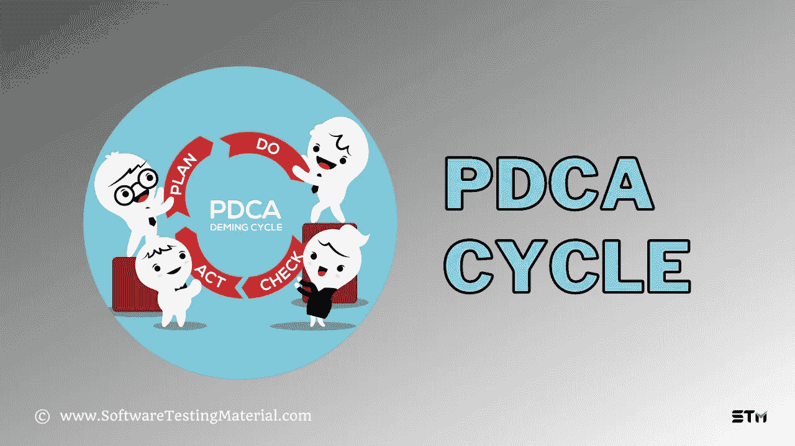

# PDCA 循环|计划、检查和行动循环的详细指南

> 原文:[https://www.softwaretestingmaterial.com/pdca-cycle/](https://www.softwaretestingmaterial.com/pdca-cycle/)

## 

## **什么是 PDCA 循环？**

计划-执行-检查-行动(PDCA)循环是一种迭代的四步管理方法，在商业中用于关注流程、产品或服务的持续改进并解决问题。

PDCA 循环由四个步骤组成，即**计划**、**做**、**检查**和**行动**。它是 [**质量**](https://www.softwaretestingmaterial.com/quality-assurance-vs-quality-control/) 的关键概念之一。

PDCA 循环的概念是由威廉·爱德华·戴明博士在 20 世纪 50 年代作为一个学习或改进过程提出的。

威廉·爱德华·戴明博士被许多人认为是全面质量管理(TQM)的权威。

*   PDSA 循环(计划学习法)
*   PDCA 循环(计划、检查、调整)
*   [戴明循环/戴明圈/戴明轮](https://en.wikipedia.org/wiki/W._Edwards_Deming)
*   休哈特循环

简而言之，我们可以说 PDCA 是用来解决问题和改进过程的。

解决问题——如果某些东西不能正常工作。我们使用 PDCA 作为分析工具来发现隐藏的问题并找到解决方案。

改进流程——如果正在运行的东西没有产生最佳结果。我们使用 PDCA 作为分析工具来寻找现有功能的潜在改进。

## **什么时候使用 PDCA 循环？**

它可以在所有类型的组织中使用，并且可以很好地实施全面质量管理或六适马计划。

我们使用 PDCA 循环的一些情况是

*   当一个新的改进项目开始时
*   实施任何变更时
*   当定义重复过程时

遵循改善方法的公司也使用这种方法。Kaizen 方法是一种组织思维模式，专注于小而频繁的变化，随着时间的推移，这些变化会导致重大改进。

## **PDCA 循环如何工作**

让我们看看在 [SDLC](https://www.softwaretestingmaterial.com/sdlc-software-development-life-cycle/) 中，我们在 PDCA 循环的每个阶段都做了些什么。

你也可以看看这个视频

[https://www.youtube.com/embed/-M6WhypN_SU?rel=0](https://www.youtube.com/embed/-M6WhypN_SU?rel=0)

### **计划:**

识别机会(问题或改进)。计划一个改变(要么解决一个问题，要么改善某些领域)，并决定要实现什么目标。

在这里，我们定义了目标、策略和支持方法，以实现我们计划的目标。

### **做:**

按计划设计或修改业务需求

在这里，我们实施计划(将计划付诸行动)并测试其性能

### **检查:**

评估结果，以确保我们是否按计划达到目标

在这里，我们制作一个清单来记录哪些是成功的，哪些是失败的(吸取的教训)

### **行动:**

如果变化没有按计划进行，那么继续循环，用不同的计划实现目标。

在这里，我们对没有按计划工作的地方采取行动。任务是不断尝试用不同的计划来改进流程。

PDCA 循环是一个持续的过程，直到我们实现我们计划的目标。

## **PDSA 循环的利弊**

PDCA 循环的优点和缺点是

### **优点:**

PDCA 循环的好处如下。

*   易于理解，实施时功能强大
*   它可以应用于任何类型的组织
*   帮助解决问题和改进流程

### **缺点:**

*   这会使过程变得缓慢，所以当你处理紧急问题时，这不是一个值得推荐的方法。
*   这是一个连续的过程，而不是一个端到端的过程。因此，这需要坚定的领导。