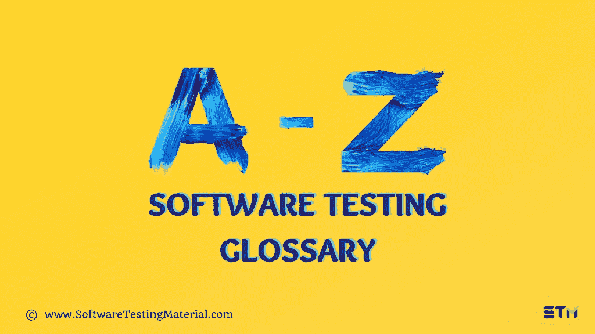

# 所有新的软件测试人员都应该学习的软件测试术语

> 原文:[https://www . software testing material . com/software-testing-terms/](https://www.softwaretestingmaterial.com/software-testing-terms/)

如果你是一个新的软件测试人员，你可能会听到很多不熟悉的缩写和术语。

没有人们谈论的上下文，试图跟上所有不同的术语可能会令人沮丧甚至不知所措。

在这篇文章中，我将回顾一些新的软件测试人员在开始第一天工作之前应该知道的通用术语。

[a](#h-a)|[【b】](#h-b)|[【c】](#h-c)|[【d】](#h-d)|[【e】](#h-e)||[【g】](#h-g) [u](#h-u)|[【v】](#h-v)|[【w】](#h-w)|[【x】](#h-x)|[和](#h-y) | [Z](#h-z)

### **实际结果**

当我们执行测试用例时，我们会将结果与预期结果进行比较，这些结果被称为实际结果。它通常在错误报告中用来解释意外输出的发生。

### **异常**

异常是软件测试环境中与预期结果的偏离，也就是说，它是一个缺陷。当你在白盒测试中发现了一个与数据流相关的代码中的问题，就叫做数据流异常。

### **按照设计**

“按设计”是一个术语，通常用于拒绝 bug，作为 QA，我们报告 bug 是因为应用程序的功能不符合预期。但是有可能我们没有意识到预期的功能。那些无效的 bug 被否定为“按设计”。

### **审计**

审计是一个一般的评估过程，它发生在构建或测试软件产品的过程中。它可以帮助组织评估团队是否遵循规则，并遵守标准、规范、合同或其他协议。

### **可用性**

可用性是可用系统时间与系统运行所需或预期的总工作时间之比。

**B**

### **拦截器**

Blocker 指的是 bug 的严重程度，就是应用程序完全崩溃的时候。它表明软件不再是可测试的，没有解决方法，测试人员不能测试应用程序。

### **Bug 延期**

延迟是 bug 生命周期中 bug 的状态之一。这意味着该错误在当前版本中不会得到修复，但开发人员会在未来的版本中处理这些问题。

### **漏洞泄露**

Bug 泄漏是指在生产环境中有一个 bug 没有被测试团队检测到，并且在测试周期中被遗漏了。通常，这些错误是由客户或最终用户报告的。

### **Bug 发布**

Bug 发布是指团队将带有一些已知 bug 的应用程序发布到生产环境中。通常，这些错误的优先级和严重性都很低，由于时间限制或其他优先级的原因而无法修复。

**C**

### **更换控制板**

变更控制委员会是一组主要在软件项目中工作的个人，他们负责做出变更、做出重要决策等等。

### **变更请求**

变更请求是指提案中产品或系统的变更。当客户或另一个团队成员想要变更已达成一致的可交付成果时，他们通常会提出这些问题。

### **清单**

清单包括各种测试，帮助我们确定产品是否可以部署。它包含了一个带有定义好的过程的测试列表，它帮助我们弄清楚是否所有的事情都被完全执行了。

### **检查点**

检查点是一个中间的验证步骤，也就是说，它在不经历整个过程的情况下识别测试中是否存在问题。它帮助我们将特定对象的当前值与期望值进行比较。

### **CMMI**

能力成熟度模型集成是一种过程改进方法，有助于组织找到自己的优势和劣势。它有助于通过适当的流程变更、改进和修改来简化和组织流程。

### **代码覆盖率**

代码覆盖率是一个度量标准，用于确定在测试时有多少代码被成功验证。这是一种白盒测试技术，有助于分析软件得到验证的全面程度。

### **代码注入**

代码注入是一种安全风险，当攻击者使用应用程序的输入流将不受信任的数据输入系统时，就会发生这种风险。在这里，攻击者利用输入验证缺陷来注入和执行恶意代码。

### **代码审查**

代码审查帮助我们检查软件代码以识别缺陷并评估代码的质量。它可以与团队领导或同事正式或非正式地发生。通过在周期的早期发现问题，这有助于减少时间、精力和金钱。

### **编码标准**

代码标准是帮助您编写统一的、可读的和可维护的代码的规则、指南和最佳实践。因此，它为编写代码提供了一个健壮的过程。

### **编译**

编译是将源代码转换成目标代码(即可执行代码)的过程。它检查语法错误，只有当代码的结构正确时，它才将其转换成目标代码。

### **符合性**

法规遵从性是由外部和内部团队制定的一套规则、规章和指导方针。在测试环境中，它在应用程序发布到生产环境之前检查产品、过程、代码等是否符合标准。

### **有条件签署**

当代码被发布到生产环境中时，会发生有条件的签署，其中包含了在此版本中未修复的已知问题或缺陷。当应用程序测试不符合测试计划的退出标准时，就会发生这种情况。

### **覆盖率**

测试中的覆盖率是指测试周期中执行的测试数量的度量。它帮助我们确定软件是否被彻底测试过，它可以帮助我们在测试应用程序时识别错误。

### **众包**

众包是向一大群人请求服务或信息的过程。众包与大量的个人群体合作。众包的工作方式是把一个项目分成更小的任务。

**D**

### **每日构建**

每日构建可以定义为每天创建一个软件版本，这些构建是根据系统中的最新变化自动生成的。基本的冒烟测试是为了检查应用程序的稳定性，这有助于每天以较少的工作量检测代码中的即时 bug 和错误。

### **死锁**

当两个或多个系统同时使用相同的资源，导致进程进入等待状态，最终导致彼此阻塞时，就会发生死锁。

### **调试**

调试可以被定义为寻找和修复程序中的错误的过程。这是一项极其复杂和乏味的任务，因为在调试的每个阶段都必须解决错误。

### **可交付物**

可交付成果是完成后提交给客户或任何利益相关者的产品或成果。在测试环境中，它可以是从测试规范文档到测试结束文档的任何东西。

### **领域专家**

领域专家是指在特定领域拥有特殊知识或技能的个人。此人在该领域有工作经验，并提供了对该领域有价值的见解。

### **停机时间**

停机时间是指系统无法使用的时间。这些停机时间是由软件错误、硬件问题、维护停工甚至环境灾难造成的。

**E**

### **边缘情况**

边缘情况可以定义为客户使用应用程序的不太可能的场景。输入和输出异常的情况很少发生。我们在进行猴子测试时发现了这些错误。

### **仿真器**

仿真器是一种软件，用于在我们没有实际设备的情况下测试应用程序。它尽可能在软件和硬件方面模仿实时设备。

### **专长**

专业知识可以定义为个人通过学习、实践和培训获得的特殊技能或知识。要成为一名专业的测试人员，你应该拥有高效测试人员的技能。

**F**

### **故障转移**

故障切换是指当现有资源出现故障时，系统切换到另一资源的能力。它将接受性能测试，验证服务器出现故障时系统移动备份资源的速度。

### **假阴性**

当测试用例通过，但功能有缺陷时，就会出现假阴性。它造成了更高的风险，因为它建立了一个不可靠的系统来批准有缺陷的申请。

### **假阳性**

假阳性是当测试用例失败，但功能中没有问题或错误时的状态，尽管它工作正常。在这种情况下，测试人员会浪费时间去寻找不存在的 bug。

### **功能**

它可以被定义为在系统中进行的改变，将新的功能引入系统或者修改现有的功能。特征可以是用于在软件中执行任务的功能的集合。

### **灵活性**

灵活性是系统适应未来变化的能力。

**G**

### 小黄瓜

Gherkin 是一种特定于领域的语言，开发人员用它来编写 cumber 中的测试用例。

### **目标**

目标是项目管理团队试图达到的期望结果。

### **图形用户界面**

图形用户界面(GUI)是一种与应用程序和网站交互的方式。它非常有效地为用户提供了方便。它通过为用户提供窗口、图标、菜单、按钮和其他图形对象来控制他们的计算机/手机，从而帮助用户浏览网站或程序。

凭借其出色的设计，GUI 是使计算发展到今天的创新之一。它是从早期基于文本的命令行界面发展而来的，这种界面要求输入命令，并且没有吸引人的图标或视觉图形。

### **GUI 测试**

GUI(图形用户界面)测试是一种处理测试图形用户界面的软件测试。它也被称为“用户界面测试”或“视觉测试”。

它是关于确定 GUI 是否提供了预期的结果。这可以手动完成，但是现在，通过 GUI 测试自动化工具的帮助，GUI 测试成为可能。

**H**

### **试探法**

试探法是简单、快速、容易出错的方法，可以帮助我们解决问题和做出决策。这是一种基于经验和知识的方法，因此允许测试人员在执行测试时遵循他们的直觉和错误猜测技巧。

### **热修复**

它是对生产环境中的代码的即时修复，用于 bug 修复、安全修复、新特性等。而不会造成环境中的任何停机时间。这通常发生在客户发现系统中的关键问题而不能等待下一个版本的时候。

**我**

### **事件**

测试应用程序时，您可能会在系统中观察到在这种情况下无法预料的奇怪行为，这些行为称为事件。只有在找到问题的根本原因时，它才被称为错误。

### **内包**

内包是分配项目的过程(即他们的核心业务的一部分，以确保质量和一致性始终是高的)。

### **迭代**

迭代指的是根据测试报告或用户反馈，对应用程序进行小的、逐步的更新。每次创建软件的新版本时，它都是建立在先前版本基础上的迭代。

### **互操作性**

互操作性是指两个或多个系统能够轻松地进行通信或交换数据，并使用已交换的数据。

**J**

### **工作保障**

工作保障是指拥有一份不太可能被解雇、也不会被解雇的工作的状态。它让员工在工作场所有一种稳定感。作为工作保障的一部分，雇主还可以向雇员提供养老金和健康保险等福利。

**K**

### **关键绩效指标**

KPI 是用于衡量测试过程的效率和有效性的指标。测试的一些 KPI 是缺陷检测百分比、缺陷关闭率、需求完成拒绝的 bug 等。

**L**

### **观感**

这个术语通常用来描述应用程序的用户界面。它更多的是关于图形用户界面，而不是应用程序的可用性。

**M**

### **手动测试**

手动测试是一种软件测试，测试人员在不运行任何程序的情况下检查应用程序。

### **突变**

突变也被称为错误，它被定义为源代码中微小但故意的变化。这些小的变化是针对编码过程中出现的典型低级错误而设计的。

### **可维护性**

可维护性是软件应用程序易于维护和支持成本效益变化的能力。在软件测试中，它指的是每当我们在软件应用程序中做出一些改变时，我们可以多么容易地更新测试计划或测试用例。

**N**

### **命名标准**

命名标准是在信息技术(IT)世界中创建的概念，用于确保公司可以为文件、文件夹和软件维护统一的名称，以避免任何混淆。

### **新功能**

一个新的特征是向现有软件添加新功能，这意味着软件接收更新以提供更多功能。

### **新功能测试**

新功能测试是对软件的新功能进行测试，以确保添加到现有软件中的所有新功能都能按预期工作。执行这种测试的人应该对新特性有清楚的了解。

**O**

### **结果**

在软件测试中，当案例被执行并且自动化脚本运行时，我们得到结果。这里的预期结果将是一个满足所有需求的稳定的应用程序，并且可以发布到市场上。

### **外包**

外包是让公司或个人在内部完成工作的过程。外包与大群人一起工作。

**P**

### **P0**

P0 是为必须修复的 bug 或必须立即完成的任务设置的最高优先级。当一切都失败了，系统崩溃了，并且没有办法在不修复它的情况下访问系统时，P0 被分配。

### **同行评审**

同行评审是由在层次结构中处于类似角色的同行测试人员检查测试用例、测试脚本和自动化代码的过程。它有助于在早期发现问题并纠正错误。

### **性能**

性能是系统在一定时间内对各种行为的反应能力。

### **先决条件**

先决条件是在执行测试之前必须满足的条件。例如，在电子商务测试中，在执行再订购案例时，先决条件是拥有一个订单失败或订购了相同商品的帐户。

### **生产**

生产是一个术语，指的是在市场上发布的应用程序。它是一个在硬件和软件上都有真实用户和实时设置的环境。当测试团队确认代码稳定且没有错误时，就将代码推向生产。

### **便携性**

可移植性是一个软件应用程序在许多平台上运行的能力，如数据可移植性、托管、查看等。,

**问**

### **质量**

质量是根据客户要求和期望衡量产品或服务的关键参数之一。

### **质量保证**

质量保证(QA)是一组有计划、有系统的活动，以确保产品或服务满足其用户和其他特定利益相关者的要求。

它是质量管理不可或缺的一部分，可以被认为是定义公司产品或服务质量标准的一种方式。

质量保证活动提供符合质量标准的书面证据。

执行质量保证的人被称为质量保证工程师或质量审核员。

### **质量控制**

质量控制是确保产品或服务符合要求并通过任何必要测试的过程。

> ***必读:** [质保 vs 质控](https://www.softwaretestingmaterial.com/quality-assurance-vs-quality-control/)*

### **质量保证服务**

QA 服务是一个术语，用来指为其他人或组织执行的 QA 活动。

质量保证服务确保产品、服务或组织满足组织的期望。

质量保证服务通常由第三方公司提供，该公司监控签约实体的服务质量，以确保工作产品符合约定的规范。质量保证服务通常在合同的基础上进行，以验证一个或多个组织过程的质量和性能。

### **质量保证即服务**

质量保证即服务(QaaS)是使用自动化工具测试软件的过程。QA 即服务也指基于云的服务，为公司提供测试工具和服务。

QaaS 有许多名称，如测试即服务、自动化即服务和云中测试。

扮演提供 QaaS 角色的公司称为 QaaS 提供商。

QaaS 有许多好处，如降低成本、可伸缩性和可靠性。它还通过自动化软件测试过程和减少人工劳动来提供安心。

由于基于云的服务、自动化工具和寻求减少手动工作的公司的兴起，QaaS 在市场上迅速受到欢迎。

### 质量保证顾问

QA 顾问是质量保证和软件测试服务的一部分，这意味着他们帮助提高软件应用程序及其生产过程的质量。他们的目标是确保最终产品符合客户标准。

QA 顾问是测试领域的专家，没有软件测试人员，他们无法完成工作。他们的工作是手动和自动测试软件应用程序，创建应该发送给开发人员的报告，发现问题，并提出改进建议。

QA 顾问是 QA 团队的一部分。他们的工作是为项目中出现的任何问题提供解决方案。他们通常与项目经理、软件开发人员和软件测试人员一起创建测试计划、编写需求并提高软件的整体质量。

**R**

### **发布**

发布是将产品分发到实时环境的过程。当软件到达它的目标客户手中时。应用程序随着每个构建和版本而更新，随后发布到生产环境中。

### **发行说明**

发行说明是指在软件发布时与产品的客户或顾客共享的文档。它包含关于新的增强、已知缺陷、缺陷修复等的细节。

### **风险缓解**

风险缓解是对不可预见的灾难进行规划的过程，这有助于减少此类情况的影响。风险缓解侧重于降低 SDLC 中负面后果的可能性。

### **鲁棒性**

健壮性是指软件的完整性和稳定性。当测试软件的健壮性时，我们将关注负面测试，为软件提供无效的输入来检查其异常处理。

### **根本原因**

根本原因是用于说明问题发生原因的术语。当系统以意想不到的方式运行时，我们会尝试找出其根本原因来解决问题。

### **根本原因分析**

根本原因分析是找到问题的根本原因以确定问题的适当解决方案的过程。它向我们展示了导致失败的过程、事件、趋势或系统。

### **可靠性**

可靠性是系统持续超时运行的能力。

### **可重用性**

可重用性是使用现有的软件，一个以上的软件，很少或没有变化。这是一个成本效益和时间节省的质量属性。

**S**

### **可扩展性**

可伸缩性是系统在不降低性能的情况下处理因使用量增加而产生的压力需求的能力。

### **脚本**

脚本通常意味着测试脚本，可以是自动化脚本中详细的一步一步的指令。通常，单个测试脚本或多个测试脚本是为单个测试用例编写的。测试脚本通常使用 Javascript、Pearl、Python、Ruby 等创建。

### **选择器**

选择器是一个常用术语，用来表示自动化中使用的 CSS 选择器。CSS 选择器是一个元素选择器的组合，它是一个标识网页中 web 元素的值。

### **安全**

安全性是系统抵御或阻止破坏系统的恶意或未经授权的尝试，同时为合法用户提供访问的能力。

### **Showstopper**

Showstopper 是一个非常严重的错误，它不允许用户在模块或单元中继续操作。它不允许 QA 在没有解决问题的情况下测试应用程序。

### **签署**

QA 签核发生在应用程序被彻底测试并宣布测试周期完成时。这表明应用程序已经过全面测试，可以发布了。

### **模拟器**

模拟器仅模拟真实设备的软件配置，以创建测试应用程序的环境。模拟器通常用于模仿 iPhones 和 iPad 设备。

### **阶段**

stage 是一个测试环境，是生产环境的副本，但不会在公共领域中提供。这是部署过程的最后一步。

### **可支持性**

可支持性是系统满足必要要求和需求以识别和解决问题的能力。

**T**

### **试验台**

测试床是指为执行测试用例而配置的测试环境。它包括执行测试所需的特定硬件、软件、操作系统、网络配置和其他设置。

### **测试日志**

测试日志是测试结果和其他与执行相关的细节的记录。它提供了关于各种测试操作、环境和结果的信息，这些信息可以在以后与涉众共享。

### **试运行**

一旦测试被执行，测试运行将跟踪测试结果。测试状态，如通过、失败、已分配、进行中，以及其他有关测试周期的信息

### **测试软件**

Testware 是一个集合术语，用于所有与测试相关的文档、软件和其他工件。它包括脚本、测试工具、数据库、文件、文档、输入数据、环境以及其他与软件测试相关的软件或实用程序。

### **可测试性**

可测试性表明系统或组件在多大程度上便于执行测试，以确定是否满足预定义的测试标准。

**U**

### **用户故事**

在敏捷软件开发模型中，用户故事是关于软件需求的非正式的、一般性的解释，是从最终用户的角度编写的。它是敏捷框架中最小的工作单元。

### **可用性**

可用性被描述为用户如何有效地利用系统，以及用户能够学习操作或控制系统的容易程度。众所周知的可用性原则是 KISS(保持简单愚蠢)。软件应用应该是用户友好的。

**V**

### **V 型**

软件开发中的 v 模型也被称为验证和确认(V&V)模型。它描述了系统或应用程序从需求阶段到维护阶段所经历的生命周期。在 V-Model 中，每个阶段必须在下一个阶段开始之前完成。

**W**

### **演练**

软件测试中的走查是由作者发起的非正式会议，目的是与同事或团队成员一起审查文档，以收集对要测试的系统的反馈。

### **网页表单**

webform 是允许用户输入数据的 HTML 表单。一种常见的 web 表单是与在线订票或注册活动相关的表单，这种表单通常会要求您提供姓名和地址等信息。

### **网络服务器**

web 服务器托管并交付 HTML 文档。它使网站在万维网上可用，任何人都可以使用浏览器(例如，Firefox)查看该网站。

### **白名单**

白名单(就电子邮件而言)是一种过滤器，有助于将不需要的电子邮件从个人收件箱中分离出来。

白名单(就网站而言)是一种过滤器，用于通过网络过滤器或黑名单允许的预先批准的网站列表。

### **解决方法**

软件开发中的变通方法是指解决意外问题的临时解决方案。工作区的存在是为了不浪费时间来实现理想的解决方案或等待新功能的实现。

**X**

### **XPath**

XPath 代表 XML Path，是一种从 XML 文档中选择节点的查询语言。

### **XML**

XML 代表可扩展标记语言。它提供了以人类可读和计算机可读的方式编码数据的规则。

**Y**

### YAML

YAML 是一种流行的人类可读的数据序列化标准，支持许多编程语言。

**Z**

### **泽法**

JIRA 泽法是一个简单而强大的本地应用程序，驻留在 JIRA 软件或 JIRA 核心中，为任何 JIRA 项目带来测试管理的能力，以帮助团队保持对他们工作的掌控。

## **总之**

我整理了一份每个软件测试人员都应该知道的常用软件测试术语的清单。我为我们使用的每一个术语提供了定义，这样你就可以更好地与你的团队或客户就项目过程中发生的事情进行交流。如果有任何其他短语让你困惑，让我们知道，我们将根据需要更新这个词汇表！另外，这里是 [100+种软件测试](https://www.softwaretestingmaterial.com/types-of-software-testing/)帖。

如果有什么不明白的，欢迎在下面评论！测试愉快！

**相关帖子:**

*   [手动测试教程](https://www.softwaretestingmaterial.com/manual-testing-tutorial/)
*   [如何成为一名软件测试员](https://www.softwaretestingmaterial.com/how-to-become-a-software-tester/)
*   你为什么选择软件测试作为职业？
*   [从手工测试到自动化测试的职业转变](https://www.softwaretestingmaterial.com/career-shift-from-manual-to-automation-testing/)
*   [公司众包测试指南&测试人员](https://www.softwaretestingmaterial.com/crowdsourced-testing-guide/)
*   [完整游戏测试指南](https://www.softwaretestingmaterial.com/how-to-become-a-game-tester/)
*   [如何成为一名游戏测试员](https://www.softwaretestingmaterial.com/how-to-become-a-game-tester/)
*   [软件质量保证流程需要什么](https://www.softwaretestingmaterial.com/software-quality-assurance-process-entail/)
*   [实时软件 QA 面试问答](https://www.softwaretestingmaterial.com/software-qa-interview-questions-answers/)