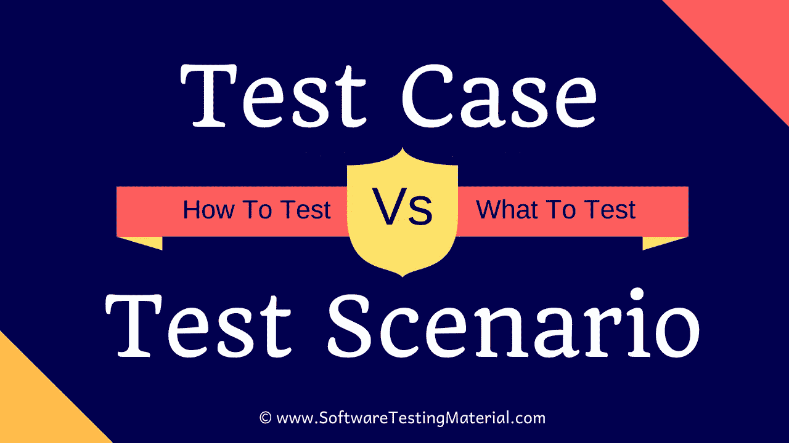

# 测试场景与测试用例之间的区别

> 原文:[https://www . software testing material . com/test-scenario-vs-test-case/](https://www.softwaretestingmaterial.com/test-scenario-vs-test-case/)

在这篇文章中，我们将看到测试用例与测试场景之间的区别。在大多数面试中，你都会遇到这个问题，即测试场景与测试案例。在本帖中，我们将展示测试场景和测试用例之间的 10 个差异。这些测试场景和测试用例模板都在[测试工件](https://www.softwaretestingmaterial.com/test-deliverables/)之下。作为测试人员，这两个模板在[软件测试生命周期(STLC)](https://www.softwaretestingmaterial.com/stlc-software-testing-life-cycle/) 的测试设计和测试执行阶段非常有用。

### **测试场景与测试用例**

#### 什么是测试场景？

测试场景给出了我们要测试什么的想法。测试场景就像一个高级测试用例。

测试场景回答"**要测试什么**"

#### 什么是测试用例？

测试用例是一个测试场景的肯定和否定的可执行步骤的集合，该测试场景具有一组前置条件、测试数据、预期结果、后置条件和实际结果。

测试用例回答"**如何测试**"

假设我们需要测试 Gmail 应用程序登录页面的功能。上述登录页面功能的测试用例如下:

**测试用例示例:**

**测试用例 1:** 输入有效用户名和有效密码
**测试用例 2:** 输入有效用户名和无效密码
**测试用例 3:** 输入无效用户名和有效密码
**测试用例 4:** 输入无效用户名和无效密码

### **测试用例与测试场景之间的差异**

[https://www.youtube.com/embed/i1F8LoPYmpc?rel=0](https://www.youtube.com/embed/i1F8LoPYmpc?rel=0)

| 判例案件 | 测试场景 |
| --- | --- |
| 测试用例由测试用例名称、前提条件、测试步骤、预期结果和后置条件组成 | 测试场景是一个 liner，但是它与多个测试用例相关联 |
| 测试用例指导用户“如何测试” | 测试场景指导用户“测试什么” |
| 测试用例的目的是通过执行一系列步骤来验证测试场景 | 测试场景的目的是测试软件应用程序的端到端功能 |
| 当与测试人员异地工作时，创建测试用例是很重要的 | 创建测试场景有助于您应对时间敏感的情况(尤其是在敏捷环境中) |
| 软件应用程序经常变化。这导致了页面的重新设计和新功能的添加。维护测试用例很难 | 由于其高层次的设计，测试场景易于维护 |
| 与测试场景相比，耗时更多 | 与测试用例相比，耗时更少 |
| 需要更多资源来创建和执行测试用例 | 相对较少的资源足以创建并使用测试场景进行测试 |
| 它有助于对应用程序进行详尽的测试 | 它以敏捷的方式帮助测试端到端的功能 |
| 测试用例来源于测试场景 | 测试场景源自用例 |
| 测试用例是低级动作 | 测试场景是高层次的行动 |
| 测试用例是由测试人员编写的 | 测试场景由测试领导、业务分析师和测试人员编写。 |
| 测试用例可能与多个测试场景关联，也可能不关联。 | 测试场景有多个测试用例。 |

注意:同时使用测试场景和测试用例将确保一个健壮的、高覆盖率的测试计划。最佳实践是编写测试场景，然后转移到测试用例。尽管这是最佳实践，但在当今的敏捷时代，大多数公司更喜欢测试场景。在敏捷时代，测试用例正被测试场景所取代，以节省时间。查看下面的帖子，了解测试用例模板的详细解释。

> [带解释的测试用例](https://www.softwaretestingmaterial.com/test-case-template-with-explanation/)

您也可以从这里下载[样本测试用例模板](https://www.softwaretestingmaterial.com/wp-content/uploads/2016/02/Sample-Test-Case-Template-SoftwareTestingMaterial.xlsx)。

**相关帖子:**

*   [带有详细说明的测试计划](https://www.softwaretestingmaterial.com/test-plan-template/)
*   [测试策略–完整指南](https://www.softwaretestingmaterial.com/test-strategy/)
*   [软件开发生命周期](https://www.softwaretestingmaterial.com/sdlc-software-development-life-cycle/)
*   [软件测试生命周期](https://www.softwaretestingmaterial.com/stlc-software-testing-life-cycle/)
*   [Bug 生命周期](https://www.softwaretestingmaterial.com/bug-life-cycle/)
*   [严重性与优先级](https://www.softwaretestingmaterial.com/what-is-the-difference-between-severity-and-priority-in-software-testing/)
*   [软件测试中的 PDCA](https://www.softwaretestingmaterial.com/pdca-cycle/)