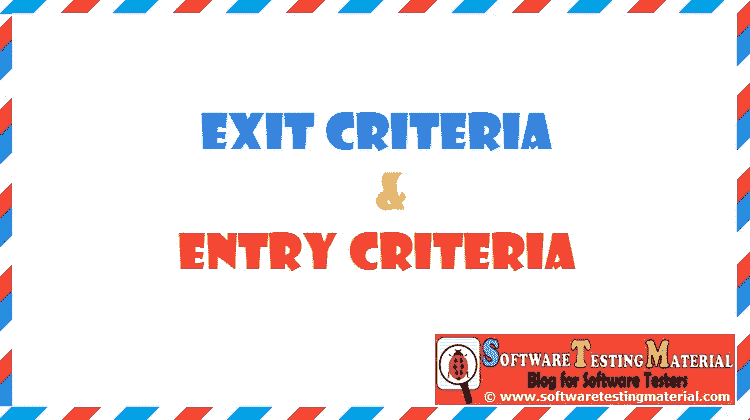

# STLC 过程中的进入和退出标准

> 原文:[https://www . software testing material . com/entry-and-exit-criteria/](https://www.softwaretestingmaterial.com/entry-and-exit-criteria/)

软件测试生命周期过程中的进入和退出标准——在这篇文章中，我们将看到什么是进入标准，什么是退出标准，以及我们如何在 STLC 的每个阶段应用这些标准

## **参赛标准:**

开始测试过程之前必须达到的先决条件。

## **退出标准:**

测试前必须满足的条件应被总结。

查看以下视频，了解“进入和退出标准”

[https://www.youtube.com/embed/kLsCWhBxgyw?rel=0](https://www.youtube.com/embed/kLsCWhBxgyw?rel=0)

### **测试计划:**

测试经理/测试主管准备测试策略和测试计划文档，测试人员将有机会参与准备过程。每个公司都不一样。

**参赛标准:**需求文档

**退出标准:** [测试策略](https://www.softwaretestingmaterial.com/test-strategy/)、[测试计划](https://www.softwaretestingmaterial.com/test-plan-template/)和测试工作量估算文档。

### **测试设计:**

在测试设计阶段，测试人员根据需求文档和测试计划准备测试场景、测试用例/测试脚本和测试数据。在这里，测试人员参与了准备测试用例、审查同行的测试用例、获得测试用例的批准以及将测试用例存储在存储库中的过程。

**进入标准:**需求文档，测试计划

**退出标准:**测试用例，测试脚本(如果自动化)，测试数据。

### **测试环境设置:**

在这个阶段，在大多数公司中，测试人员不会参与准备测试环境设置的过程。最有可能的是开发团队或实现团队准备测试环境。每个公司都不一样。作为一名测试人员，您将获得一份安装文档来设置测试环境。给定测试环境的就绪性。

**进入标准:** [测试计划](https://www.softwaretestingmaterial.com/test-plan-template/)，抽测案例，测试数据

**退出标准:**测试环境，烟雾测试结果

### **测试执行:**

在这个阶段，测试人员参与测试用例的执行，报告缺陷并更新[需求跟踪矩阵](https://www.softwaretestingmaterial.com/requirements-traceability-matrix/)。

**进入标准:** [测试计划文档](https://www.softwaretestingmaterial.com/test-plan-template/)，测试用例，测试数据，测试环境

**退出标准:**测试用例执行报告。[缺陷报告](https://www.softwaretestingmaterial.com/bug-report-template/)， [RTM](https://www.softwaretestingmaterial.com/requirements-traceability-matrix/)

### **测试结束:**

传统上，这是测试的最后阶段。测试领导参与准备测试指标和测试结束报告。一旦测试过程完成，测试主管发出测试结束报告

**进入标准:**测试用例执行报告(确保没有高严重性的缺陷被打开)，缺陷报告
**退出标准:**测试结束报告，[测试度量](https://www.softwaretestingmaterial.com/test-metrics/)