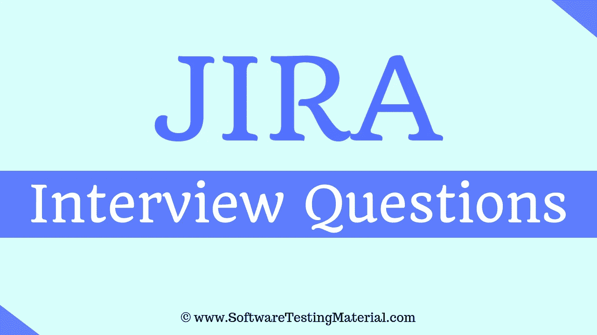

# JIRA 面试问答|软件测试材料

> 原文:[https://www . software testing material . com/jira-interview-questions/](https://www.softwaretestingmaterial.com/jira-interview-questions/)

在本帖中，我们涵盖了最常见的亚特兰大 JIRA 面试问题和答案。JIRA 是一个由 Atlassian 开发的错误跟踪和缺陷管理工具。JIRA 被用作项目管理工具和问题跟踪器。

这里，我们列出了 JIRA 面试中常见的 JIRA 面试问题和答案。我们将看到这些 JIRA 面试问题和答案的细节，这将有助于你破解你的 JIRA 面试。

**1。什么是 JIRA？**
JIRA 是由 Atlassian 开发的问题跟踪产品，它允许 bug 跟踪和敏捷项目管理。“JIRA”这个名字是从 Gojira 这个词继承来的，这个词在日语中是哥斯拉的意思，指的是竞争对手 Bugzilla。

| 吉拉 | Bugzilla |
| --- | --- |
| JIRA 是一个商业工具 | Bugzilla 是一个开源工具 |
| 与 Bugzilla 相比，JIRA 是一个用户友好的工具 | 与 JIRA 相比，Bugzilla 不是一个友好的工具 |
| 拖放问题优先级在 JIRA 可用 | 拖放问题优先级在 Bugzilla 中不可用 |
| JIRA 具有用户定义语义的可配置链接类型。JIRA 还有可插拔的远程问题链接，允许将问题链接到 JIRA 以外的任何其他实体 | Bugzilla 只有一种链接类型:blocks/depends，外加一个 Bug ID 定制字段 |
| 与 Bugzilla 不同，JIRA 允许根据问题的项目和类型定义多个工作流 | 与 JIRA 不同，Bugzilla 可以让用户选择新问题的初始状态 |
| 在 JIRA 可用的自定义字段类型太多了，无法一一列举，插件中可用的自定义字段类型甚至更多 | Bugzilla 中可用的自定义字段类型有文本字段、多选、下拉、日期/时间、Bug ID |
| JIRA 仅允许基于项目和类型字段的条件配置 | Bugzilla 允许您显示/隐藏整个自定义字段或基于其他字段值的特定值 |
| JIRA 缺乏高级搜索选项。JIRA 有灵活的 JQL 语言(JIRA 查询语言)，允许你建立任意布尔表达式 | Bugzilla 有一个强大的高级搜索选项 |

**4。吉拉可以用于测试用例管理吗？**
尽管 JIRA 并没有被设计成测试用例管理，但是它可以被配置成以两种不同的方式支持测试用例管理。

您可以在 JIRA 更改本地组件来满足测试用例管理的需求，或者您可以使用 Atlassian Marketplace 中可用的附加组件之一(例如:JIRA 的泽法)

> [流行的测试管理工具](https://www.softwaretestingmaterial.com/test-management-tools/)

**5。什么是 JIRA 的工作流程？**
工作流被定义为为了达到某个目标而需要完成的一系列顺序任务。
在 JIRA 中，工作流被定义为一个 bug 或问题的生命周期中涉及的一系列顺序任务(如创建/打开 bug、工作进行中以及完成/关闭)。

**创建:**创建问题或错误
**工作进行中:**为解决问题而执行的一系列操作
**关闭:**验证后完成问题

**6。解释在 JIRA 使用工作流？**
JIRA 工作流是问题在其生命周期中经历的一组状态和转换，通常代表您组织内的流程。存在无法编辑的预定义内置工作流；但是，您可以复制并利用这些工作流来创建自己的工作流。

7 .**。编辑活动工作流时有哪些限制？**
编辑活动工作流的草稿时会受到限制:

*   无法编辑工作流名称
*   无法删除工作流状态
*   如果状态没有传出转换，则不能添加任何传出转换，无论是常规还是全局
*   不能更改步骤 ID

**8。在 JIRA 什么是工作流设计师？**
JIRA 的工作流设计器是一个图形工具，使您能够查看工作流的布局，并创建和修改工作流的过程和转换。

*   您可以管理状态和转换:添加、单击和拖动，或选择编辑属性以重命名或删除
*   您可以添加全局转换，以允许工作流程中的不同状态转换到所选状态。在转换的属性板中选择“允许所有状态转换到此状态”。
*   您可以更改过渡使用的屏幕。
*   您可以配置高级转换选项，如条件、触发器、验证器和 post 函数。

**9。在 JIRA 服务台是如何工作的？**
以下是客户和服务台代理如何在 JIRA 合作解决请求。

1.  您的客户通过门户网站或电子邮件向服务代理提交请求
2.  服务台代理在其 JIRA 服务台热线中看到该请求，并调查该问题。
3.  您的客户和其他参与者利用门户网站或电子邮件与在 JIRA 服务台工作的服务台代理讨论请求。
4.  您的服务代理完成了请求，您的客户感到满意。

10。JIRA 的报告是如何生成的？
在 JIRA 生成报告的步骤如下:
**步骤 1:** 导航到所需的电路板，然后单击“报告”。您可以找到不同类型的报告。
**第二步:**点击切换报告，查看不同的报告。
**步骤 3:** 点击切换报告选项，查看不同的报告

**11。JIRA 生成的报告类型有哪些？**
JIRA 在项目中提供了不同类型的报表，用于显示整个项目生命周期中的项目统计数据。有分析问题的报告，也有 Scrum 和看板项目的报告。

**12。列举一些 JIRA 看板项目产生的报告。**
JIRA 的看板项目生成的报表有

*   检查图
*   累积流程图

13。列举一些 JIRA Scrum 项目产生的报告。
JIRA 任何 Scrum 项目生成的报告是

*   冲刺报告
*   检查图
*   烧毁图表
*   累积流程图
*   史诗报告
*   释放燃尽
*   速度图
*   版本报告

**14。列举一些在 JIRA 生成的用于问题跟踪和分析的报告。**

以下是在需要分析问题时生成的常规报告:

*   平均年龄报告
*   已创建和已解决的问题报告
*   饼图报告
*   最近创建的问题报告
*   解决时间报告
*   时间跟踪报告
*   用户工作量报告
*   版本工作量报告
*   工作量饼图报告

15。JIRA 的问题是什么？
不同的组织使用 JIRA 来跟踪各种类型的问题，这些问题可以代表从软件错误到项目任务或休假申请表的任何事情。

问题是任何 JIRA 项目的基石。一个问题可以代表一个故事、一个 bug、一项任务或项目中的另一种问题类型。

16。解释一个问题是如何在 JIRA 产生的。
让我们一步一步地看看问题是如何在 JIRA 的亚特兰蒂斯产生的。

1.  点击屏幕上方的**创建**，打开**创建问题**对话框。
2.  在**创建问题**对话框中选择相关的**项目**和**问题类型**。
3.  为该问题键入一个**摘要**，并填写任何适当的字段(必填字段标有星号)
    注意:在创建下一个问题之前，请确保检查它们都是正确的。
4.  如果您对您的问题内容感到满意，请点击**创建**按钮。

**17。JIRA 的颜色指标是什么，并提及它们的意义？**
JIRA 有三种颜色(蓝色、橙色&绿色)指示器。使用不同的颜色表示，问题跟踪变得很容易。这三种颜色用于表示在任何特定问题上花费的时间。

**蓝色:**蓝色表示原始估计值，即解决问题的估计时间
**橙色:**橙色表示剩余估计值，即解决问题的剩余时间
**绿色:**绿色表示花费或记录的时间，即解决问题所花费的总时间

18。任何特定问题的变更历史记录中包含哪些元素？
针对某一特定问题的历史变更包括以下内容

*   创建和删除评论
*   创建和删除问题链接
*   删除工作日志
*   文件的附件
*   问题字段更改

**19。如何查看 JIRA 任何问题的变更历史？**
可以通过以下步骤在 JIRA 查看任何问题的变更历史:

*   打开任何问题。
*   点击“活动”部分的“历史”选项卡。

20。如何在 JIRA 与其他用户共享问题？
在 JIRA 的发行说明页面上有一个股票期权。使用此共享选项，可以与其他用户共享问题。点击共享选项后，它会要求您提供“用户名或电子邮件”和“注释”

**21。为什么一个问题在 JIRA 被贴上标签？**
在 JIRA 标记问题可以让您找到问题属于哪个类别。借助标签可以轻松搜索问题。标签可以在创建问题时进行初始设置。如果需要，还可以对其进行修改。

**22。在 JIRA，问题是如何关联的？**
意为建立两者之间的联系。在 JIRA，一个问题可以与相同或不同 JIRA 服务器上的其他问题相链接。

一个问题可以与其它问题链接，如下所示

1.  一个问题可能与另一个问题相关
2.  一个问题可能会重复另一个问题
3.  一个问题可能会阻止另一个问题

**23。“移动问题向导”在 JIRA 有什么用？**
**移动问题**向导使您能够在您的 JIRA 实例中指定另一个项目。**移动问题**向导允许您更改问题的某些属性，如问题类型、问题状态和自定义字段。

*   **问题类型:**如果您的问题是目标项目中不存在的自定义问题类型，您必须选择新的问题类型。
*   **问题状态:**如果您已经为您的问题分配了自定义状态，并且它不存在于您的目标项目中，则您必须为您的问题选择新的问题状态。
*   **自定义字段:**如果您为目标项目中不存在的问题定义了**必需的**自定义字段，您必须为它们设置值。

**24。如何在 JIRA 安排发行？**
要安排问题，请填写其**到期日**字段。这可以在创建问题时完成，也可以在以后通过编辑问题来完成。只有拥有排班问题权限的用户才能填写**到期**日期字段。

**25。项目详情如何在 JIRA 上市？**
所有的项目都有一些属性显示在项目摘要部分下。
JIRA 的属性列表如下

1.  项目的性质
2.  项目的关键
3.  成分
4.  版本

**26。JIRA 的发行类型有哪些？**
每个吉拉应用程序都带有默认的问题类型。您可以使用这些默认问题类型，也可以创建自己的问题类型来满足项目和团队的需要。
下面是每个吉拉应用程序中特定问题类型的示例:

吉拉核心违约发行类型:

*   **任务**——需要完成的任务
*   **子任务**——较大工作中的较小任务

吉拉软件默认问题类型

*   **故事**–从用户角度表达的功能需求
*   **Bug**–损害产品或服务功能的问题
*   **史诗**-包含许多问题的大作品

吉拉服务台默认问题类型

*   **事件**–系统中断或事件
*   **服务** **请求**——用户对产品或服务的一般请求
*   **变革**–新技术或解决方案的推出
*   **问题**–跟踪事故的根本原因

**27。克隆在 JIRA 是什么问题？**
通过克隆或复制问题，您可以在同一项目中快速创建问题的副本。克隆问题是原始问题的副本，包含原始问题中存储的相同信息，如摘要、影响版本、组件等。克隆问题同样可以与原始问题相关联。

克隆问题与原始问题是不同的实体。原始问题的任务对克隆的问题没有影响，反之亦然。

克隆问题保留以下信息:

*   摘要
*   描述
*   代理人
*   环境
*   优先
*   问题类型
*   安全性
*   记者
    (如果您没有**修改记者**权限，将会以您为记者创建克隆问题。)
*   成分
*   影响版本
*   版本修复
*   问题链接(可选)
*   附件(可选)
*   项目
    (保存克隆后，您可以将其移动到另一个项目，如移动问题中所述。)

自定义字段的内容也是克隆的。

**28。有哪些不是克隆自**原**期的东西？**
不是克隆的东西:

*   时间跟踪
*   评论
*   问题历史
*   链接到 Confluence 页面

**29。如何创建问题的克隆？**
按照下面提到的步骤创建一个问题的克隆

1.  打开您想要复制的任何 JIRA 问题
2.  选择**更多** > **克隆**。将出现**克隆问题**屏幕
    ——如果您愿意，您可以编辑克隆问题的**摘要**。
    –如果该问题包含其他问题的链接，您可以选择是否在新的克隆问题中包含这些链接。
    –如果问题包含子任务，您可以选择是否在新的克隆问题中创建子任务。
    –如果问题包含附件，您可以选择是否在新的克隆问题中包含附件。
3.  单击创建。

三十岁。JIRA 的子任务是什么？
子任务是将一个父问题分解成多个较小的任务，这些任务可以单独分配和跟踪。父问题的所有子任务都在父问题的主屏幕上汇总。子任务始终属于与其父问题相同的项目。

31。如何在 JIRA 创建子任务？

1.  导航至您希望成为即将创建的子任务的父问题的问题。
2.  选择**更多>创建子任务**。您将看到**创建子任务**屏幕。
3.  根据需要填写详细信息，然后点击页面底部的**创建**。

32。如何在 JIRA 制作看板？
让我们看看在 JIRA 创建看板的一步一步的过程

1.  使用有效凭据登录 JIRA 应用程序，并导航到控制面板。
2.  点击项目下拉菜单并选择**创建项目。**
3.  选择**看板软件开发**，点击**下一步**。
4.  输入所有必要的详细信息，然后点击**创建**。

33。提及一些受欢迎的 JIRA 插件？
一些流行的 JIRA 附加组件如下

*   JIRA 的泽法——测试管理
*   詹金斯–CI
*   开源代码库
*   松弛的
*   Atlassian REST API 浏览器
*   JIRA 的编剧
*   JIRA 工具包插件
*   速度时间表

34。如何在 JIRA 定义一个组件？
构件是一个工程的子分部。它们用于将项目中的问题组合成更小的部分。
管理项目的组成部分

*   以项目管理员身份登录 JIRA。
*   选取“设置”>“项目”>,然后点按项目的名称。将出现“项目摘要”页面。
*   在左侧菜单中选择组件。将显示组件页面，演示组件的概要和每个组件的信息。

35。如何在 JIRA 删除一个组件？
删除一个 JIRA 组件，

1.  导航到组件屏幕，将鼠标悬停在相关组件上以显示删除按钮。
2.  如果您愿意，系统会提示您将这些问题与另一个组件连接起来。

36。我们可以与 JIRA 集成哪些版本控制系统？
JIRA 可以与 Git、Subversion、Visual SourceSafe 等版本控制系统集成。,

37。解释一下如何同时编辑多个问题？
可以通过执行批量操作来同时编辑多个问题。若要执行此批量操作，您将需要全局的“进行批量更改”权限以及每个项目的相关权限。

JIRA 可用的批量操作如下

*   通过工作流程转移多个问题
*   删除多个问题
*   移动多个问题
*   编辑多个问题
*   观看或停止观看多期

38。泽法对吉拉来说意味着什么？
JIRA 泽法是一个附加应用程序，它在 JIRA 提供高度复杂的测试管理功能。

39。JIRA 仪表板的重要性是什么？如何在吉拉创建新仪表板或自定义现有仪表板？
仪表板是您登录 JIRA 应用程序时看到的第一个页面。
这是所有 JIRA 用户通用的默认仪表盘，但您可以根据自己的需求创建自己的仪表盘。
你可以通过添加不同的小工具来设计你的个人仪表盘。
按照以下步骤在 JIRA 创建仪表板。

1.  使用有效凭据登录您的 JIRA 帐户
2.  选择吉拉图标>**仪表盘**
3.  点击并选择**创建仪表板**创建一个空白仪表板。您也可以选择**复制仪表板**来创建您当前正在查看的仪表板的副本
4.  显示**创建仪表板**页面
5.  命名您的仪表板并添加描述
6.  填写剩余字段，然后单击**创建**T2】注意:可以从管理仪表板部分编辑、复制、共享和删除仪表板

40。如何在 JIRA 向仪表板添加小工具？
您必须是 JIRA 管理员才能在 JIRA 向仪表板添加小工具。一些应用程序允许多组人员共享仪表板。如果您拥有更新共享仪表板的权限，共享仪表板的其他人也将看到您的更改。

以下是将小工具添加到仪表板的步骤:

1.  通过选择导航栏中的仪表板链接，转到仪表板。
2.  点击仪表板上的**添加小工具**。
3.  使用小工具向导选择要添加的小工具。

41。在 JIRA，什么是看板？
在 JIRA，看板是使用看板预设或 DIY 选项创建的板。如果一个团队的重点是管理和约束他们的在制品，那么看板就适合他们。

**42。什么是 JIRA 的 Scrum 板？**
JIRA 的 Scrum 板是使用 Scrum 预置创建的板。如果一个团队计划在 sprints 中工作，那么 Scrum board 适合他们。

**43。在 JIRA 什么是验证器？**
JIRA 的验证器在执行转换之前检查转换的任何输入是否有效。当验证器失败时，问题不会进展到转换的目标状态。

**44。什么是问题收集器？**
JIRA 的一个问题收集者可以让你轻松地将 JIRA 反馈表嵌入到自己的网站中。这有助于网站访问者通过您的网站将问题记录到 JIRA。您网站的访问者不需要 JIRA 的用户帐户就可以使用 JIRA 反馈表。

**45。什么是审计日志？**
JIRA 的审计日志允许管理员回顾您的站点中所做的更改。审核日志帮助您解决问题。

**结论:**

在本帖中，我们已经涵盖了最重要的 JIRA 面试问题和答案。希望这些 JIRA 面试问题和答案对你即将到来的 JIRA 面试有所帮助。

**相关帖子:**

*   [敏捷面试问题](https://www.softwaretestingmaterial.com/agile-testing-interview-questions/)
*   [6 个最受欢迎的人力资源面试问题](https://www.softwaretestingmaterial.com/6-important-interview-questions/)
*   [SQL 面试问题](https://www.softwaretestingmaterial.com/sql-interview-questions/)
*   [Java 面试问题](https://www.softwaretestingmaterial.com/java-interview-questions/)
*   [软件测试面试问题](https://www.softwaretestingmaterial.com/100-software-testing-interview-questions/)
*   [硒面试问题](https://www.softwaretestingmaterial.com/selenium-interview-questions/)
*   [量角器面试问题](https://www.softwaretestingmaterial.com/protractor-interview-questions-softwaretestingmaterial-updated-2018/)