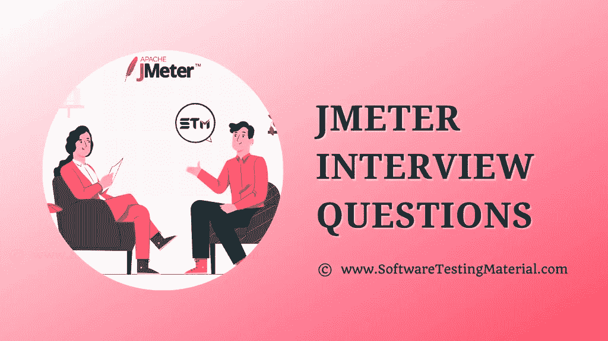

# 要准备的前 40+ JMeter 面试问题和答案

> 原文:[https://www . software testing material . com/jmeter-interview-questions/](https://www.softwaretestingmaterial.com/jmeter-interview-questions/)



你准备好迎接即将到来的 JMeter 工作面试了吗？如果你确切地知道招聘经理会在下一次 JMeter 负载测试面试中问你什么问题，那不是很好吗？

在这篇文章中，我们已经涵盖了所有重要的 JMeter 面试问题和答案。

我们还介绍了与您相关的其他主题，如下所示。不要错过退房。

### **#1。JMeter 是什么？**

JMeter 是一个开源软件应用程序，用于对客户端/服务器应用程序进行性能和负载测试。在 JMeter 的帮助下，您可以生成复杂的报告，告诉您您的网站或 web 应用程序到底出了什么问题。

> **必读:** [JMeter 替代品](https://www.softwaretestingmaterial.com/jmeter-alternatives/)

### **#2。****JMeter 是如何工作的？**

它的工作方式类似于一组用户向目标服务器发送请求。该工具收集来自目标服务器的响应和其他统计信息，这些信息通过图表或表格显示应用程序或服务器的性能，以便检查应用程序的性能。

### **#3。解释 JMeter 中使用的正则表达式？**

在 Jmeter 中，正则表达式用于搜索和操作文本。它用于从响应中动态提取一些值，以便在后续请求中使用，或者出于报告目的保存这些值。前处理器和后处理器中都使用正则表达式。

### **#4。正则表达式中的“包含”和“匹配”表示什么？**

包含在正则表达式中意味着正则表达式至少匹配目标的某个部分。
正则表达式中的 While 匹配意味着正则表达式应该匹配整个目标。

### **#5。什么是听众？**

侦听器用于以表格、图形、树、日志文件或任何其他可以呈现给利益相关者的格式来存储负载测试的执行结果。这些监听器可以在测试中的任何地方进行调整，包括直接在测试计划下。

### **#6。列举一些 JMeter 监听器**

一些 JMeter 监听器如下

*   样条可视化工具
*   汇总报告
*   聚集图
*   断言结果
*   查看结果树
*   在表格中查看结果
*   监控结果
*   响应时间图
*   分布图
*   BeanShell 监听器
*   总结报告
*   后端监听器
*   比较断言可视化工具
*   图表结果
*   邮件可视化工具
*   将响应保存到文件
*   简单数据写入器
*   JSR223 监听器

### **#7。JMeter 中使用的各种类型的处理器是什么？**

jmeter 中有两种处理器

*   预处理器
*   后处理器

### **#8。什么是 JMeter 预处理器？**

JMeter 预处理器用于在测试场景中执行采样器请求之前执行动作。这些用于配置采样器执行之间或测试数据生成之前的超时，或者根据性能测试的需要从数据库获取数据。

### **#9。提一些前置处理器元素？**

一些预处理器元件包括

*   Beanshell 预处理程序
*   BSF 预处理器
*   HTML 链接解析器
*   HTTP URL 重写修饰符
*   JDBC 预处理器
*   JSR223 预处理程序
*   正则表达式用户参数
*   样本超时
*   用户参数

### **#10。什么是后处理器？**

JMeter 后处理器用于在处理完采样器请求后执行某些操作。这些用于获得响应或将数据收集到一个变量中以备后用。

### **#11。提一些前置处理器元素？**

一些后处理器元件包括

*   Beanshell 后处理器
*   BSF 后处理器
*   CSS/JQuery 提取器
*   调试后处理器
*   JDBC 后处理器
*   JSON 路径后处理器
*   JSR223 后处理器
*   正则表达式提取器
*   结果状态操作处理程序
*   XPath 提取器

### **#12。您可以在 JMeter 上执行哪些类型的测试？**

Apache JMeter 用于测试静态资源(HTML 和 JavaScript)和动态资源(AJAX、JSP 和 Servlets)的性能。我们可以使用这个工具来执行 web 应用程序的负载测试和压力测试。

### **#13。说出 JMeter 支持的协议？**

JMeter 支持的协议如下:

*   Web 协议:它支持 HTTP 和 HTTPS 网站。用于测试 web 应用程序。
*   Web 服务:它支持 SOAP 和 REST。用于测试 web 服务应用程序。
*   用于测试数据库应用程序的 JDBC 驱动程序。
*   目录:LDAP(轻量级目录访问协议)。
*   邮件服务:用于测试 POP3、IMAP、SMTP 等邮件服务器。
*   通过 JMS 的面向消息的中间件(MOM)服务。
*   文件传输协议为测试 FTP 服务器和应用程序提供支持。
*   蒙戈布(NoSQL)。
*   本机命令或 shell 脚本。
*   TCP。

### **#14。JMeter 中的测试计划是什么？**

测试计划可以被看作是在 JMeter 上运行测试的容器。它描述了运行测试时 JMeter 将执行的一系列步骤，比如测试什么以及如何执行。

### **#15。列出 JMeter 中的一些测试计划元素？**

一个完整的测试计划由一个或多个元素组成，例如

*   线程组
*   逻辑控制器
*   样本生成控制器
*   听众
*   倍
*   断言
*   配置元素

### **#16。什么是工作台？**

JMeter 工作台只是一个临时存储位置，用来存储可以添加到测试计划中的测试元素。JMeter 不会保存工作台的组件，除非进行了配置。它们必须作为测试片段单独保存。

### **#17。JMeter 的测试计划中测试元素的执行顺序是怎样的？**

测试计划元素的执行顺序如下:

*   配置元素
*   预处理器
*   倍
*   样品
*   后处理器(除非 SampleResult 为空)
*   断言(除非 SampleResult 为空)
*   侦听器(除非 SampleResult 为空)

### **#18。JMeter 中的定时器是什么？**

JMeter thread naturally sends requests without applying any delay between each sampler/<wbr>request. Timers are utilized to get a pause between the requests. If we perform load testing or stress testing on a server without any delay, it will create a server overload problem. Timer in JMeter solves the server overload issues. 

### **#19。JMeter 中的定时器有哪些类型？**

JMeter 中的各种计时器有:

*   常数计时器
*   高斯随机定时器
*   同步计时器
*   均匀随机定时器
*   泊松随机定时器
*   宝肖计时器
*   BSF 定时器
*   恒定吞吐量计时器
*   JSR223 定时器

### **#20。JMeter 中的样本是什么？**

它生成一个或多个样本结果。这些样本结果有各种不同的特征，如数据大小、运行时间等。JMeter 向服务器发送特定类型的请求；在采样器的帮助下，线程组决定需要发出哪个请求。常用的采样器有 HTTP 请求、JDBC 请求、FTP 请求等。,

### **#21。JMeter 中的线程组是什么？**

线程组是 JMeter 的一个重要元素。在这里，您可以设置线程组中给定的用户数量和加载所有用户的时间。测试计划必须至少有一个线程组。线程组的控件允许您设置线程数量、上升周期和执行测试的次数。

### **#22。JMeter 中的测试片段是什么？**

它是一种类似线程组的元素，有助于在创建大型流的脚本时建立基于模块的方法。唯一的区别是，除非被**模块控制器**或**包含控制器**引用，否则测试片段不会被执行。

### **#23。JMeter 中的模块控制器是什么？**

JMeter 中的模块控制器允许你在测试计划的控制器(包含子元素)之间切换。这些控制器可以放在线程组或工作台中。

### **#24。JMeter 中的包含控制器是什么？**

Include 控制器设计为使用外部 JMX 文件。JMeter 中的 Include 控制器允许您使用多个测试计划。

### **#25。JMeter 中的函数和变量是什么？**

JMeter 函数是特殊的值，它可以填充测试树中任何采样器或者其他元素的字段。

函数调用如下所示:

```
${__functionName(var1,var2,var3)}
```

JMeter 提供用户定义的静态值(或变量)，以及执行不同动作的内置函数。

可以将函数和变量写入任何测试组件的任何字段中，以使脚本可重用。

变量的语法:

```
${VARIABLE}
```

### **#26。如果引用了未定义的函数或变量，JMeter 会做什么？**

如果引用了未定义的函数或变量，JMeter 不会报告/记录错误——引用会原封不动地返回。例如，如果 STM 没有被定义为变量，那么${STM}的值就是${STM}。

### **#27。JMeter 中的断言是什么？断言的类型有哪些？**

断言有助于确认测试中的服务器返回预期的结果。

JMeter 中一些常用的断言如下。

*   **响应断言:**它通过比较服务器响应和字符串模式来验证结果是否符合预期，从而方便用户。
*   **大小断言:**它测试来自服务器的每个响应，包含预期的字节数。它帮助用户确定大小，即等于、不等于、大于或小于给定的字节数。
*   **持续时间断言:**您可能需要测试服务器的响应是否达到用户定义的时间。如果花费的时间超过用户定义的时间，服务器响应将失败。
*   **XML 断言:**它检查来自服务器的响应是否以正确的 XML 格式保存数据。
*   **HTML 断言:**验证响应数据的语法很有用。

### **#28。如何确保 JMeter 脚本的可重用性？**

通过遵循以下几点，我们可以保证测试脚本的可重用性:

*   利用“CSV 数据集配置”、“用户定义的变量”等配置元素来支持更好的数据重用。
*   模块化共享任务，并通过“模块控制器”调用它们。
*   创建自己的 BeanShell 函数，并重用它们。

### **#29。JMeter 中的控制器有哪些类型？**

JMeter 中的两种控制器是:

**采样器控制器:**采样器使得 JMeter 能够向服务器发送特定类型的请求。它们刺激用户从目标服务器请求页面。

**逻辑控制器:**这些控制器让你控制一个线程中采样器的处理顺序。它可以改变来自任何子元素的请求的顺序。

### **#30。JMeter 中的尖峰测试是什么？**

在应用程序的某一点突然增加用户数量，然后在此间隔检查其行为，这就是尖峰测试。

### **#31。如何在 JMeter 中进行尖峰测试？**

在 JMeter 中，可以利用同步计时器进行峰值测试。这个计时器继续阻塞线程，直到保留了特定数量的线程。它同时释放它们，因此产生很大的瞬时负载。

### **#32。监听测试有什么用？**

监控测试的一些用途包括:

*   它对于系统管理和压力测试非常有用。
*   它还提供了与压力测试一起使用时有关服务器性能的附加信息。
*   监视器使得在客户端查看服务器性能和响应时间之间的联系变得容易。
*   作为系统管理工具，它还提供了一种从一个控制台监控多台服务器的简单方法。

### **#33。JMeter 支持哪些重要的插件？**

JMeter 支持不同类型的插件，有助于生成高质量的结果。JMeter 支持的一些重要插件如下。

*   线程组插件
*   监听器插件
*   采样器插件

### **#34。什么是数据参数化，JMeter 中数据参数化有哪些不同的方式？**

数据参数化允许我们重用脚本。我们可以为同一个请求传递不同的参数，而不需要在脚本中硬编码这些值。

这可以使用 CSV 数据集配置文件或用户定义的变量来完成。

### **#35。JMeter 和 LoadRunner 有什么区别？**

| 测试工具 | 工具 |
| --- | --- |
| 开源工具 | 许可软件 |
| 它是由 Apache 开发的 | 它是由水星开发的 |
| 它缺乏用户界面 | 它的用户界面令人印象深刻 |
| 与 LoadRunner 相比，技术含量较低 | 它有更多的技术能力 |
| 它不支持 SAP 和 Siebel | 它支持 SAP、Siebel 和 PeopleSoft |

### **#36。能否将 selenium 与 JMeter 集成？**

Apache JMeter 和 Selenium 可以通过在 JMeter ext 文件夹中添加 WebDriver sampler 插件，然后重启 JMeter 来集成。然后，我们可以在 Webdriver sampler 中编写 selenium 代码，然后执行它来查看性能。

### **#37。JMeter 和 Selenium 有什么区别？**

| 测试工具 | 硒 |
| --- | --- |
| JMeter 是一个支持性能测试的开源工具 | Selenium 是一个开源工具，主要支持 web 浏览器集成测试 |
| 它不支持跨浏览器测试 | 它支持多种浏览器进行跨浏览器测试 |
| 它适用于应用程序的性能和压力测试 | 它适用于更复杂的测试，如生产监控和负载测试 |
| 运行 JMeter 不需要浏览器 | 运行 Selenium 需要浏览器 |
| 它支持分布式测试。 | 为了支持分布式测试，我们需要使用一个扩展 ie。，硒格。 |

### **#38。什么是分布式负载测试？**

分布式负载测试是使用多个系统模拟大量用户的巨大工作负载的过程。多个系统用于分布式负载测试，因为单个系统无法生成大量用户(线程)。JMeter 采用主从式配置实现负载测试。

### **#39。你会如何在 JMeter 中进行主从配置？**

主从配置被认为是分布式测试的一部分，在分布式测试中，使用多台机器来执行被测服务器的负载测试。所有的机器应该在同一个网络中，并且安装了相同的 JMeter 版本。配置是这样完成的，一台机器作为主机，其他机器作为从机。

在 JMeter 中执行主从配置的步骤如下。

1.  主机–编辑 jmeter.properties 文件，并根据文件中的 remote_host 字段添加所有从机的 IP 地址。
2.  保存文件并再次启动 JMeter。
3.  从 JMeter 的 RUN 菜单中，选择 Remote Start 并选择要调用的机器的 IP。
4.  选择 RUN 菜单并选择 Remote Start all 来启动所有用于测试的从机。

### **#40。如何减少 JMeter 中的资源需求？**

以下是一些减少 JMeter 中资源需求的建议:

*   利用非图形用户界面模式。
*   使用尽可能少的侦听器
*   禁用“查看结果树”或“查看表中的结果”等侦听器。它会消耗大量内存，并导致 JMeter 耗尽内存或控制台冻结。
*   尽量不要使用功能模式。
*   不要使用许多相似的采样器，而是在一个循环中使用相同的采样器，并使用变量(CSV 数据集)来改变样本。或者使用访问日志采样器。
*   使用 CSV 输出而不是 XML。
*   尽量少用断言。
*   仅存储必要的数据。
*   禁用所有 JMeter 图形，因为它们会消耗大量内存。不过，您可以使用 web 界面中的 JTL 选项卡查看实时图表。
*   在每次测试运行之前，清除“文件”选项卡。
*   当使用本地路径时，尝试将其从 CSV 数据集配置中删除。访问测井取样器。

## **结论:**

我希望这篇关于 JMeter 面试问题的文章能帮助你更好地理解这个概念，让你毫无障碍地破解任何面试。我希望我们已经在这里涵盖了最常被问到的 JMeter 面试问题。如果你有任何我们在这里没有提到的问题，请在评论区提问，我们将会回答。

**相关帖子:**

*   [最佳性能测试工具](https://www.softwaretestingmaterial.com/performance-testing-tools/)
*   [硒面试问题](https://www.softwaretestingmaterial.com/testng-interview-questions/)
*   [软件测试面试问题](https://www.softwaretestingmaterial.com/100-software-testing-interview-questions/)
*   【Selenium 自动化测试人员的 Java 面试问题
*   【Selenium 测试人员的 Python 面试问题
*   [你为什么选择软件测试作为你的职业](https://www.softwaretestingmaterial.com/choose-software-testing-as-a-career/)
*   [解释您的 Selenium 测试自动化框架](https://www.softwaretestingmaterial.com/explain-test-automation-framework/)