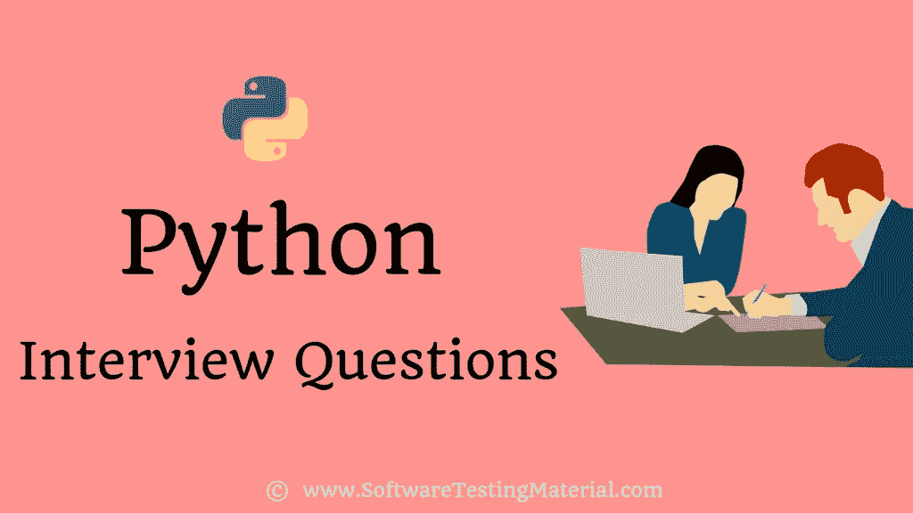

# Python 面试问题

> 原文:[https://www . software testing material . com/python-interview-questions/](https://www.softwaretestingmaterial.com/python-interview-questions/)

在这里，我们将讨论 Python 编程语言中最常见的 Python 面试问题和答案。希望这个面试问题列表将成为你搜索 Python 编码面试问题的一站式资源，帮助你破解任何 Python 面试。

有经验的 Python 程序员可能会比那些刚开始学习 Python 编程的人更快地赶上竞争对手。因此，我们在这里为初学者和有经验者编制了一个 Python 编程面试问题列表。

> 还念: [Java 面试问题](https://www.softwaretestingmaterial.com/java-interview-questions/)

现在让我们进入 Python 问答部分。然而，完全有可能你已经知道其中的一些。但是我们认为你仍然会从阅读中受益。

## **基本 Python 面试问题 1–25:**

**1。Python 是什么？使用 Python 有什么好处？**

Python 是一种开源解释的、高级的、面向对象的脚本语言。它由荷兰程序员吉多·范·罗苏姆创建，并于 1991 年发布。

*   应用程序开发更快更容易
*   它是世界上发展最快的编程语言之一
*   由于其简单易用的语法规则，很容易保持代码库的可读性和应用程序的可维护性
*   它不需要显式的内存管理，因为解释器本身会将内存分配给新的变量，并自动释放它们。
*   它可以用于服务器端 web 开发、软件开发、数学、人工智能、数据分析、数据科学、系统脚本、科学计算等。,
*   它由一个巨大的标准库组成，包括互联网协议、字符串操作、web 服务工具和操作系统接口等领域。许多常用的编程任务已经被编写到标准库中，这大大减少了要编写的代码长度。
*   它有一个庞大的支持社区来获得你的答案。感谢它是开源的和社区开发的。

**2。Python 的特点？**

*   易于学习和使用
*   表达性语言
*   解释语言
*   跨平台语言
*   高级语言
*   轻便的
*   自由和开源语言
*   面向对象语言
*   可扩张的
*   大型标准图书馆
*   GUI 编程支持
*   完整的
*   可嵌入
*   动态类型语言

**3。PEP 8 是什么？**

PEP 代表 Python 增强提案。PEP 8 是 Python 的风格指南。这是一组关于如何编写可读性更好的 Python 代码的规则。

**4。Python 脚本是如何执行的？**

当 Python 脚本被执行时，它不会将其代码转换成机器代码。它实际上将其转换成一种叫做字节码的东西。Python 脚本的执行意味着在 Python 虚拟机(PVM)上执行字节码。

*假设你的脚本在“D:\ mypython code \ script . py”*

—打开命令行:开始菜单->运行并键入 cmd

—类型:C:\ python 27 \ python . exe D:\ mypython code \ script . py

**5。有什么区别。py 和。pyc 文件？**

。py 文件是保存 Python 代码的原始文本文件。

。pyc 文件是。py 文件。这些是由 Python 编译器生成的字节码文件。

Python 编译。py 文件并将其保存为。pyc 文件

**6。python 区分大小写吗？**

是的。Python 是一种区分大小写的语言。

7 .**。Python 中的酸洗和拆洗是什么？**

**腌制:**

pickle 是 pickle 模块接受任何 Python 对象并将其转换为字符串表示，并通过调用 dump 方法将其转储到文件中的过程。

**拆线:**

拆包是从存储的字符串表示中检索原始 Python 对象的过程。简单地说，酸洗的逆过程被称为拆线。

**8。Python 中的猴子补丁是什么？**

Python 中的 Monkey Patching 指的是在运行时对类或模块进行动态修改

**9。什么是 python 模块？说出 Python 中一些常用的内置模块？**

Python 模块是由 Python 代码组成的文件。Python 模块可以定义函数、类和变量。Python 模块是包含可运行代码的. py 文件。

10。Python 中的局部和全局变量是什么？

**局部变量:**

在函数内部声明的变量称为局部变量。这些变量存在于局部空间，而不存在于全局空间。locals()是在函数中访问的，它返回可以从该函数本地访问的所有名称。

**全局变量:**

在函数外部或全局空间中声明的变量称为全局变量。程序中的任何函数都可以访问这些变量。globals()返回可以从该函数全局访问的所有名称。

**11。Python 中的链表和元组有什么区别？**

**列表 vs 元组**

**列表:**

*   列表是可变的。可变数据类型意味着可以修改这种类型的 python 对象
*   列表是由逗号分隔的元素序列，并用方括号或简单的方括号“]”括起来。
*   列表长度可变
*   列表操作比元组操作更大，这使得它有点慢

**双缝:**

*   元组是不可变的。不可变的对象不能被修改。元组对象创建后，我们不能修改它
*   元组是由逗号分隔并由圆括号或圆括号“()”包围的元素序列
*   元组具有固定长度
*   元组操作的大小比链表小，这使得它的速度稍快

**12。len()是做什么的？**

它用于确定字符串、列表、数组等的长度。

len(a)

13。Python 中的*args 和**kwargs 是什么？

在 Python 中，*args 和**kwards 用于向使用特殊符号的函数传递可变数量的参数。

当我们不确定函数中要传递多少个参数时，我们使用*args 和**kwargs 作为参数。

**14。Python 是怎样一种解释型语言？**

Python 是一种解释型语言。Python 程序直接从源代码运行。它将程序员编写的源代码转换成中间语言，中间语言又被翻译成必须执行的机器语言。它将源代码转换成中间语言，中间语言又被翻译成必须执行的本地语言/机器语言。

15。Python 中内置的类型有哪些？

Python 中常见的原生数据类型如下。

**1。可变内置类型:**我们可以在不改变身份的情况下改变内容

*   字典
*   目录
*   设置

**2。不可变的内置类型:**一旦内容被创建，我们就不能更改它

*   用线串
*   元组
*   民数记

16。Python 中如何管理内存？

*   Python 中的内存由 Python 私有堆空间管理。所有 Python 对象和数据结构都位于私有堆中。程序员无权访问私有堆，Python 中的私有堆由 Python 解释器负责。
*   Python 内存管理器负责为 Python 对象分配 Python 堆空间。
*   Python 有一个内置的垃圾收集器，它回收所有未使用的内存并释放内存，使其可用于堆空间。

**17。有哪些工具有助于发现 bug 或执行静态分析？**

PyChecker: PyChecker 是一个静态分析工具，它可以发现 Python 源代码中的错误，并对样式或代码复杂性中的问题发出警报。

**Pylint:** Pylint 检查一个模块是否符合编码标准。

18。什么是 Python decorators？

Python decorators 允许程序员向现有代码添加功能。它是包装一个函数，以便扩展包装函数的行为，而不是永久地修改它。

**19。Python 识别的不同环境变量是什么？**

Python 可以识别的环境变量有

*   皮顿路径
*   PYTHONSTARTUP
*   PYTHONCASEOK
*   PYTHONHOME

20。什么是 PYTHONPATH？

PYTHONPATH 是一个由 Python 标识的环境变量，它告诉解释器在哪里定位导入到程序中的模块文件。

**21。什么是 PYTHONSTARTUP？**

PYTHONSTARTUP 是一个由 Python 标识的环境变量，它包含一个包含 Python 源代码的初始化文件的路径。

**22。什么是 PYTHONCASEOK？**

PYTHONCASEOK 是由 Python 标识的环境变量，在 windows 中用于指示 Python 在导入语句中查找第一个不区分大小写的匹配

**23。PYTHONHOME 是什么？**

PYTHONHOME 是一个由 Python 标识的环境变量，Python 是一个可选的模块搜索路径。通常它被嵌入在 PYTHONSTARTUP 或 PYTHONPATH 目录中，以便于切换模块库。

**24。Python 中的名字是什么？**

Python 中的名称也称为标识符。这是访问变量的一种方式。它只是给对象起的一个名字。在 Python 中，我们可以通过给变量赋值来声明变量。

**25。Python 中的命名空间是什么？**

名称空间是一种命名系统，用于确保 Python 中每个对象(可能是变量或方法)的名称都是唯一的，以避免命名冲突。基于名称空间，Python 解释器理解代码中试图指向的确切方法或变量

## **数据科学基础 Python 面试问题:**

**26。Python 中的作用域是什么？**

我们可能无法从程序的每个部分访问所有的名称空间。作用域是指可以访问命名空间的编码区域。

**27。Python 中的迭代器有哪些？**

在 Python 中，迭代器用于迭代容器，比如一个列表或一组元素。迭代器实现 __itr__ 和 next()方法来迭代存储的元素。在 Python 中，我们通常使用循环来迭代集合(列表、元组)。

**28。Python 中的切片是什么？**

切片是一种字符串操作，用于从序列类型(如列表、元组和字符串)中选择一系列项目。

slice 对象表示由 range(开始、停止、步进)指定的索引。slice()方法允许三个参数。开始、停止和步进。

start–切片开始的起始编号。
停止–表示切片结束的数字。
步长–每次步进后增加的值(默认值= 1)。

虽然我们可以通过指定一个索引来获取元素。在 Python 中，一个字符串(比如文本)从索引“0”开始，第 n 个字符存储在“n-1”。我们也可以使用负数进行反向索引。通过这样做，我们只能得到单个元素，而使用切片，我们可以得到一组元素。使用 slice 从一个范围中获取元素是有益且容易的。

**29。Python 中的字典是什么？**

python 中的字典是一个无序的、可变的、索引的集合。字典用花括号编写，python 字典中的元素存储为键值。字典按键进行索引，并被优化为在知道键的情况下检索值。键是唯一的，而值可以重复。

三十岁。Python 中的 Pass 是什么？

Pass 语句是一个空操作。它执行的时候什么都不会发生。当我们想要创建一个空的类或函数时，Pass 语句有助于无错误地传递控件。

例:
If(x>100)
print(" Python 面试题")
else
pass

31。如果语句在语法上是必需的，但没有代码或命令的执行，Python 中使用了什么语句？

我们使用 Pass 语句。

32。调试 Python 程序的命令是什么？

用于在调试模式下运行 Python 程序的命令是

$ python-m pdb python-script-file-name . py

33。python 中的参数和实参是什么？

参数是在函数声明期间传递的变量。

实参是传递给函数的变量(参数)的实际值。当一个函数被调用时，实参是我们传递给函数形参的实际值。

// x 和 y 为参数
//函数定义
def add(x，y):
返回 x+y
// 10 和 20 为自变量
//函数调用
result=add(10，20)
print(result)

34。Python 中参数是传值还是传引用？

Python 既不通过值传递，也不通过引用传递。Python 通过“赋值”传递。python 中的一切都是对象。我们传递的参数最初是对对象的引用，而不是对固定内存位置的引用。我们不能改变引用的值，但是如果它是可变的，我们可以改变对象。

35。列表和字典有什么区别？

**列表 vs 词典:**

**列表:**

*   Python 列表可以用来存储一系列可变的元素。因此元素可以在创建后进行修改。它们可以是任何数据类型。它们可以全部相同，也可以混合使用。
*   列表中的元素总是通过从零开始的数字索引来访问。
*   只要订单中有一组项目，就可以使用列表

**字典:**

*   Python 字典是一个无序的键值对集合。字典按键进行索引，并被优化为在知道键的情况下检索值。键是唯一的，而值可以重复。
*   字典中的元素可以通过使用它们的键来访问。
*   只要有一组映射到值的唯一键，就可以使用字典。

36。你如何获得字典中所有键的列表？

为了获得字典中所有键的列表，我使用了功能键():

mydict={'x':90，' y':91，' z ':92 }
my dict . keys()
dict _ keys([' x '，' y '，' z'])

37。在 Python 中，什么时候使用列表、元组和集？

Python 列表可以用来存储一系列可变的元素。因此元素可以在创建后进行修改。它们可以是任何数据类型。它们可以全部相同，也可以混合使用。它非常适合需要存储以后可以更改的对象的项目。

元组是不可变的。不可变的对象不能被修改。元组对象创建后，我们不能修改它。元组操作的大小比链表小，这使得它的速度稍快。对于需要一系列常量的项目来说，它是理想的。

Python 集合可用于存储独特元素的集合。对于不要求列表中有重复元素的项目来说，这是理想的选择。如果我们有两个列表，它们之间有共同的元素，那么我们可以利用集合来消除它们。

38。如何在 Python 中删除列表中的重复元素？

从列表中删除重复元素有不同的方法。一种方法是遍历列表，识别重复项并删除它们。从列表中删除重复元素最常用的方法是使用集合。

a = [1，4，4，5]列表(集合(a))

39。Python 中 lambda 是什么？

lambda 函数是 Python 中的一个小型匿名函数。它可以接受任意数量的参数，但只能有一个表达式。

要定义 lambda 函数，首先编写关键字 lambda(而不是 def ),后跟一个或多个由逗号分隔的参数，然后是冒号(:)，最后是单行表达式。

***语法:***

lambda 参数:表达式

***例如:***

a = lambda x，y: x * y
a(4，3) #调用 lambda 函数

产量:12

40。Python 中 Lambda 函数和普通函数(def 函数)有什么区别？

**λ函数与 Def 函数。**

*   Lambda 只包含一个表达式，可以接受任意数量的参数，而 Def 可以包含多个表达式
*   Lambda 返回一个可以赋给任何变量的函数对象，而 Def 函数包含一个函数名，传递参数并强制有一个 return 语句
*   Lambda 不能有返回语句，而 Def 可以有返回语句

41。Python 中的 unittest 是什么？

Python 中的 Unittest 是一个单元测试框架。单元测试是软件测试的第一级。在单元测试中，我们测试最小的可测试部分，以验证软件的每个单元都按预期执行。

它支持以下内容:

*   设置的共享
*   自动化测试
*   将测试聚合到集合中

**42。如何用 Python 复制一个对象？**

在 Python 中有两种创建副本的方法

1.  浅层复制(***)Copy . Copy()***)
2.  深度复制( ***copy.deepcopy()*** )

**43。深度复制和浅度复制有什么区别？**

**深度复制:**

*   它不会复制对对象的引用。这意味着对对象副本的更改不会反映在原始对象中。
*   它是使用“deepcopy()”函数实现的。
*   与浅拷贝相比，它使程序的执行速度变慢。

**浅层复制:**

*   它复制对对象的引用。这意味着对对象副本的更改会反映在原始对象中。
*   它是使用“copy()”函数实现的。
*   与深度拷贝相比，它使程序的执行更快。

**44。如何将一个整型数转换成一个字符串？**

Python 有一个内置函数 str()，用于将整数转换为字符串。我们需要向这个函数传递一个整数。它会将整数转换成字符串。

**45。python 中如何将整数转换成八进制字符串:**

Python 有一个内置函数 oct()，用于将整数转换为八进制。我们需要向这个函数传递一个整数。它会将整数转换成八进制字符串，并返回值。

这个函数返回一个以“0o”为前缀的八进制字符串

**46。python 中如何将整数转换成十六进制字符串:**

Python 有一个内置函数 hex()，用于将整数转换为十六进制字符串。我们需要向这个函数传递一个整数。它会将整数转换为十六进制字符串并返回值。

此函数返回以“0x”为前缀的小写十六进制字符串

**47。Python 中的控制流语句有哪些？**

在 Python 中，程序的执行流程通常是自顶向下的。为了打破这种自顶向下的顺序并操纵程序的执行流，我们使用控制流语句。

这些控制流语句在程序根据情况做出决定时使用，例如根据时间显示“早上好”或“晚上好”。

Python 中有三种控制流语句——***if***， ***for*** ， ***while*** 。

**结论:**

我们希望这组 Python 编程面试问题能帮助你准备 Python 面试。

如果你是一名[软件测试员](https://www.softwaretestingmaterial.com/manual-testing-tutorial/)，这对你也有帮助。这篇文章也涵盖了面向 QA 测试人员的 python 面试问题。它帮助你用 Python 面试清除你的[硒](https://www.softwaretestingmaterial.com/selenium-tutorial/)。

有问题吗？请在评论区提到它，我们会尽快回复您。

获取此 python 访谈问答，供有经验者下载 pdf

这里有一些 Python 书籍的首选，用于仔细检查您的 Python 准备工作。