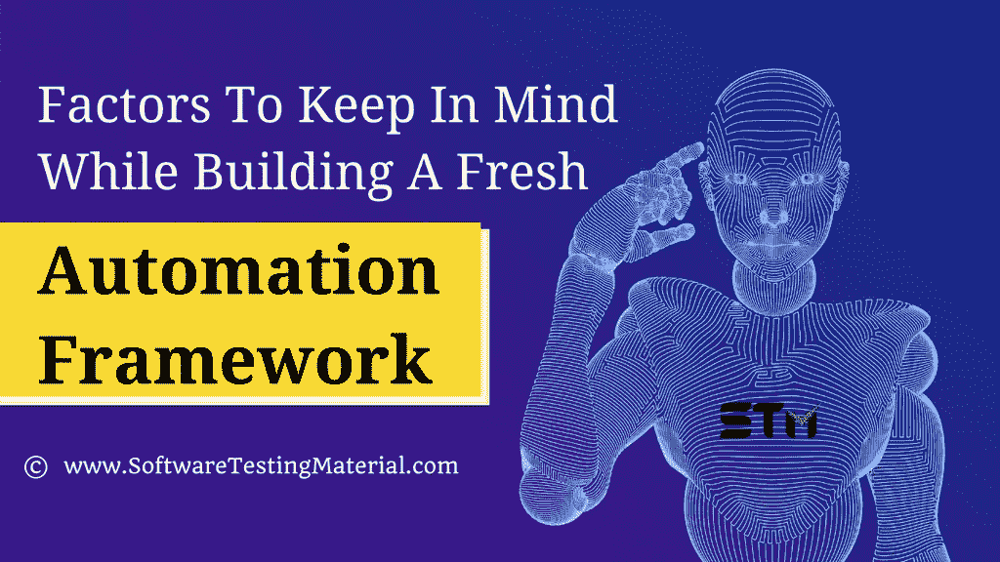

# 在构建一个全新的测试自动化项目/框架时，应该记住的因素

> 原文:[https://www . software testing material . com/building-a-fresh-test-automation-project-framework/](https://www.softwaretestingmaterial.com/building-a-fresh-test-automation-project-framework/)

在上一个框架系列中，我们已经看到了[如何在面试](https://www.softwaretestingmaterial.com/explain-test-automation-framework/)中解释测试自动化框架。今天，我们将看到在构建一个全新的测试自动化框架时应该记住的因素。

## 在构建一个全新的测试自动化项目/框架时，人们应该记住哪些因素？

老实说，最初我很难正确回答这个问题。

上面的题目，是一个非常著名的[软件测试面试问题](https://www.softwaretestingmaterial.com/100-software-testing-interview-questions/)，可能有因人而异的答案。

不，不是的。我们必须明白，在构建一个新的测试自动化项目的时候，肯定有一些主要的因素需要被记住。

然而，一个人衡量每个因素的重要性的方式，以及在构建一个项目时的经验，增加了理解上的一点变化。

凭借十几个个人的采访经验，在桌子的两边，我在下面提到了在构建一个新的测试自动化项目/框架时应该记住的事情的综合列表。

### **了解被测应用的所有信息**

因为您将为一个特定的系统自动化测试用例，所以您必须对它有足够的了解。

知道以下问题的答案对你来说很重要，

1.  应用稳定吗？
2.  是否有足够的手动测试运行在同一个？
3.  被测应用是 Web 还是 Windows 还是移动？
4.  需要哪些数据流、流程和输入？

关键是你要通过记录需求来非常熟悉应用程序，并且在这两个需求的基础上，同时考虑自动化将如何断言和验证它们。

您可能已经理解了需求，并且已经阅读了概述整个应用程序的文档，然而，开始探索性测试将使您更好地了解系统的内部工作流。

仅仅知道应用程序是如何工作的，不应该是你的目标，你也应该开始理解事物是如何内部连接的。

### **专用资源和目标受众**

一旦您知道您已经很好地完成了测试中的应用程序，尝试获得以下问题的答案:

1.  是否有专门的自动化团队，如果有，投入了多少资源？
2.  车队的结构会是怎样的？
3.  测试报告的受众是谁？
4.  目标受众有多大？
5.  需要什么样的测试报告？

对于一个测试自动化工程师来说，从一开始就知道这些是很重要的，因为下面的原因，

*   如果自动化团队是有限的，那么也许团队在处理日常自动化任务时不会面临巨大的挑战。然而，如果团队很大而且分散，那么在协调工作时可能会出现一些挑战。在这种情况下，需要维护框架或脚本的版本。这可以在本地存储库中或版本化工具中完成。由于许多人将在同一个框架上工作，因此可以很容易地监控对软件代码所做的更改。
*   就测试报告而言，考虑到目标受众的偏好和技术接触，可以决定报告的粒度、日志记录、将报告转换为其他存储/格式的能力，甚至将报告邮寄给个人等。在此基础上，可以从一开始就设计测试框架。

### **预算成本和决定合适的工具**

预算限制是需要考虑的最重要的事情之一。这是因为，它将与自动化工具的选择直接相关，因为成本将涉及许可产品、升级版本付款、设置测试环境(如果需要外部软件和硬件)以及工具的维护。

因此，总是建议弄清楚项目的预算，并在此基础上选择工具。

### **对测试自动化范围的现实期望**

在您开始开发一个测试自动化框架之前，您以及管理层和项目团队必须决定自动化框架的期望，这是非常关键的。

明智的做法是从保持现实的期望和预先定义测试范围开始。

下面是测试团队应该讨论和同意的一些要点，

*   不可能实现 100%的自动测试。
*   自动化每一个测试用例是一个遥不可及的目标。
*   测试自动化的好处只有在多次测试之后才能获得
*   执行和期望立即获得投资回报是一个神话
*   应为工具选择和框架创建留出单独的上升时间。

### **设计**

决定框架类型的设计是另一个关键任务。这本质上是由测试脚本的测试数据的输入类型决定的。

以下是一些常用的测试自动化框架，

*   数据驱动的自动化框架
*   关键词驱动的自动化框架
*   模块化自动化框架
*   混合自动化框架
*   线性脚本框架
*   行为驱动开发框架
*   组织良好的框架
*   配置选项
*   框架版本控制
*   扩展性和维护

阅读更多关于[类型的测试自动化框架](https://www.softwaretestingmaterial.com/types-test-automation-frameworks/)

### **测试脚本最佳实践**

最后，谈到最基础也是最重要的一点，测试脚本和数据处理任务。强烈建议单独处理测试脚本、测试数据、库和其他实用程序文件，并且代码最好以面向对象的方式编写。这允许代码的可重用性以及 OOPs 概念带来的其他好处。

一些被广泛使用的脚本标准如下:

*   构建对象存储库:(例如:存储在 OR.properties 文件中的 web 元素定位器)
*   设计一个通用函数库:(例如:将所有常用操作保存在一个文件中)
*   使用集成测试管理工具编写测试用例:(示例 TestNG)
*   将测试参数化:(例如:保存一个单独的数据源文件)
*   保存生成的文件和截图
*   要生成测试报告
*   测试自动化框架与 CI/CD 工具的集成:(例如:与像 Jenkins 或 TeamCity 这样的工具集成的能力)

希望这对大家有帮助。加分点:你对概念理解得越好，你就能更好地解释你的答案。

**作者简介:**

Sainy Banerjee Pal 是新加坡一家政府机构的高级软件测试工程师，也是一名已出版的合著者，他在 SAP、电子、电信、AFC、电子商务等领域拥有超过 6 年的丰富软件行业经验，并为多家领先网站撰稿。你可能会经常发现她潦草地记笔记、阅读文章、热情地向他人或在 https://medium.com/@sainy.banerjee09.解释概念

在这里，我精心挑选了几个帖子，可以帮助你了解更多与面试相关的东西:

*   [在自动化框架中应用 OOPS 的地方](https://www.softwaretestingmaterial.com/oops-concept-in-automation-framework/)
*   [Selenium web driver 中的数据驱动框架](https://www.softwaretestingmaterial.com/data-driven-framework-selenium-webdriver/)
*   [Selenium 中带有页面工厂的页面对象模型](https://www.softwaretestingmaterial.com/page-object-model/)
*   [Selenium教程](https://www.softwaretestingmaterial.com/selenium-tutorial/)
*   [手动测试教程](https://www.softwaretestingmaterial.com/manual-testing-tutorial/)
*   [软件测试人员 SQL 教程](https://www.softwaretestingmaterial.com/sql-tutorial-complete/)
*   [性能测试教程](https://www.softwaretestingmaterial.com/performance-testing-tutorial/)
*   [安全测试教程](https://www.softwaretestingmaterial.com/security-testing-tutorial/)
*   [API 测试教程](https://www.softwaretestingmaterial.com/api-testing/)
*   [Postman教程](https://www.softwaretestingmaterial.com/postman-tutorial/)